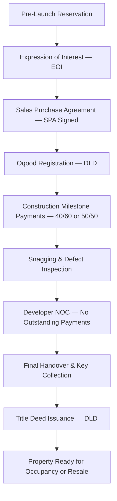
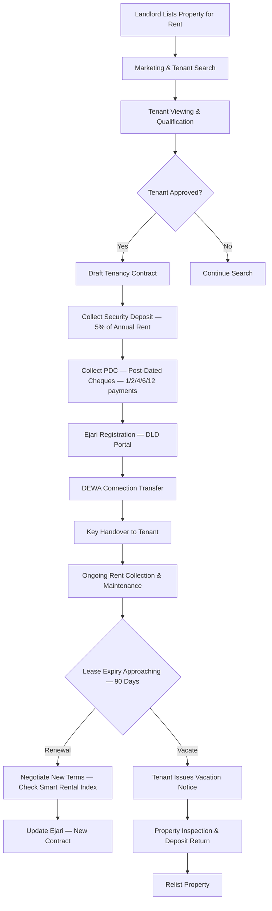
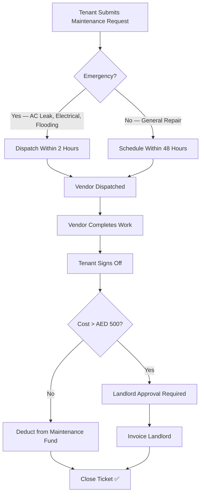

# White Caves Real Estate LLC — Complete Agency Services Catalogue

> **Trade License**: Dubai DED | **RERA ORN**: 12345 | **Founded**: 2024
> **Headquarters**: DAMAC Hills 2, Dubai, UAE
> **Managing Director**: Arslan Malik (Level 5 Master)

---

## 🏛️ Company Overview

White Caves Real Estate LLC is a premier Dubai-based real estate agency specializing in luxury residential and commercial property transactions across Dubai's most sought-after communities. Operating under a full RERA brokerage license, the company manages a portfolio of **9,378+ property units** and employs **100 professionals** including 60 dedicated sales and leasing agents.

### Core Value Proposition
- **Speed-to-Lead**: < 5 minute response guarantee (industry benchmark: 15-30 minutes)
- **AI-Powered CRM**: 12 specialized AI personas for automated lead qualification, document generation, and market intelligence
- **Full Compliance**: 100% Trakheesi, Ejari, and DLD REST verification on every transaction
- **Multi-Currency Support**: AED, USD, EUR, GBP real-time pricing for international investors
- **Golden Visa Advisory**: Expert guidance on AED 2M+ property investments qualifying for UAE Golden Visa

---

## 📋 Service Lines

### 1. Secondary Market Property Sales

**Description**: White Caves facilitates the sale of ready-to-move-in properties across Dubai's premium communities. Our 30 sales agents handle the complete transaction lifecycle from initial listing to DLD title deed transfer.

**Process**:
1. Property valuation and market appraisal
2. Professional photography, virtual tours, and listing content creation
3. Trakheesi permit registration and Madmoun QR code generation
4. Portal syndication (Property Finder, Bayut, Dubizzle)
5. Buyer qualification and viewing coordination
6. Offer negotiation and Form F (Form 6) execution
7. DLD transfer and title deed processing
8. Post-sale handover and key delivery

**Commission Structure**: 2% of sale price (standard Dubai market rate)

**Target Markets**:
| Market Segment | Price Range (AED) | Primary Communities |
|---------------|-------------------|---------------------|
| Entry-Level | 500K – 1.5M | DAMAC Hills 2, JVC, Dubai South |
| Mid-Market | 1.5M – 5M | Business Bay, Dubai Marina, JBR |
| Luxury | 5M – 20M | Downtown Dubai, DIFC, City Walk |
| Ultra-Luxury | 20M+ | Palm Jumeirah, Emirates Hills, Bluewaters |

---

### 2. Off-Plan Investment Advisory

**Description**: White Caves partners with Dubai's top developers to offer exclusive off-plan investment opportunities. Our agents guide investors through the entire lifecycle — from pre-launch reservation to Oqood registration and final handover.

**Developer Partnerships**:
| Developer | Key Projects | Commission Rate |
|-----------|-------------|-----------------|
| DAMAC Properties | DAMAC Hills 2, DAMAC Lagoons, DAMAC Islands | 5-7% |
| Emaar Properties | Dubai Hills Estate, Dubai Creek Harbour, The Valley | 3-5% |
| Nakheel | Palm Jumeirah, Jumeirah Islands, JAFZA | 3-5% |
| Sobha Realty | Sobha Hartland, Sobha One | 4-6% |
| Meraas | Bluewaters, City Walk, La Mer | 3-5% |

**Off-Plan Lifecycle**:

**Payment Plans**: Most Dubai developers offer attractive post-handover payment plans:
- **40/60**: 40% during construction, 60% on handover
- **50/50**: Equal split
- **60/40**: Front-loaded for faster construction timelines
- **Post-Handover 3-5 Year**: Monthly installments after handover (Golden Visa eligible)

---

### 3. Ejari Lease Administration & Tenant Relations

**Description**: White Caves manages the complete leasing lifecycle — from tenant onboarding to Ejari registration, rent collection via PDC (Post-Dated Cheques), maintenance coordination, and lease renewal or termination.

**Leasing Lifecycle**:

**Rent Collection Methods**:
| Method | Cheques | Common For |
|--------|---------|------------|
| 1 Cheque | 1 (full year) | Premium tenants, corporates |
| 2 Cheques | 2 (6-month intervals) | Standard leases |
| 4 Cheques | 4 (quarterly) | Mid-range tenants |
| 6 Cheques | 6 (bi-monthly) | Budget tenants |
| 12 Cheques | 12 (monthly) | Short-term, furnished |

**Bounced Cheque Protocol**:
1. Contact tenant immediately — 3-day grace period
2. Issue formal written notice if unresolved
3. Escalate to RERA Rental Dispute Centre after 15 days
4. Legal proceedings if > 30 days overdue

---

### 4. Property Portfolio Management

**Description**: White Caves manages 9,378+ property units across Dubai's premium communities on behalf of individual landlords, corporate investors, and developer-managed portfolios.

**Portfolio Breakdown**:
| Community | Units Managed | Avg. Rent (AED/year) | Occupancy Rate |
|-----------|---------------|---------------------|----------------|
| DAMAC Hills 2 | 3,200 | 45,000 – 85,000 | 94% |
| Downtown Dubai | 1,800 | 120,000 – 350,000 | 97% |
| Dubai Marina | 1,500 | 80,000 – 200,000 | 96% |
| Business Bay | 1,200 | 65,000 – 150,000 | 93% |
| Palm Jumeirah | 800 | 200,000 – 800,000 | 98% |
| Other Communities | 878 | Various | 91% |

**Services Included**:
- Tenant screening and credit verification
- Lease contract preparation and Ejari registration
- Rent collection and PDC management
- Maintenance coordination and vendor management
- Annual property inspection reports
- Landlord financial reporting (monthly/quarterly)
- Market rent appraisal for renewal negotiations

---

### 5. High-Net-Worth Investor Concierge

**Description**: Dedicated concierge service for HNWI clients investing AED 10M+ in Dubai real estate. Includes personalized property tours, legal advisory, Golden Visa processing, and post-purchase property management.

**Concierge Services**:
- Private airport pick-up and luxury property tours
- Dedicated senior agent (1:1 ratio)
- Legal counsel for complex multi-unit portfolio acquisitions
- Tax optimization advisory (UAE zero personal income tax advantage)
- Post-acquisition property management and tenant placement
- Annual portfolio performance review with MD

---

### 6. Dubai Golden Visa Property Advisory

**Description**: UAE offers 10-year Golden Visa to property investors who purchase real estate worth AED 2 million or more. White Caves provides end-to-end guidance on qualifying investments.

**Eligibility Criteria (2026)**:
| Requirement | Detail |
|-------------|--------|
| Minimum Investment | AED 2,000,000 (property value) |
| Property Type | Residential only (not commercial) |
| Mortgage Allowed | Yes — at least AED 2M in equity required |
| Off-Plan Eligible | Yes — if registered through Oqood |
| Multiple Properties | Can combine values to reach AED 2M threshold |
| Visa Duration | 10 years (renewable) |
| Family Sponsorship | Spouse + children included |

---

### 7. Property Valuation & Market Appraisal

**Description**: White Caves provides professional property valuations using DLD transaction data, Smart Rental Index benchmarks, and comparable market analysis.

**Valuation Methodology**:
1. **Comparable Sales Analysis**: Recent transactions in the same community (last 6 months)
2. **Smart Rental Index**: DLD's AI-powered rental benchmark for accurate rent pricing
3. **Income Approach**: Net rental yield calculation (ROI = Annual Rent / Property Price × 100)
4. **Developer Price Index**: Off-plan pricing relative to developer's published payment plan
5. **Physical Inspection**: Condition assessment, view premium, renovation value-add

**Average Rental Yields by Community (2026)**:
| Community | Avg. Yield | Trend |
|-----------|-----------|-------|
| DAMAC Hills 2 | 8.5% | ↑ Rising |
| JVC | 7.8% | ↑ Rising |
| Dubai Marina | 6.2% | → Stable |
| Downtown Dubai | 5.5% | → Stable |
| Palm Jumeirah | 4.8% | → Stable |

---

### 8. Maintenance & Facility Management

**Description**: White Caves coordinates all maintenance requests for managed properties, from minor repairs to major renovations, through a network of approved vendors.

**Maintenance Workflow**:

**SLA Targets**:
| Priority | Response Time | Resolution Time |
|----------|--------------|-----------------|
| P0 — Emergency | 2 hours | 24 hours |
| P1 — Urgent | 24 hours | 48 hours |
| P2 — Standard | 48 hours | 5 business days |
| P3 — Cosmetic | 5 business days | 14 business days |

---

### 9. RERA Compliance & DLD Transaction Processing

**Description**: White Caves ensures 100% compliance with Dubai's regulatory framework across all transactions.

**Regulatory Bodies**:
| Body | Responsibility | Key Service |
|------|---------------|-------------|
| RERA | Broker licensing, advertising permits | License renewal, Trakheesi permits |
| DLD | Title deed transfers, Ejari registration | Transaction processing, REST verification |
| DED | Trade license | Annual renewal |
| FTA | VAT 5% on commissions | Quarterly filing, TRN management |
| UAE FIU | Anti-money laundering | Sanctions screening per transaction |
| Dubai Municipality | Makani addressing, building permits | Location verification |
| DEWA | Electricity & water utility | Premises number verification |

**Key Compliance Tools**:
- **Dubai REST App**: Property status verification, agency credential checks
- **Trakheesi System**: Advertising permit registration and management
- **Madmoun QR Code**: Mandatory listing verification for all digital ads
- **Smart Rental Index**: AI-powered rental pricing benchmark
- **Ejari Portal**: Tenancy contract registration and management
- **Oqood System**: Off-plan property registration

---

## 📊 Revenue Model

### Revenue Streams
| Stream | Rate | Annual Target (AED) |
|--------|------|---------------------|
| Secondary Sales Commission | 2% of sale price | 12,000,000 |
| Off-Plan Sales Commission | 3-7% (developer pays) | 8,000,000 |
| Leasing Commission | 5% of annual rent | 3,500,000 |
| Lease Renewal Commission | 2.5% of annual rent | 1,200,000 |
| Property Management Fees | 5-8% of rental income | 800,000 |
| Concierge & Advisory | Fixed + success fee | 500,000 |
| **Total Annual Target** | | **AED 26,000,000** |

### Commission Split Matrix
| Role | Agent Share | Company Share |
|------|-----------|---------------|
| Junior Agent (< 1 year) | 60% | 40% |
| Agent (1-3 years) | 65% | 35% |
| Senior Agent (3+ years) | 70% | 30% |
| Team Lead | 75% | 25% |
| Top Performer of the Year | 80% | 20% |

---

## 🏆 Competitive Positioning

### Market Position: #4 of 48 Licensed Agencies in Dubai
| Rank | Agency | Specialty |
|------|--------|-----------|
| 1 | Betterhomes | Full-service market leader |
| 2 | Allsopp & Allsopp | Premium residential |
| 3 | Haus & Haus | Luxury segment |
| **4** | **White Caves Real Estate** | **AI-powered CRM + DAMAC specialist** |
| 5 | Fam Properties | Off-plan focused |

### Competitive Advantages
1. **AI-First CRM**: Only agency with 12 specialized AI personas for automated operations
2. **Speed-to-Lead**: Sub-5-minute response time (industry avg: 15-30 minutes)
3. **DAMAC Specialist**: Largest independent portfolio in DAMAC Hills 2 (3,200 units)
4. **Full Digital Platform**: Custom-built enterprise CRM (not Salesforce/HubSpot dependent)
5. **Multi-Language**: Arabic, English, Hindi, Urdu, Russian support
6. **Golden Visa Expert**: Streamlined AED 2M+ investment qualification process
