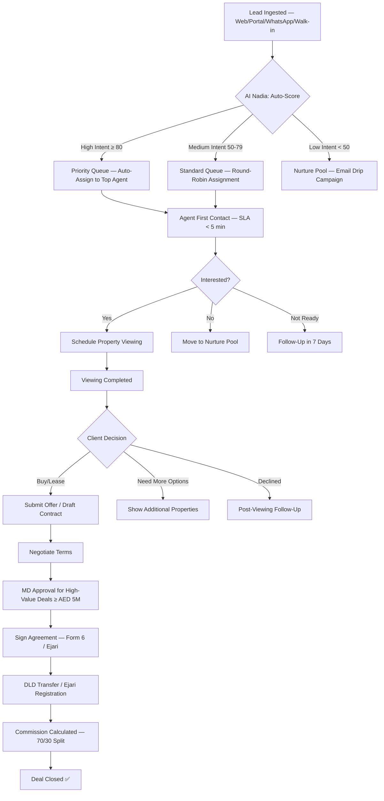
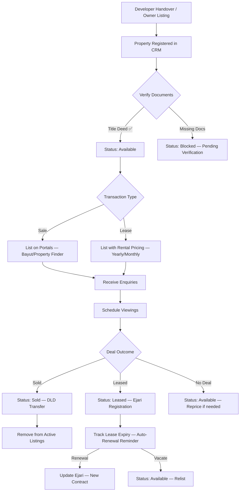
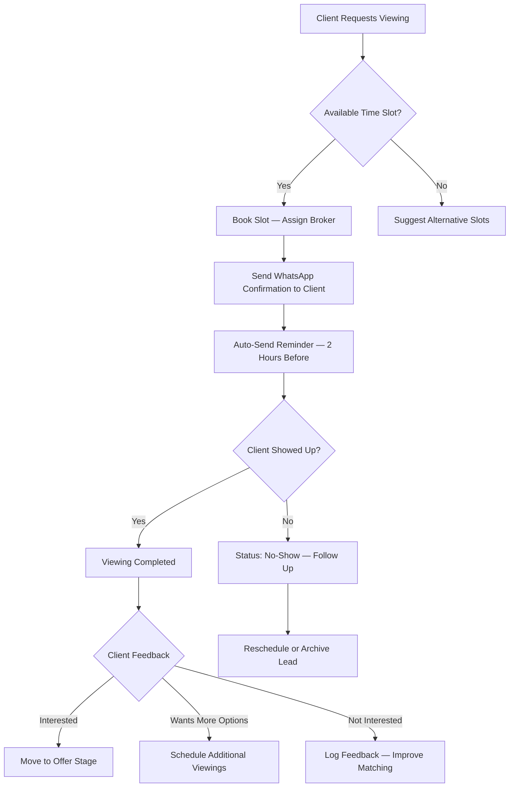
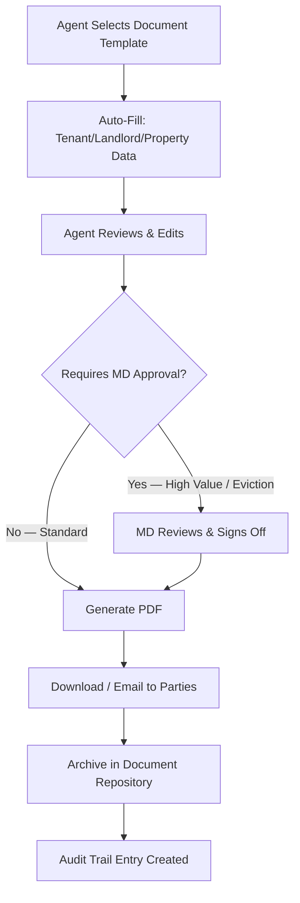
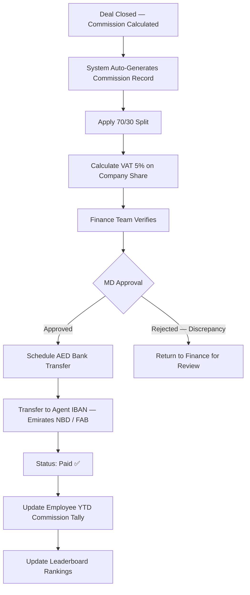
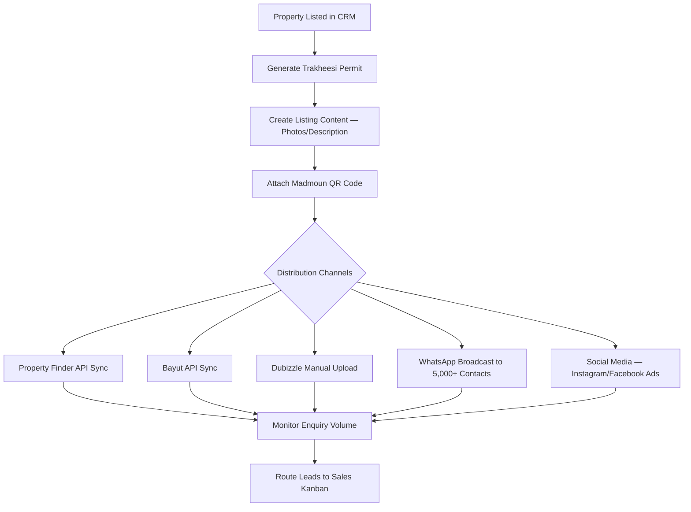
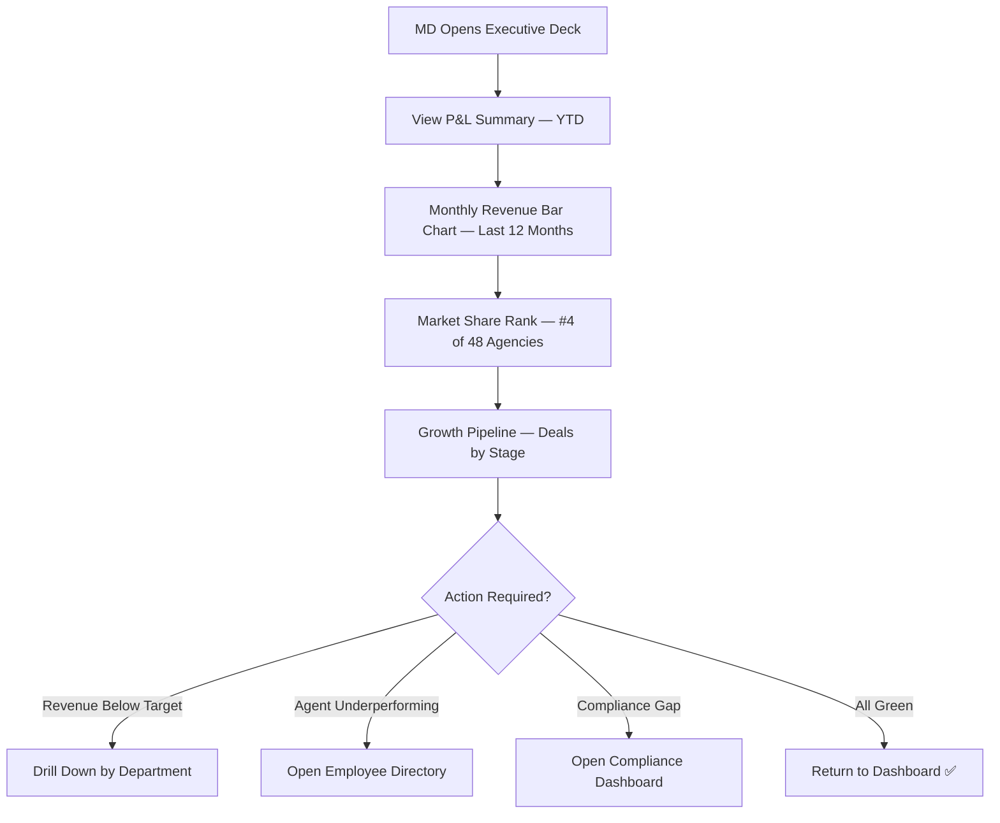
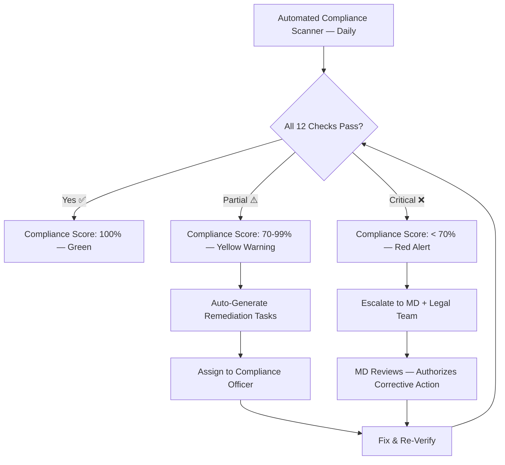
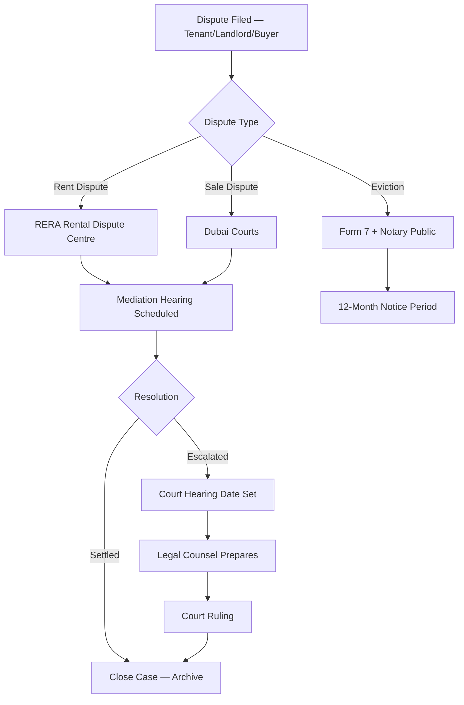

# Managing Director — 14 Operations Business Process Workflows

> **White Caves Real Estate LLC** — Complete Business Process Documentation
> **Owner:** Managing Director (Level 5 Master — Arslan Malik)
> **Last Updated:** 2026-07-28

---

## Table of Contents

1. [Sales Kanban & Lead Pipeline](#01-sales-kanban--lead-pipeline)
2. [Master Property Inventory](#02-master-property-inventory)
3. [Viewing Scheduler](#03-viewing-scheduler)
4. [Document Generation Centre](#04-document-generation-centre)
5. [Commission Management](#05-commission-management)
6. [Marketing & Syndication](#06-marketing--syndication)
7. [Executive Control Deck](#07-executive-control-deck)
8. [Regulatory Compliance](#08-regulatory-compliance)
9. [Technology & Infrastructure](#09-technology--infrastructure)
10. [Legal & Case Management](#10-legal--case-management)
11. [AI Assistants Hub](#11-ai-assistants-hub)
12. [AI Command Centre](#12-ai-command-centre)
13. [Master Audit Trail](#13-master-audit-trail)
14. [Employee Directory & Leaderboard](#14-employee-directory--leaderboard)

---

## 01. Sales Kanban & Lead Pipeline

### Business Narrative
Every potential client contacting White Caves Real Estate enters the Sales Kanban pipeline. The Managing Director has full visibility over all leads — from first contact to deal closure. Speed-to-lead (response within 5 minutes) is the critical KPI that separates top agencies in Dubai.

### Stakeholders
- **Managing Director**: Oversees pipeline health, assigns high-value leads, approves deal escalations.
- **Sales Agents (30)**: Work leads through stages, schedule viewings, negotiate offers.
- **AI Persona (Nadia)**: Auto-qualifies and scores incoming leads based on budget, location, and intent signals.

### SLA Targets
| Metric | Target | Escalation |
|--------|--------|------------|
| First Response Time | < 5 minutes | Auto-escalate to team lead after 10 min |
| Lead Qualification | < 2 hours | Nadia AI auto-scores if agent idle |
| Viewing Scheduled | < 24 hours | Flagged on MD dashboard if overdue |
| Offer Submission | < 48 hours | Commission penalty if delayed |

### Process Flowchart

### Input Data
- Lead Name, Email, Phone, Nationality
- Source Channel (Property Finder, Bayut, Dubizzle, WhatsApp, Walk-in, Referral)
- Budget Range (AED), Preferred Communities, Property Type
- AI Confidence Score (0-100)

### Output Data
- Deal Value (AED), Commission Amount (AED), Agent Performance Points
- RERA Form 6 / Ejari Contract Reference Number
- DLD Transaction ID

---

## 02. Master Property Inventory

### Business Narrative
White Caves manages a portfolio of 9,378+ property units across Dubai's premium communities (DAMAC Hills 2, Downtown Dubai, Dubai Marina, Palm Jumeirah, Business Bay). The inventory tracks every property through its full lifecycle — from developer handover to tenant occupancy or sale closure.

### Stakeholders
- **Managing Director**: Monitors portfolio health, approves new listings, reviews valuation changes.
- **Property Coordinators**: Maintain listing accuracy, upload photos, update status.
- **AI Persona (Clara)**: Matches properties to buyer/tenant preferences using ML scoring.

### Property Lifecycle

### Key Property Fields (30+ Fields)
| Category | Fields |
|----------|--------|
| **Identity** | ID, Title, Title (Arabic), Unit Number |
| **Location** | Community, Sub-Community, Building Name, Floor, Latitude, Longitude |
| **Developer** | DAMAC, Emaar, Nakheel, Sobha, Meraas |
| **Type** | Villa, Apartment, Townhouse, Penthouse, Off-Plan, Commercial, Land |
| **Ownership** | Freehold, Usufruct, Musataha |
| **Pricing** | Price AED, USD, EUR, GBP, Rental Frequency, Service Charge/sqft |
| **Layout** | Beds, Baths, Sqft, Plot Size, Furnishing, Parking, View Type, Balcony, Pool, Maid Room |
| **Government** | RERA Permit (Trakheesi), Title Deed No., Makani No., DEWA Premises No., Madmoun QR |
| **Status** | Available, Reserved, Leased, Sold, Under Maintenance, Blocked |
| **Media** | Primary Image, Gallery, Floor Plan, Virtual Tour URL |
| **Agent** | Assigned Broker ID, Broker Name |

### Multi-Currency Pricing
| Currency | Rate (vs AED) | Example (AED 2,500,000) |
|----------|---------------|-------------------------|
| AED | 1.00 | 2,500,000 |
| USD | 0.27 | 675,000 |
| EUR | 0.25 | 625,000 |
| GBP | 0.22 | 550,000 |

---

## 03. Viewing Scheduler

### Business Narrative
Property viewings are the highest-conversion touchpoint in Dubai real estate. White Caves operates an interactive weekly calendar grid where the Managing Director can monitor all scheduled viewings, broker assignments, and viewing outcomes across the entire team of 60 agents.

### Stakeholders
- **Managing Director**: Monitors viewing volume, identifies agents with low booking rates.
- **Sales & Leasing Agents (60)**: Manage their personal viewing schedules.
- **Clients**: Receive automated WhatsApp reminders 2 hours before viewing.

### Viewing Workflow

### Viewing Status Codes
| Status | Color Code | Meaning |
|--------|-----------|---------|
| Confirmed | 🟢 Green | Viewing booked and confirmed |
| Pending | 🟡 Yellow | Awaiting client confirmation |
| Completed | 🔵 Blue | Viewing done, feedback pending |
| No-Show | 🔴 Red | Client did not attend |
| Cancelled | ⚪ Gray | Cancelled by client or agent |

---

## 04. Document Generation Centre

### Business Narrative
Dubai real estate transactions require specific RERA-mandated documents at every stage. White Caves automates the generation of these documents with pre-filled templates to ensure compliance and speed.

### Document Templates

| Document | RERA Reference | Use Case |
|----------|---------------|----------|
| Form A | Seller Authorization | Seller appoints agency to sell |
| Form B | Buyer Authorization | Buyer appoints agency to find property |
| Form F (Form 6) | Sale Agreement | Binding sale contract between buyer/seller |
| Form I | Agency Agreement | General agency appointment |
| Form 7 | Eviction Notice | Landlord serves eviction to tenant |
| Form 12 | Rent Increase Notice | Landlord notifies tenant of rent adjustment |
| NOC | No Objection Certificate | Developer confirms no outstanding payments |
| Ejari Contract | Tenancy Agreement | Standard Dubai rental contract for Ejari registration |

### Document Generation Workflow

### VAT 5% Calculation
All commission invoices include UAE VAT at 5% (Federal Tax Authority — FTA):
- **Commission Amount (AED)**: e.g., AED 50,000
- **VAT 5%**: AED 2,500
- **Total Invoice**: AED 52,500
- **TRN Format**: `100-XXXX-XXXX-XXXX-XXXX` (Tax Registration Number)

---

## 05. Commission Management

### Business Narrative
White Caves operates a transparent commission structure. Every closed deal generates a commission record with an automatic 70/30 split (70% to the closing agent, 30% retained by the company). The Managing Director approves all payouts before bank transfers.

### Commission Structure
| Deal Type | Commission Rate | Agent Share | Company Share |
|-----------|----------------|-------------|---------------|
| Secondary Sale | 2% of sale price | 70% (1.4%) | 30% (0.6%) |
| Off-Plan Sale | 3-7% (developer pays) | 70% | 30% |
| Lease (Annual) | 5% of annual rent | 70% (3.5%) | 30% (1.5%) |
| Lease Renewal | 2.5% of annual rent | 70% (1.75%) | 30% (0.75%) |

### Payout Workflow

### AED Bank Payout Details
| Field | Example |
|-------|---------|
| Agent IBAN | `AE64 0330 0000 1234 5678 901` |
| Bank | Emirates NBD |
| Base Salary (AED/month) | AED 12,000 |
| Commission This Deal | AED 35,000 |
| VAT 5% Deducted | AED 1,750 |
| Net Payout | AED 33,250 |
| Payout Status | ✅ Paid / ⏳ Pending / ❌ On Hold |

---

## 06. Marketing & Syndication

### Business Narrative
White Caves syndicates property listings across Dubai's major portals (Property Finder, Bayut, Dubizzle) and runs targeted marketing campaigns via WhatsApp, email, and social media. All advertising must comply with DLD's **Trakheesi** permit system and display mandatory **Madmoun QR codes**.

### Compliance Requirements (2026 Research)
- **Trakheesi Permit**: Every property advertisement must have a valid permit registered through the Trakheesi system. Marketing without a permit = major violation.
- **Madmoun QR Code**: All visual/digital ads must feature the mandatory DLD QR code for listing verification.
- **Three-Broker Rule**: DLD limits a seller from listing with more than 3 brokers simultaneously.

### Marketing Workflow

---

## 07. Executive Control Deck

### Business Narrative
The Executive Deck gives the Managing Director a real-time overview of the company's financial health: Profit & Loss summary, monthly revenue trends, market position ranking, and growth pipeline projections.

### Key Metrics
| Metric | Current | Target |
|--------|---------|--------|
| Market Rank (Dubai Agencies) | #4 of 48 | Top 3 |
| Monthly Revenue (AED) | AED 2.8M | AED 3.5M |
| YTD Revenue (AED) | AED 19.6M | AED 25M |
| Active Deals in Pipeline | 47 | 60+ |
| Agent Productivity (Deals/Agent/Month) | 2.3 | 3.0 |

### Executive Dashboard Flow

---

## 08. Regulatory Compliance

### Business Narrative
Dubai's real estate market operates under strict regulatory oversight from RERA and DLD. White Caves runs 12 automated compliance checks to ensure the company remains in good standing at all times.

### 12 Compliance Checks

| # | Check | Regulator | Frequency |
|---|-------|-----------|-----------|
| 1 | RERA Broker License Validity | RERA | Monthly |
| 2 | Agency Trade License (DED) | DED | Annual |
| 3 | Trakheesi Ad Permits Active | DLD | Per listing |
| 4 | Ejari Registration Timeliness | DLD | Per contract |
| 5 | Escrow Account Compliance (Law 8/2007) | DLD | Quarterly |
| 6 | AML Screening — Sanctions Check | UAE FIU | Per transaction |
| 7 | UAE PDPL Data Privacy | UAE Govt | Annual |
| 8 | Smart Rental Index Compliance | DLD | Per rent notice |
| 9 | Form 7 Eviction Notice Validity | RERA | Per eviction |
| 10 | Oqood Off-Plan Registration | DLD | Per off-plan deal |
| 11 | Title Deed Verification | DLD REST | Per sale |
| 12 | Commission Disclosure (Form A/B) | RERA | Per deal |

### Compliance Audit Flow

---

## 09. Technology & Infrastructure

### Business Narrative
The Technology Monitor provides real-time visibility into the platform's health: API response times, WebSocket connection counts, database query performance, and server error rates.

### Monitored Systems
| System | Technology | Metric | Target |
|--------|-----------|--------|--------|
| API Server | Express v4 + TypeScript 5.7 | Response Time | < 200ms |
| Database | MongoDB Atlas (42 Prisma Models) | Query Time | < 50ms |
| WebSocket | Socket.io v4 | Connected Clients | Real-time count |
| CDN | Vercel Edge | Cache Hit Rate | > 95% |
| Auth | JWT + RBAC (5 Levels) | Token Refresh | 15-min rotation |

---

## 10. Legal & Case Management

### Business Narrative
Legal disputes in Dubai real estate are resolved through RERA mediation (Rental Dispute Centre) or Dubai Courts. White Caves tracks all active cases, court hearing dates, and legal form library.

### Legal Process Flow

---

## 11. AI Assistants Hub

### Business Narrative
White Caves deploys 12 specialized AI personas, each trained for a specific domain of Dubai real estate operations. The Managing Director can monitor all persona activity, confidence scores, and routing decisions from the AI Intelligence hub.

### 12 AI Personas

| # | Name | Specialty | Use Case |
|---|------|-----------|----------|
| 1 | 🧠 Nadia | Lead Qualification | Auto-scores leads by budget, location, and intent |
| 2 | 📋 Mary | Document Generation | Auto-fills RERA forms with CRM data |
| 3 | 💬 Linda | WhatsApp Communication | Chatbot for client enquiries & viewing bookings |
| 4 | 📊 Zoe | Analytics & KPIs | Real-time dashboard insights and forecasts |
| 5 | 🏠 Clara | Property Matching | ML-powered property recommendations |
| 6 | ⚖️ Nina | Compliance Checks | Automated RERA/DLD regulatory scanning |
| 7 | 👑 Theodora | Executive Advisory | Strategic market insights for MD |
| 8 | 🎯 Olivia | Marketing Optimization | Campaign performance analysis |
| 9 | 🌍 Laila | Arabic Localization | Arabic translation & cultural adaptation |
| 10 | 🔒 Sophia | Security Audit | Access control & vulnerability scanning |
| 11 | 🌸 Daisy | Tenant Relations | Tenant satisfaction & maintenance triage |
| 12 | ✨ Aurora | Market Intelligence | Competitive analysis & pricing forecasts |

---

## 12. AI Command Centre

### Business Narrative
The AI Command Centre provides a real-time stream of all AI persona interactions — every prompt, response, confidence score, and routing decision is logged for Managing Director oversight.

### Command Centre Features
- Live prompt/response event stream
- Confidence score visualization (0-100%)
- Persona routing decisions (which AI handled which request)
- Fallback escalation to human agent when confidence < 60%
- Full audit trail of AI decisions for compliance

---

## 13. Master Audit Trail

### Business Narrative
The Master Audit Trail is an append-only, tamper-proof log of every significant action taken in the platform. Only the Managing Director (Level 5 Master) has full access to the complete audit stream.

### Audit Event Types
| Event Type | Severity | Example |
|------------|----------|---------|
| `AUTH_LOGIN` | Info | User authenticated via JWT |
| `LEAD_CREATED` | Info | New lead ingested from Property Finder |
| `DEAL_CLOSED` | Success | Sale completed — AED 3.2M |
| `COMMISSION_PAID` | Success | Agent payout — AED 22,400 |
| `COMPLIANCE_ALERT` | Warning | Trakheesi permit expiring in 7 days |
| `ACCESS_DENIED` | Error | Unauthorized access attempt to audit trail |
| `DATA_EXPORT` | Warning | CSV export of lead database |

### Audit Trail Features
- Append-only (no edits or deletions)
- Severity filter (Info / Warning / Error / Critical)
- Date range filter
- User/agent filter
- CSV export with UTF-8 BOM for Excel compatibility

---

## 14. Employee Directory & Leaderboard

### Business Narrative
White Caves employs 100 staff members, with 60 dedicated Sales and Leasing agents who drive the company's revenue. The Managing Director tracks all employee performance through real-time leaderboards with separate competition pools for Sales and Leasing teams.

### 100-Employee Workforce Structure
| Department | Count | Roles |
|------------|-------|-------|
| Sales Team | 30 | Senior Sales Agent, Sales Agent, Junior Sales Agent |
| Leasing Team | 30 | Senior Leasing Agent, Leasing Agent, Junior Leasing Agent |
| Compliance & Legal | 10 | Compliance Officer, Legal Counsel, Paralegal |
| Marketing & Communications | 10 | Marketing Manager, Content Creator, Social Media Specialist |
| Finance & Admin | 8 | Finance Manager, Accountant, Admin Assistant |
| Technology & AI | 6 | CTO, Full-Stack Developer, AI Engineer |
| Executive Management | 4 | Managing Director, COO, VP Sales, VP Leasing |
| HR & Recruitment | 2 | HR Manager, Recruitment Specialist |

### Dual Employee of the Year Competitions

**🏙️ Sales Agent of the Year Pool (30 Agents)**
| Ranking Criteria | Weight |
|-----------------|--------|
| Total Gross Revenue (AED) | 35% |
| High-Net-Worth Deal Count (≥ AED 5M) | 25% |
| Form 6 / DLD Transfer Conversion Rate | 15% |
| Client Satisfaction Score (out of 5.0) | 15% |
| Oqood Off-Plan Registration Count | 10% |
| **Reward**: Platinum Trophy + 10% Profit Share + Managing Director Rolex Award |

**🏬 Leasing Agent of the Year Pool (30 Agents)**
| Ranking Criteria | Weight |
|-----------------|--------|
| Total Contracts Signed | 30% |
| Rent Volume Closed (AED) | 25% |
| Ejari SLA Speed (avg. days to registration) | 20% |
| Tenant Satisfaction Score (out of 5.0) | 15% |
| Renewal Rate (%) | 10% |
| **Reward**: Gold Trophy + 5% Commission Bonus + Annual Luxury Trip |

### AED Payroll Matrix
| Field | Description |
|-------|-------------|
| Employee ID | `WC-EMP-001` format |
| IBAN | UAE IBAN — `AE64 0330 0000 XXXX XXXX XXX` |
| Bank | Emirates NBD / First Abu Dhabi Bank (FAB) |
| Base Salary | AED 8,000 – 25,000/month (by tier) |
| YTD Commission | Cumulative AED earned through closed deals |
| Net Monthly Payout | Base + Commission - VAT Deductions |

---

## Appendix: Dubai Real Estate Best Practices (2026 Research)

### Speed-to-Lead
- Response time < 5 minutes is the critical predictor of conversion in Dubai.
- Use automated lead routing to ensure zero leads are missed.

### Trakheesi & Madmoun Compliance
- Every property advertisement must have a valid Trakheesi permit.
- All digital ads must display the Madmoun QR code for listing verification.
- Violations can result in agency license suspension.

### Smart Rental Index
- All rent increase notices must reference the DLD's AI-powered Smart Rental Index.
- 90-day legal notification window must be respected for rent adjustments.

### Escrow Account (Law No. 8 of 2007)
- Agencies dealing with developer funds must strictly adhere to escrow regulations.
- Developer technical inspection reports must be updated every 6 months.

### Dubai REST App
- The primary portal for verifying property status, agency credentials, and managing DLD transactions.
- Always verify Title Deed and Plot data against official records before initiating transactions.

### Three-Broker Rule
- DLD limits a seller from listing with more than 3 brokers simultaneously to prevent duplicate listings.
