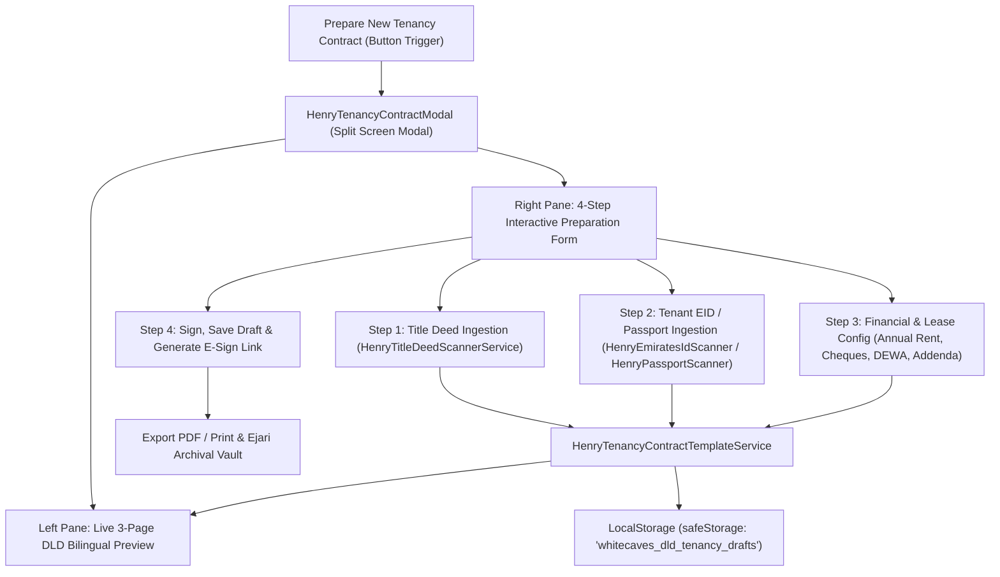

# Software Design Description (SDD)
## Henry AI — Official DLD Unified Tenancy Contract Interactive Preparation Architecture
**Document Version:** 1.0.0  
**Authority:** White Caves Real Estate L.L.C  
**Standard:** Dubai Land Department (DLD) Unified Tenancy Contract  
**System Module:** `HenryTenancyContractTemplateService.ts` & `HenryTenancyContractModal.tsx`

---

### 1. Component Architecture & Data Flow



---

### 2. State & Data Models

```typescript
export interface DldTenancyContractData {
  contractId: string;
  contractDate: string;
  
  // Owner / Lessor
  ownerName: string;
  lessorName: string;
  lessorEmiratesId: string;
  lessorLicenseNo: string;
  lessorLicensingAuthority: string;
  lessorEmail: string;
  lessorPhone: string;
  
  // Tenant
  tenantName: string;
  tenantEmiratesId: string;
  tenantLicenseNo: string;
  tenantLicensingAuthority: string;
  tenantEmail: string;
  tenantPhone: string;
  
  // Property
  propertyUsage: 'residential' | 'commercial' | 'industrial';
  plotNo: string;
  makaniNo: string;
  buildingName: string;
  propertyNo: string;
  propertyType: string;
  propertyAreaSqM: number;
  location: string;
  premisesNoDewa: string;
  
  // Contract
  contractPeriodFrom: string;
  contractPeriodTo: string;
  contractValue: number;
  annualRent: number;
  securityDepositAmount: number;
  modeOfPayment: string;
  
  // Signatures
  tenantSignature?: string;
  tenantSignatureDate?: string;
  lessorSignature?: string;
  lessorSignatureDate?: string;
  
  // Additional Terms
  additionalTerms: string[];
  
  // Metadata
  createdAt: string;
  updatedAt: string;
  status: 'draft' | 'ready_for_signature' | 'signed' | 'registered_ejari';
}
```

---

### 3. LocalStorage Persistence Layer
The service uses `safeStorage` to manage:
1. `whitecaves_dld_tenancy_blank_template`: Pristine blank structure with empty placeholders.
2. `whitecaves_dld_tenancy_active_draft`: The currently active draft in the preparation wizard.
3. `whitecaves_dld_tenancy_saved_contracts`: Array of finalized contracts ready for archival and re-editing.

---

### 4. UI/UX Interaction Design (Split Screen Modal)
- **Container**: Full-width luxury glassmorphism modal with responsive split layout (50% Live Preview | 50% Step Form).
- **Left Preview Pane**:
  - Displays high-resolution, pixel-accurate HTML rendering of Pages 1, 2, and 3.
  - Interactive page switcher (`Page 1: Contract Details`, `Page 2: Terms & Conditions`, `Page 3: Rights & Addendum`).
  - Zoom controls (`75%`, `100%`, `125%`).
- **Right Form Pane**:
  - Step navigation with completed indicators (`1. Property & Landlord`, `2. Tenant KYC`, `3. Lease & Financials`, `4. Sign & Finalize`).
  - Dropzone for drag-and-drop ingestion of Title Deed and EID/Passport.
  - "1-Click Auto-Fill with Sample Scanned Data" button for rapid demonstration.
  - Real-time binding: changes immediately reflect on the left preview without page reload.
