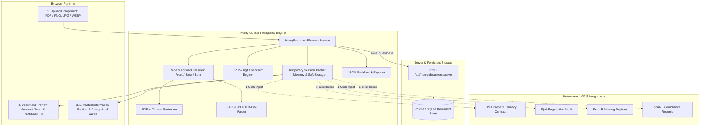

# 🏛️ Software Design Document (SDD): 3.19.2 Scan Emirates ID Engine & Session Store

**Target System:** White Caves Document Studio & ERP Core — AI Assistant Henry (`WC-AI-003`)  
**Module Identifier:** `3.19.2 Scan Emirates ID`  
**Standard Architecture:** Atomic 3-Part Component Architecture (`Uploader` + `PreviewViewer` + `ExtractionSection`)  
**Version:** 3.0.0  

---

## 1. Architectural System Overview



---

## 2. Core Service Interface & Temporary Session Cache

```typescript
export interface EmiratesIdExtractedData {
  // Identity Keys
  idNumber: string;             // "784-1984-5852080-0"
  rawIdNumber: string;          // "784198458520800"
  cardNumber: string;           // "144597571"
  chipNumber?: string;          // "2500069345"

  // Personal Info (Bilingual)
  fullNameEn: string;           // "Arslan Malik Bashir Ahmad"
  fullNameAr: string;           // "ارسلان مالك بشير احمد"
  firstName: string;            // "Arslan"
  lastName: string;             // "Bashir Ahmad"
  dateOfBirth: string;          // "10/02/1993"
  nationalityEn: string;        // "Pakistan"
  nationalityAr: string;        // "باكستان"
  nationalityCode: string;      // "PAK"
  gender: 'M' | 'F';            // "M"

  // Document Validity
  issueDate: string;            // "08/04/2025"
  expiryDate: string;           // "22/11/2026"
  isExpired: boolean;
  daysUntilExpiry: number;

  // Employment & Residency
  occupationEn: string;         // "Managing Director"
  occupationAr: string;         // "مدير إدارة"
  employerEn: string;           // "White Caves Real Estate L.L.C"
  employerAr: string;           // "وايت كيفز للعقارات ذ.م.م"
  issuingPlaceEn: string;       // "Dubai"
  issuingPlaceAr: string;       // "دبي"

  // ICAO TD1 MRZ Lines
  mrz?: {
    line1: string;              // "ILARE1445975719784199318057330"
    line2: string;              // "9302109M2611228PAK<<<<<<<<<<<6"
    line3: string;              // "BASHIR<AHMAD<<ARSLAN<MALIK<<<<"
  };

  // Telemetry & Cache
  confidenceScore: number;      // 0.0 to 1.0
  scannedAt: string;            // ISO timestamp
  scannedSide?: 'front' | 'back' | 'both';
  documentFormat?: string;      // "pdf" | "image/png" | "image/jpeg" | "image/webp"
}

export interface IHenryEmiratesIdScannerService {
  scanDocument(file: File): Promise<EmiratesIdExtractedData>;
  scanDualSide(frontFile: File, backFile: File): Promise<EmiratesIdExtractedData>;
  detectDocumentSide(text: string): 'front' | 'back' | 'both';
  
  // Temporary Cache Storage API
  setCachedEmiratesId(data: EmiratesIdExtractedData): void;
  getCachedEmiratesId(): EmiratesIdExtractedData | null;
  clearCachedEmiratesId(): void;
  onEmiratesIdUpdated(listener: (data: EmiratesIdExtractedData | null) => void): () => void;
  
  // Downstream Converters
  toTenancyParty(data: EmiratesIdExtractedData): { name: string; emiratesId: string; phone: string; email: string };
  toViewingParty(data: EmiratesIdExtractedData): { clientName: string; clientPassportOrEid: string };
  getDemoExtractedData(): EmiratesIdExtractedData;
}
```

---

## 3. UI Component Architecture

The module `HenryEmiratesIdScannerView` is decomposed into 3 primary sub-sections:

### Section 1: Upload File Component (`HenrySharedDocumentUploader` / Dropzone)
- Multi-format ingestion accepting `.pdf`, `.png`, `.jpg`, `.jpeg`, `.webp`.
- Dual front/back upload zone with automatic side detection.
- Fast preset loader button (`Load Arslan Malik EID Sample`).

### Section 2: Document Preview Pane
- Visual canvas renderer for PDF or high-resolution images.
- Interactive **Front / Back** flip toggle buttons.
- Zoom controls (Zoom In, Zoom Out, Reset 100%).

### Section 3: Extracted Information Cards
- Card 1: **Identity Number & Card ID** with live checksum verification pill.
- Card 2: **Bilingual Personal Data** (English Name, Arabic Name, DOB, Gender, Nationality).
- Card 3: **Validity & Expiry Dates** with active/expired badge.
- Card 4: **Employment, Sponsor & Issuing Place**.
- Card 5: **ICAO 9303 TD1 MRZ Terminal** (3-line raw monospace terminal).
- Action Footer:
  - `Auto-Fill Tenancy Lease (as Tenant)`
  - `Auto-Fill Tenancy Lease (as Landlord)`
  - `Save & Archive to KYC Vault`
  - `Copy JSON Variables`
  - `Clear / Reset`

---

## 4. Cross-Module Data Flow & Injection Strategy

1. **State Persistence**:
   Whenever a file is scanned or loaded in `HenryEmiratesIdScannerView`, `henryEmiratesIdScannerService.setCachedEmiratesId(data)` is triggered.
2. **Downstream Subscription**:
   Components like `HenryTenancyContractJourneyView` or `HenryDocumentStudio` can call `henryEmiratesIdScannerService.getCachedEmiratesId()` to instantly pull the active resident's name, Emirates ID, nationality, and sponsor into contract forms without re-uploading.
3. **Session Cleanliness**:
   Users can clear the temporary cache at any time via `Discard` / `Clear Session`.
