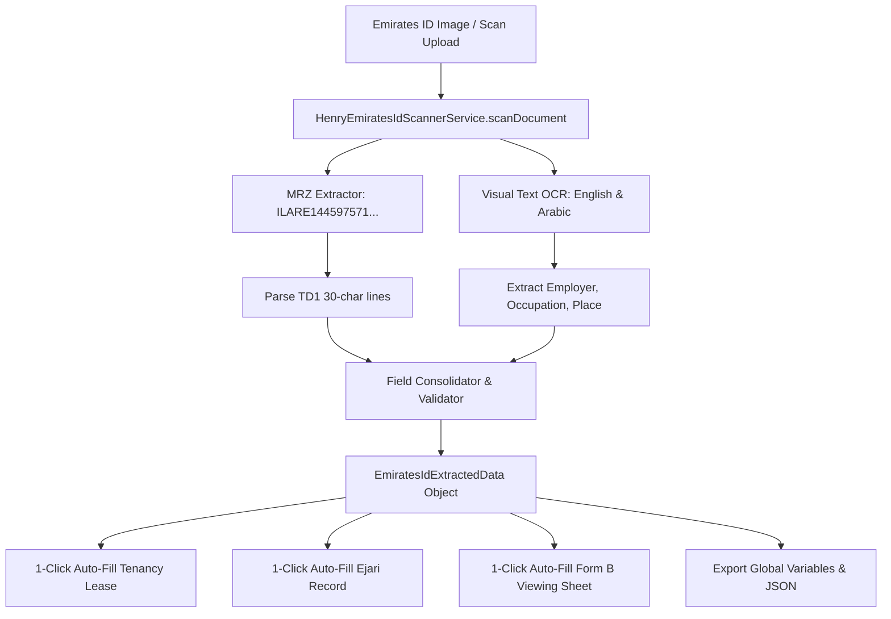

# 🏛️ Software Design Document (SDD): Henry AI Emirates ID OCR & Parsing Architecture

**Target System:** Henry AI Optical Extraction Engine  
**Module:** `src/services/HenryEmiratesIdScannerService.ts`  
**Standard:** 4-Way Folder Architecture (`View.tsx` / `Logic.logic.ts` / `Style.style.ts` / `Data.data.ts`)  

---

## 1. System Flow & Data Pipeline



---

## 2. TypeScript Data Schema (`EmiratesIdExtractedData`)

```typescript
export interface EmiratesIdExtractedData {
  // Identity Keys
  idNumber: string;             // e.g. "784-1993-1805733-0"
  rawIdNumber: string;          // e.g. "784199318057330"
  cardNumber: string;           // e.g. "144597571"
  chipNumber?: string;          // e.g. "2500069345"

  // Personal Info (Bilingual)
  fullNameEn: string;           // e.g. "Arslan Malik Bashir Ahmad"
  fullNameAr: string;           // e.g. "ارسلان مالك بشير احمد"
  firstName: string;            // e.g. "Arslan"
  lastName: string;             // e.g. "Bashir Ahmad"
  dateOfBirth: string;          // e.g. "10/02/1993" (DD/MM/YYYY)
  nationalityEn: string;        // e.g. "Pakistan"
  nationalityAr: string;        // e.g. "باكستان"
  nationalityCode: string;      // e.g. "PAK"
  gender: 'M' | 'F';            // e.g. "M"

  // Document Validity
  issueDate: string;            // e.g. "08/04/2025"
  expiryDate: string;           // e.g. "22/11/2026"
  isExpired: boolean;
  daysUntilExpiry: number;

  // Employment & Residency
  occupationEn: string;         // e.g. "Managing Director"
  occupationAr: string;         // e.g. "مدير إدارة"
  employerEn: string;           // e.g. "White Caves Real Estate L.L.C"
  employerAr: string;           // e.g. "وايت كيفز للعقارات ذ.م.م"
  issuingPlaceEn: string;       // e.g. "Dubai"
  issuingPlaceAr: string;       // e.g. "دبي"

  // Machine Readable Zone (MRZ) Raw Lines
  mrz?: {
    line1: string;              // "ILARE1445975719784199318057330"
    line2: string;              // "9302109M2611228PAK<<<<<<<<<<<6"
    line3: string;              // "BASHIR<AHMAD<<ARSLAN<MALIK<<<<"
  };

  // Extraction Metadata
  confidenceScore: number;      // 0.0 to 1.0 (e.g. 0.99)
  scannedAt: string;            // ISO timestamp
}
```
