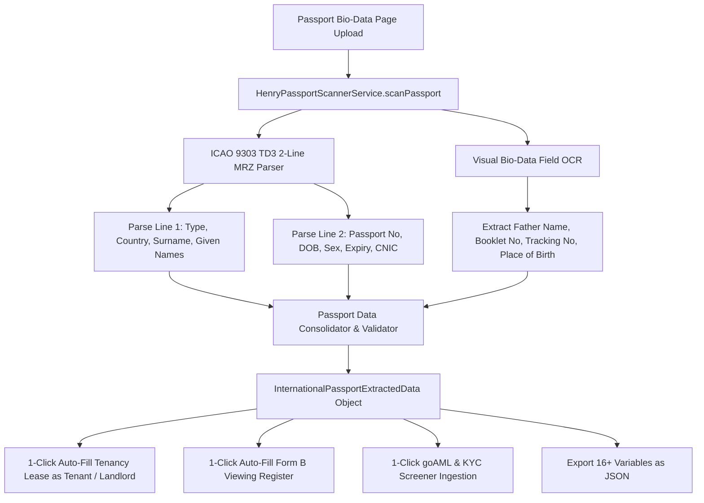

# 🏛️ Software Design Document (SDD): Henry AI International Passport OCR & MRZ Engine

**Target System:** Henry AI Optical Extraction Engine  
**Module:** `src/services/HenryPassportScannerService.ts`  
**Standard:** 4-Way Folder Architecture (`View.tsx` / `Logic.logic.ts` / `Style.style.ts` / `Data.data.ts`)  

---

## 1. System Architecture & Processing Pipeline



---

## 2. TypeScript Data Schema (`InternationalPassportExtractedData`)

```typescript
export interface InternationalPassportExtractedData {
  // Document Identity
  passportNumber: string;            // e.g. "DR0760143"
  passportType: string;              // "P" (Standard Passport)
  issuingCountry: string;            // "Islamic Republic of Pakistan"
  issuingCountryCode: string;        // "PAK"
  bookletNumber: string;             // "R7587163"
  trackingNumber: string;            // "99992498902"
  issuingAuthority: string;          // "PAKISTAN"

  // Personal Identity
  surname: string;                   // "MALIK"
  givenNames: string;                // "ARSLAN"
  fullName: string;                  // "Arslan Malik"
  fatherName: string;                // "Bashir Ahmad"
  nationalIdentityNumber: string;    // "32303-4339014-9" (CNIC)
  dateOfBirth: string;               // "10/02/1993"
  gender: 'M' | 'F';                 // "M"
  placeOfBirth: string;              // "MUZAFFARGARH, PAK"
  nationality: string;               // "PAKISTANI"
  nationalityCode: string;           // "PAK"

  // Validity Lifespan
  dateOfIssue: string;               // "22/02/2024"
  dateOfExpiry: string;              // "21/02/2034"
  isExpired: boolean;
  validityYears: number;             // 10

  // 2-Line ICAO 9303 TD3 MRZ Lines
  mrz: {
    line1: string;                   // "P<PAKMALIK<<ARSLAN<<<<<<<<<<<<<<<<<<<<<<<<<<"
    line2: string;                   // "DR07601431PAK9302109M34022143230343390149<20"
  };

  // Telemetry
  confidenceScore: number;           // 0.999
  scannedAt: string;                 // ISO timestamp
}
```
