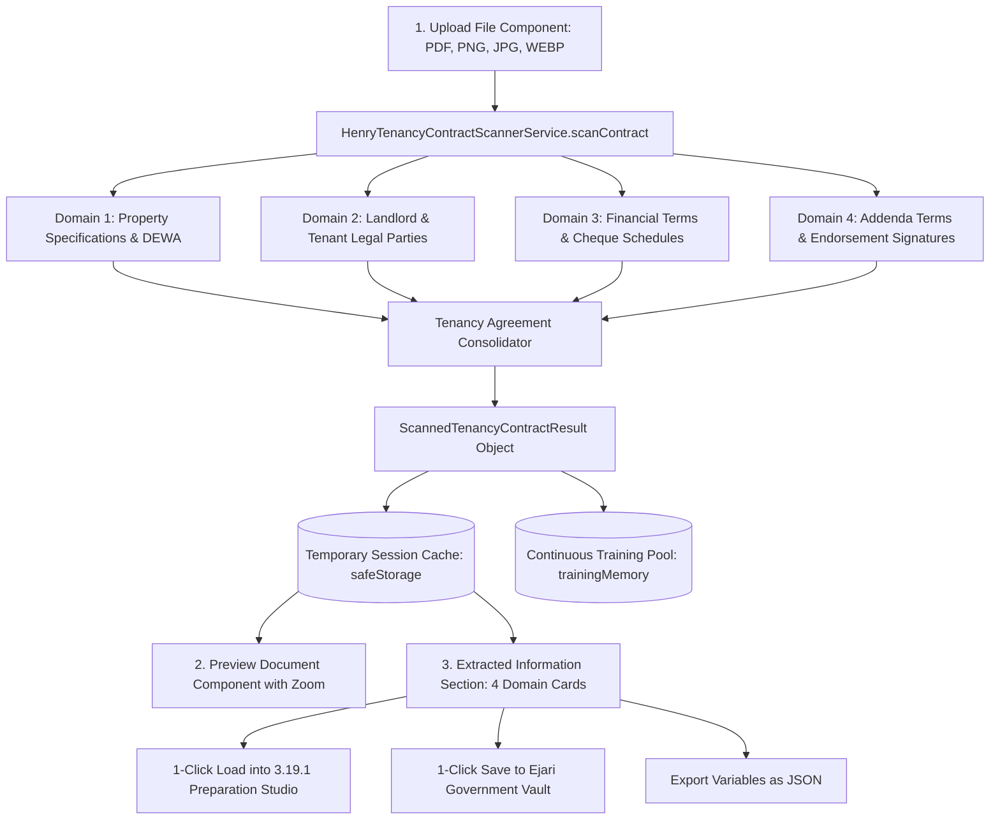

# 🏛️ Software Design Document (SDD): Henry AI Tenancy Contract Optical Ingestion Architecture

**Target System:** Henry AI Optical Extraction Engine (`WC-AI-003`)  
**Module:** `src/services/HenryTenancyContractScannerService.ts` & `src/components/crm/HenryDocumentStudio/HenryTenancyContractScannerView.tsx`  
**Governing Authority:** Dubai Land Department (DLD) / RERA / Ejari  
**Standard:** 3-Part UI Architecture + Temporary Session Store + Continuous Machine Learning

---

## 1. System Architecture & Processing Pipeline



---

## 2. TypeScript Data Schema (`ScannedTenancyContractResult`)

```typescript
export interface ScannedTenancyContractResult {
  // Classification & Fill State
  isFilled: boolean;
  fillScorePercent: number;
  totalFieldsCount: number;
  filledFieldsCount: number;
  missingFields: string[];
  classification: 'blank_template' | 'partially_filled' | 'fully_executed';
  documentFormat?: string;

  // Metadata
  contractDate: string;

  // Grouped Fields
  landlord: ScannedTenancyParty;
  tenant: ScannedTenancyParty;
  property: ScannedTenancyProperty;
  financials: ScannedTenancyFinancials;
  additionalTerms: string[];
  signatures: ScannedTenancySignatures;

  // Extraction Telemetry
  confidenceScore: number;
  scannedAt: string;
}
```

---

## 3. Temporary Session Store Architecture

```typescript
class HenryTenancyContractScannerService {
  private static readonly CACHE_KEY = 'whitecaves_henry_active_tenancy_contract_cache_v1';
  
  setCachedContract(data: ScannedTenancyContractResult): void;
  getCachedContract(): ScannedTenancyContractResult | null;
  clearCachedContract(): void;
  onContractUpdated(listener: (data: ScannedTenancyContractResult | null) => void): () => void;
}
```
