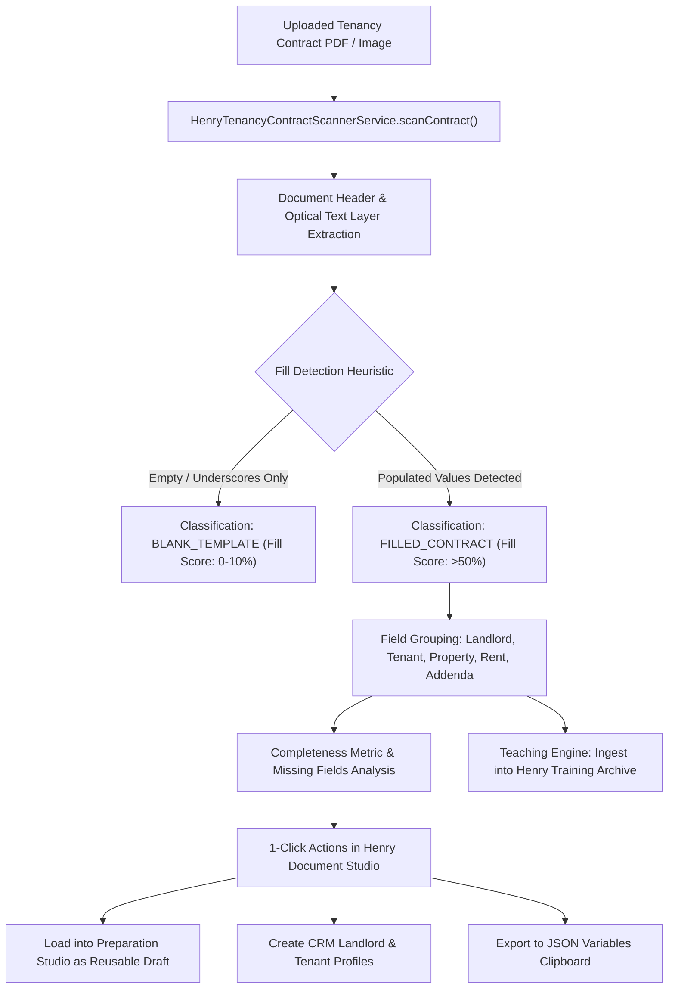

# Software Design Description (SDD)
## Henry AI — Tenancy Contract Optical AI Scanner & Learning Engine
**Document Version:** 1.0.0  
**Authority:** White Caves Real Estate L.L.C  
**System Module:** `HenryTenancyContractScannerService.ts`

---

### 1. Architecture & Processing Pipeline



---

### 2. TypeScript Data Interfaces

```typescript
export interface ScannedTenancyContractResult {
  // Classification
  isFilled: boolean;
  fillScorePercent: number;
  totalFieldsCount: number;
  filledFieldsCount: number;
  missingFields: string[];
  classification: 'blank_template' | 'partially_filled' | 'fully_executed';

  // Core Contract Details
  contractDate: string;
  
  // Landlord
  landlord: {
    ownerName: string;
    lessorName: string;
    emiratesId: string;
    email: string;
    phone: string;
    licenseNo?: string;
  };

  // Tenant
  tenant: {
    name: string;
    emiratesId: string;
    email: string;
    phone: string;
    licenseNo?: string;
  };

  // Property
  property: {
    usage: 'residential' | 'commercial' | 'industrial';
    buildingName: string;
    propertyNumber: string;
    plotNumber: string;
    propertyType: string;
    areaSqM: number;
    areaSqFt: number;
    location: string;
    makaniNo?: string;
    premisesNoDewa?: string;
  };

  // Financials & Lease
  financials: {
    periodFrom: string;
    periodTo: string;
    annualRentAed: number;
    contractValueAed: number;
    securityDepositAed: number;
    modeOfPayment: string;
  };

  // Addendum Clauses
  additionalTerms: string[];

  // Signatures
  signatures: {
    hasTenantSigned: boolean;
    tenantSignedDate?: string;
    hasLessorSigned: boolean;
    lessorSignedDate?: string;
  };

  // Telemetry
  confidenceScore: number;
  scannedAt: string;
}
```
