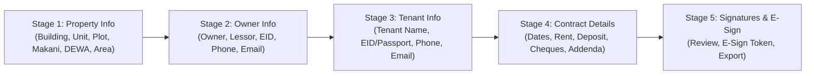

# Software Requirements Specification (SRS) — Addendum 2
## Henry AI — Multi-Contract Knowledgebase & 5-Stage Stepwise Preparation Pipeline
**Document Version:** 2.0.0  
**Authority:** White Caves Real Estate L.L.C (DET: `1388443`, RERA ORN: `44483`)  
**Standard:** Dubai Land Department (DLD) Unified Tenancy Contract Stepwise Ingestion & Auto-Fill  
**System Module:** `HenryTenancyContractScannerService.ts` / `HenryTenancyContractModal.tsx`

---

### 1. Executive Summary & Multi-Sample Training Pool
Henry AI has now ingested **multiple live executed DLD Tenancy Contracts** to build an adaptive machine learning knowledgebase for tenancy contract preparation and autonomous auto-filling.

The system enforces a strict **Stepwise Preparation Pipeline** before forwarding any lease agreement for client/landlord signature:
1. **Stage 1 — Property Information & Specifications** (Building, Unit, Plot, Makani, DEWA Premise #, Area Sq.M, Location, Usage)
2. **Stage 2 — Property Owner / Lessor Identity & Contacts** (Owner Name, Lessor Name, Emirates ID/Passport, Overseas Phone, Email)
3. **Stage 3 — Tenant Identity & Contacts** (Tenant Name, Emirates ID/Passport, Local Phone, Email)
4. **Stage 4 — Contract Details, Dates & Financial Schedules** (Period Start/End, Annual Rent AED, Deposit AED, PDC Cheques Count, 5 Addenda Clauses)
5. **Stage 5 — Endorsement Signatures & Digital E-Sign Link Generation**

---

### 2. Benchmark Training Contracts in Henry Knowledgebase

#### 🏛️ Benchmark 1: `SANIT_SINGH_CAMELIA_608_SAMPLE` (Townhouse / Land Lease)
- **Landlord:** `SANIT SINGH NAGPAL` (`784-1999-5371408-8`, `0504458097`)
- **Tenant:** `KESHIVANI MAYADEVAN` (`784-1984-7391875-7`, `050 7915250`)
- **Property:** `CAMELIA Unit 608`, Plot `176`, Area `112.24 m²`, `DAMAC HILLS 2`
- **Lease:** `13-07-2026` to `12-07-2027` | `AED 112,000` | Deposit `AED 5,600` | `3 CHEQUES`
- **Completeness:** `92% (18/20 Fields)`

#### 🏛️ Benchmark 2: `SVETLANA_JANUSIA_XH2858B_SAMPLE` (3BHK + Maid Villa / DEWA Integrated)
- **Landlord:** `SVETLANA LEVITSKAYA` (Overseas Investor, Phone `+974 5550 1054`, `svetlanaln@hotmail.com`)
- **Tenant:** `WILLIAM MICHAEL ABERNETHY` (EID `784-1979-2718379-4`, Phone `058 596 9529`, `wmabernethy@gmail.com`)
- **Property:** `Janusia Unit XH2858B`, Plot `6340`, Makani `257`, DEWA Premise `918014964`, Area `198.98 m²` ($2,141.80 \text{ sq.ft}$), Type `3 BHK + Maid Room`, `Damac Hills 2`
- **Lease:** `27-01-2026` to `26-01-2027` | `AED 120,000` | Deposit `AED 6,000` | `4 CHEQUES`
- **Addenda (Renewal & DAMAC Move-In):**
  1. *Addendum attached is integral part of contract.*
  2. *Renewal contract valid 1 year only; subject to landlord approval.*
  3. *Deposit paid from previous contract, non-refundable if uncleaned/damaged.*
  4. *Landlord arranges pre-move-in cleaning, painting, AC service.*
  5. *Key handover after EJARI, DEWA receipt, and MOVE-IN permit by DAMAC.*
- **Completeness:** `95% (19/20 Fields)`

---

### 3. Stepwise Preparation Sequence Matrix

