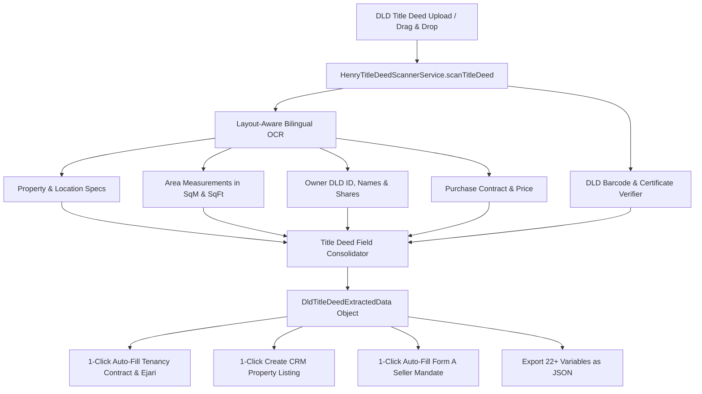

# 🏛️ Software Design Document (SDD): Henry AI Title Deed Optical Extraction Architecture

**Target System:** Henry AI Optical Extraction Engine  
**Module:** `src/services/HenryTitleDeedScannerService.ts`  
**Standard:** 4-Way Folder Architecture (`View.tsx` / `Logic.logic.ts` / `Style.style.ts` / `Data.data.ts`)  

---

## 1. System Architecture & Processing Pipeline



---

## 2. TypeScript Data Schema (`DldTitleDeedExtractedData`)

```typescript
export interface DldTitleDeedExtractedData {
  // Document Meta
  certificateNumber: string;         // e.g. "140764/2023"
  issueDate: string;                 // e.g. "18/07/2023"
  issuingAuthorityEn: string;        // "Government of Dubai - Land Department"
  issuingAuthorityAr: string;        // "حكومة دبي - دائرة الأراضي والأملاك"
  isBlockchainVerified: boolean;

  // Property Details
  propertyTypeEn: string;            // "Hotel Apartment"
  propertyTypeAr: string;            // "شقة فندقية"
  communityEn: string;               // "Madinat Hind 4" (DAMAC Hills 2)
  communityAr: string;               // "مدينة هند 4"
  plotNumber: string;                // "5120"
  municipalityNumber: string;        // "914 - 18558"
  buildingNumber: string;            // "1"
  buildingNameEn: string;            // "VIRIDIS A"
  buildingNameAr: string;            // "فريديس ايه A"
  propertyNumber: string;            // "504" (Unit)
  floorNumber: string;               // "5"
  parkingNumber: string;             // "P2-56"
  mortgageStatusEn: string;          // "Not mortgaged"
  mortgageStatusAr: string;          // "غير مرهونة"
  isMortgaged: boolean;

  // Area Measurements
  suiteAreaSqM: number;              // 32.48
  balconyAreaSqM: number;            // 6.28
  totalAreaSqM: number;              // 38.76
  totalAreaSqFt: number;             // 417.21
  commonAreaSqM: number;             // 12.65

  // Ownership Details
  ownerDldNumber: string;            // "6108481"
  ownerNameEn: string;               // "AKRAM DIB NEHME"
  ownerNameAr: string;               // "أكرم ديب نعمة"
  ownerSharePercent: number;         // 100
  ownedAreaSqM: number;              // 38.76

  // Conveyancing & Transaction History
  purchasedFromEn: string;           // "FRONT LINE INVESTMENT MANAGEMENT L.L.C"
  purchasedFromAr: string;           // "شركة الخط الأمامي لإدارة الاستثمار ش.ذ.م.م"
  registrationContractNumber: string;// "131762/2023"
  registrationDate: string;          // "18/07/2023"
  purchasePriceAed: number;          // 353000
  purchasePriceWordsEn: string;      // "Three Hundred Fifty Three Thousand UAE Dirhams only"

  // Extraction Confidence & Telemetry
  confidenceScore: number;           // 0.999
  scannedAt: string;                 // ISO timestamp
}
```
