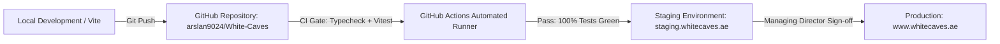

# 🚀 Deployment & Infrastructure Architecture Plan

**Entity:** WHITE CAVES REAL ESTATE L.L.C  
**Production Target:** `https://www.whitecaves.ae`  
**Hosting Environment:** Vercel (Edge Frontend) + AWS ECS / Node.js (API Backend) + MongoDB Atlas (Encrypted Database)  

---

## 1. Multi-Stage Pipeline Architecture

---

## 2. Environment Variables & Secret Configuration

| Variable | Description | Target |
|---|---|---|
| `VITE_DOMAIN` | Canonical domain (`https://www.whitecaves.ae`) | Frontend |
| `VITE_API_URL` | Express API Gateway (`/api`) | Frontend |
| `VITE_WHATSAPP_ENABLED` | WhatsApp telemetry socket trigger | Frontend |
| `MONGODB_URI` | MongoDB connection string (Encrypted) | Backend |
| `WHISPER_API_KEY` | OpenAI Whisper transcription API key | Backend |
| `DET_LICENSE_NO` | `1388443` | All |
| `RERA_ORN` | `44483` | All |
| `CORPORATE_TRN` | `100488291000003` | All |
