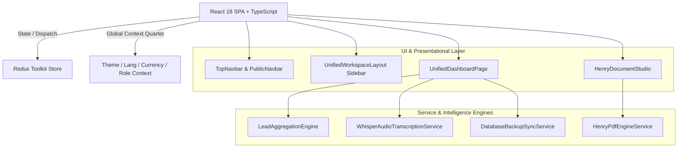

# 🏛️ Software Design Document (SDD) — Full Architecture Specification

**Product:** White Caves Real Estate Platform  
**Architecture Model:** 4-Way Folder Segregation (`View.tsx` / `Logic.logic.ts` / `Style.style.ts` / `Data.data.ts`)  
**Context Model:** Global Context Quartet (`Theme` + `Language` + `Currency` + `UserRole`)  

---

## 1. High-Level Architectural Layers



---

## 2. Global Context Quartet Architecture

1. **`ThemeContext.tsx`:** Manages `light`, `dark`, and `system` modes with CSS variables.
2. **`LanguageContext.tsx`:** Manages `en`, `ar`, `es`, `ru` with automatic `dir="rtl"` / `dir="ltr"` DOM switching.
3. **`CurrencyContext.tsx`:** Manages `AED`, `USD`, `EUR`, `GBP` with real-time FX rate conversions.
4. **`UserRoleContext.tsx`:** Manages 14 distinct roles (L1 to L5) with granular RBAC permissions and Founder Sovereign Bypass.

---

## 3. Directory Layout & Module Organization

```
src/
├── components/
│   ├── crm/HenryDocumentStudio/         # Henry AI PDF & Record Vault (4-Way Subfolder)
│   ├── layout/PublicNavbar/             # Navigation & UserPreferencesDropdown
│   └── TopNavbar/                       # Executive Glassmorphic Header
├── context/
│   ├── ThemeContext.tsx                 # Theme Mode Provider
│   ├── LanguageContext.tsx              # Multi-Language Provider
│   ├── CurrencyContext.tsx              # Currency & FX Provider
│   └── UserRoleContext.tsx              # 14-Role Sovereign Registry Provider
├── layouts/
│   └── UnifiedWorkspaceLayout.tsx       # Master Workspace & Sidebar View
├── services/
│   ├── HenryPdfEngineService.ts         # High-DPI PDF & Contract Engine
│   ├── WhisperAudioTranscriptionService.ts # Voice Note Transcription
│   └── DatabaseBackupSyncService.ts     # Encrypted Cold Backup Service
└── config/
    └── constants.ts                     # Authoritative Corporate Master Data
```
