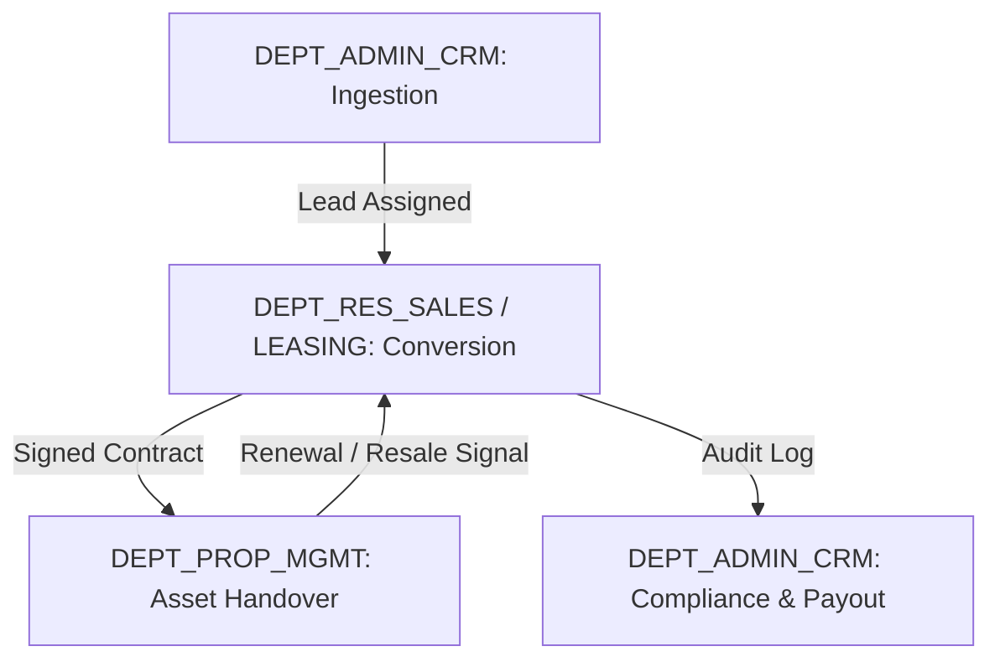

# White Caves Real Estate LLC — Department Operations Manual

**Document Classification:** Standard Operating Procedures (SOP)  
**Governance Authority:** @Ada (Chief Architect) + @Margaret (Strategic Planner)  
**Managing Director:** Arsalan Malik  
**Last Updated:** 2026-07-22

---

## 1. Executive Summary & Operational Framework

This manual establishes the mandatory operating procedures, daily performance mandates, Key Performance Indicator (KPI) thresholds, and authorization sign-off hierarchies across the 4 primary operational departments of White Caves Real Estate LLC:

1. `DEPT_RES_LEASING` — Residential Leasing
2. `DEPT_RES_SALES` — Residential Sales & Investment Advisory
3. `DEPT_PROP_MGMT` — Property Management
4. `DEPT_ADMIN_CRM` — Operations, CRM & Software Engineering

---

## 2. Departmental Mandates & Performance Standards

### 2.1 Residential Leasing (`DEPT_RES_LEASING`)

- **Core Mandate:** Rapid execution of residential tenancy agreements across DAMAC Hills 2, DAMAC Hills, and Dubailand portfolios.
- **Daily Operating Procedures:**
  1. Morning lead triage (08:30 GST) — Review all incoming portal inquiries (Property Finder, Bayut, Website).
  2. Viewing schedule confirmation — Auto-send digital business cards and location pins via WhatsApp to clients.
  3. Lease proposal preparation — Generate standardized Ejari draft forms and tenancy contracts.
  4. Cheque verification — Verify Post-Dated Cheques (PDC) against bank routing codes and landlord requirements.
- **KPI Performance Targets:**
  - Lead-to-Viewing Conversion Rate: **≥ 35%**
  - Deal Execution Cycle Time: **≤ 5 Days** (from lead creation to Ejari registration)
  - Renewal Rate Efficiency: **≥ 80%** (executed 60 days prior to lease expiry)
- **Authorization Sign-Off Tokens:**
  - Lease Agreement Generation: Level 2+ (Certified Broker)
  - Ejari Registration Final Sign-Off: Level 3+ (Senior Leasing Advisor)
  - Rent Discount / Payment Plan Exemption: Level 4+ (Leasing Manager)

---

### 2.2 Residential Sales & Investment Advisory (`DEPT_RES_SALES`)

- **Core Mandate:** High-value secondary sales and off-plan investment advisory in DAMAC Hills, Palm Jumeirah, and luxury Dubai sectors.
- **Daily Operating Procedures:**
  1. Portfolio valuation updates — Refresh automated valuation models (AVM) for active listings.
  2. Client consultation & Form A registration — Secure formal seller listing agreements.
  3. Memorandum of Understanding (MOU / Form F) draft review — Ensure RERA Form F compliance.
  4. DLD Oqood off-plan registration — Manage buyer escrow payments and developer approval slots.
- **KPI Performance Targets:**
  - Gross Written Commission (GWC) Run-Rate: **≥ AED 100,000 / month per agent**
  - Viewing-to-Offer Conversion Rate: **≥ 20%**
  - Average Sales Closing Velocity: **≤ 21 Days**
- **Authorization Sign-Off Tokens:**
  - Form A / Listing Creation: Level 2+ (Sales Executive)
  - Form F (MOU) Binding Agreement Execution: Level 3+ (Gold Producer / Senior Advisor)
  - Commission Split Deviation / Fee Reduction: Level 5 Only (Managing Director — Arsalan Malik)

---

### 2.3 Property Management (`DEPT_PROP_MGMT`)

- **Core Mandate:** End-to-end asset care, tenant relations, rent collection, and maintenance management for managed landlord units.
- **Daily Operating Procedures:**
  1. Maintenance ticket intake & urgency classification (P1 Urgent vs P2 Routine).
  2. Vendor dispatch & cost estimate review.
  3. Quarterly property inspections & condition report uploads.
  4. Rent disbursement & PDC deposit reconciliation.
- **KPI Performance Targets:**
  - Maintenance Resolution Velocity: **≤ 24 Hours** (P1 Urgent) / **≤ 48 Hours** (P2 Routine)
  - Rent Collection Timeliness: **≥ 98%** on cheque due date
  - Tenant Retention Rate: **≥ 85%**
- **Authorization Sign-Off Tokens:**
  - Work Order Approval (< AED 2,000): Level 3+ (Property Manager)
  - Major Repairs / CapEx (> AED 2,000): Level 4+ / Landlord Formal Sign-Off
  - Security Deposit Refund Release: Level 4+ (Operations Manager)

---

### 2.4 Operations, CRM & Systems (`DEPT_ADMIN_CRM`)

- **Core Mandate:** Platform stability, compliance auditing, AI Assistant orchestration, and data security governance.
- **Daily Operating Procedures:**
  1. Automated webhook monitoring — Verify Property Finder and Bayut lead ingestion pipelines.
  2. AI Telemetry audit — Inspect WhatsApp SLA (< 1.5s response time) and automated AI responses.
  3. RBAC & Data Audit — Ensure strict level 1–5 data isolation and prevent unauthorized data exports.
- **KPI Performance Targets:**
  - System Uptime SLA: **99.9%**
  - Webhook Lead Ingestion SLA: **< 15 seconds**
  - Compliance Audit Defect Rate: **0%** (RERA & UAE PDPL)
- **Authorization Sign-Off Tokens:**
  - RBAC Role Promotion: Level 5 Only (Principal Founder / System Superuser)
  - System Backup / Data Purge: Level 5 Only (Managing Director — Arsalan Malik)

---

## 3. Cross-Departmental Handoff Protocols

1. **Lead Handoff:** Ingested lead auto-assigned by CRM router within 15 minutes.
2. **Deal Handoff:** Once lease or sale contract is signed, transaction data passes to `DEPT_ADMIN_CRM` for commission calculation.
3. **Management Handoff:** Managed units transition automatically to `DEPT_PROP_MGMT` for onboarding.
