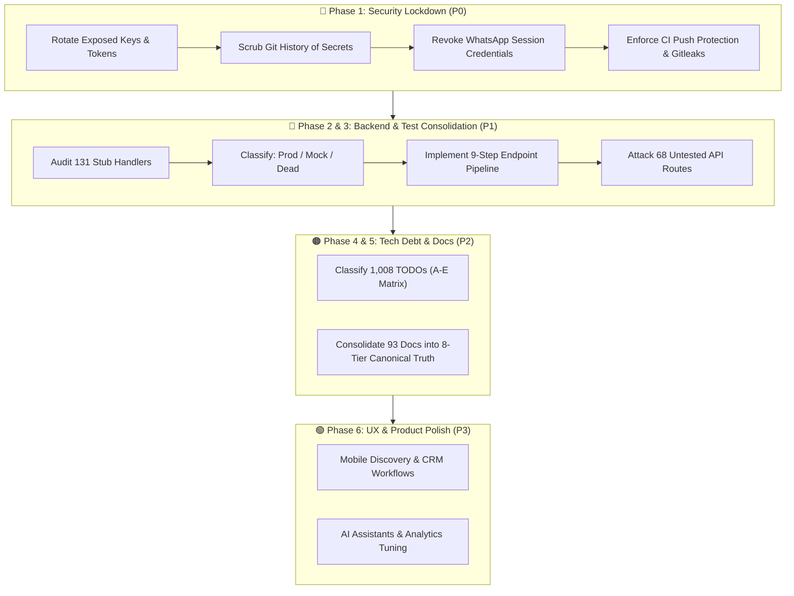
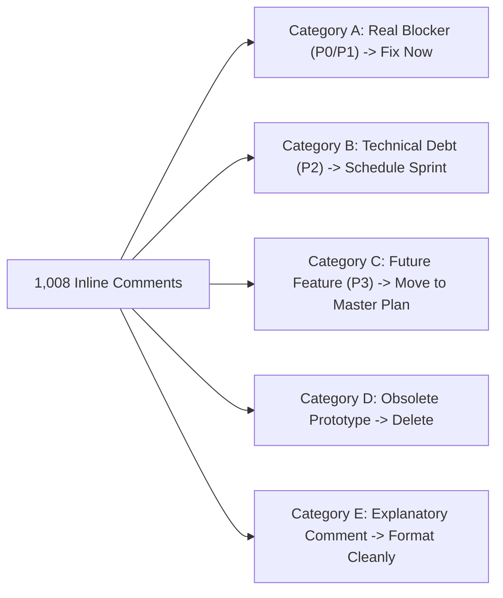
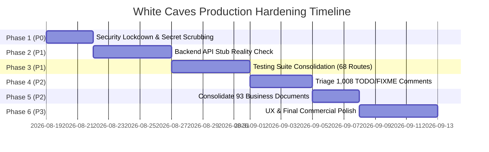

# 🛡️ White Caves Platform — Executive Technical Audit & Production Hardening Roadmap

> **Author & Reviewer:** Lead Enterprise Architect / Senior Advisory Review  
> **Target Repository:** [White Caves GitHub Repository (`arslan9024/White-Caves`)](https://github.com/arslan9024/White-Caves)  
> **Operating Status:** Active Multi-Expert Operating Model  
> **Release Target:** Enterprise Sovereign Production Hardening (P0 $\rightarrow$ P3)  
> **Source of Truth:** Canonical System Audit (`docs/EXECUTIVE_TECHNICAL_AUDIT_AND_HARDENING_ROADMAP.md`)

---

## Executive Summary & Overall Assessment

The White Caves Real Estate platform is substantially further along than a typical early-stage or unfinished application. It features deep domain functionality, extensive UI components, an ambitious 14-role sovereign identity model, and a rich multi-assistant ecosystem. 

However, development velocity has outpaced technical consolidation, leading to **significant accumulated technical debt and operational complexity**. 

> [!IMPORTANT]
> **Core Diagnosis:** The primary challenge is not a lack of features. The platform is highly orchestrated, while the repository issue tracker and codebase scans reveal critical unfinished work in security, backend handler implementation, route test coverage, and documentation fragmentation.
>
> We do not need a rewrite. We need an immediate, disciplined **Hardening + Consolidation Phase** before any further random feature additions occur.

---

## 📊 1. Current Quantified Technical Debt Backlog

The table below summarizes the quantitative findings across the repository. 

> [!NOTE]
> **Important Scoping Rule:** These numbers represent overlapping analytical lenses and scan categories across technical debt, not 1,480 distinct isolated defects. They must be resolved systematically by domain.

| Area / Scan Dimension | Metric / Finding | Severity / Priority | Primary Reference |
| :--- | :--- | :---: | :--- |
| **Open GitHub Issues** | 52 open issues | 🔴 P0 / P1 | [GitHub Issue Tracker](https://github.com/arslan9024/White-Caves/issues) |
| **Stub / Empty API Handlers** | 131 handlers | 🔴 P1 | [GitHub Issue #170](https://github.com/arslan9024/White-Caves/issues/170) |
| **TODO / FIXME / STUB Comments** | 1,008 inline comments | 🟠 P2 | Codebase Static Analysis Scan |
| **Under-Specified Business Docs** | 93 business documents | 🟠 P2 | [GitHub Issue #172](https://github.com/arslan9024/White-Caves/issues/172) |
| **Untested API Routes** | 68 routes without tests | 🔴 P1 | [GitHub Issue #171](https://github.com/arslan9024/White-Caves/issues/171) |
| **Missing-Test Scan Findings** | 68 test gap findings | 🔴 P1 | [GitHub Issue #176](https://github.com/arslan9024/White-Caves/issues/176) (`appointments.js`) |
| **High-Impact TODO Hotspots** | 20+ critical blocker items | 🟠 P1 | Core CRM & Escrow Modules |
| **Security Hardening Findings** | 20+ findings requiring remediation | 🔴 P0 | Secrets, Session Auth & Permissions |
| **CI/CD Workflows** | 10+ named active workflows | 🟡 Info | `.github/workflows/` |
| **CI/CD Workflow Runs** | 2,500+ completed runs | 🟡 Info | [GitHub Actions Activity](https://github.com/arslan9024/White-Caves/actions) |
| **Repository Git Commits** | 2,044+ commits | 🟡 Info | `main` branch commit history |

---

## 🎯 2. Platform Maturity Scorecard

| Assessment Dimension | Rating | Evaluation & Status Context |
| :--- | :---: | :--- |
| **Product Vision** | **9.0 / 10** | Comprehensive vision covering luxury Dubai brokerage, DLD/RERA compliance, DH2 hub, and client portals. |
| **Feature Breadth** | **9.0 / 10** | Expansive scope across CRM, AI assistants, optical scanning, document generation, and analytics. |
| **Architecture Ambition** | **8.5 / 10** | Advanced multi-role sovereign RBAC, decoupled frontend layouts, Redux slices, and microservices. |
| **Frontend Foundation** | **8.0 / 10** | Polished React/TypeScript views, design token system, responsive styling, and interactive dashboards. |
| **Backend Maturity** | **6.5 / 10** | Express/Prisma structure is established, but 131 stubs and mock simulation fallbacks require completion. |
| **Testing Maturity** | **6.5 / 10** | 62+ dashboard test suites passing, but 68 backend API routes lack automated test coverage. |
| **Security Posture** | **4.0 / 10** 🔴 | **Critical concern:** Exposed credentials, git history secrets, and unignored session directories require immediate lockdown. |
| **Documentation Quality** | **6.0 / 10** | Vast documentation ecosystem, but suffering from fragmentation across 93 under-specified documents. |
| **Codebase Maintainability** | **5.5 / 10** | High complexity with 1,008 TODO comments; requires modular boundary enforcement and dead-code pruning. |
| **Production Readiness** | **6.0 / 10** | Strong visual demo capabilities, but blocked from live commercial deployment until P0 security is sealed. |
| **Overall Platform Score** | **~6.5 / 10** | **Solid foundation requiring a targeted Hardening + Consolidation Phase.** |

---

## 🔴 3. Critical Findings & Strategic Action Plans



---

### 🔴 Finding 1: Security Hardening (P0 — Immediate Top Priority)

The repository contains critical open security items regarding credential exposures that must be resolved prior to any feature work:
- **[Issue #188](https://github.com/arslan9024/White-Caves/issues/188):** Possible exposed credential — requires immediate rotation.
- **[Issue #187](https://github.com/arslan9024/White-Caves/issues/187):** Exposed environment secret in `.env.local.backup...`.
- **WhatsApp Session Artifacts:** Folders such as `.wwebjs_auth/` are represented in repository history despite `.gitignore` rules identifying them as secrets.

#### Required Security Actions:
1. **Credential Rotation:** Rotate every potentially exposed API key, third-party token, database password, and webhook secret immediately.
2. **Git History Scrubbing:** Audit the entire git history using `git-filter-repo` or BFG Repo-Cleaner to permanently scrub all `.env*`, `.backup`, and exposed secret strings.
3. **Session Invalidation:** Revoke all legacy WhatsApp session tokens and purge authentication directory state.
4. **Environment File Audit:** Verify that `.gitignore` strictly rejects `.env`, `.env.*`, `*.backup`, `*.pem`, and `*.key`. Remove sensitive files from remote tracking.
5. **Automated Secret Scanning in CI:** Integrate Gitleaks / Trufflehog into `.github/workflows/` and enable GitHub Push Protection to reject any commit containing high-entropy keys.

---

### 🔴 Finding 2: Incomplete Backend API Handlers (P1 — Issue #170)

The issue tracker identifies **131 stub/empty API handlers** ([Issue #170](https://github.com/arslan9024/White-Caves/issues/170)). While the frontend UI is sophisticated, underlying business logic and database mutations are partially simulated.

#### 9-Step Production Endpoint Pipeline:
Every endpoint must pass through a strict, non-negotiable execution pipeline:
$$\text{Route} \longrightarrow \text{Authentication} \longrightarrow \text{Authorization (RBAC)} \longrightarrow \text{Validation (Zod)} \longrightarrow \text{Business Logic} \longrightarrow \text{Database (Prisma)} \longrightarrow \text{Error Handling} \longrightarrow \text{Audit Logging} \longrightarrow \text{Automated Tests}$$

#### Handler Triage & Classification Matrix:
Do not implement all 131 handlers blindly. Group them into 6 strict buckets:
- ✅ **Production Ready:** Fully wired with validation, DB access, and error handling.
- 🟡 **Partially Implemented:** Functional logic present; missing Zod schema, RBAC check, or audit log.
- 🔴 **Stub:** Empty route returning `{ status: 'ok' }` or placeholder string $\rightarrow$ implement required ones.
- 🔴 **Mock/Demo Behavior:** Hardcoded arrays in route handlers $\rightarrow$ replace with Prisma queries.
- 🔴 **Dead / Unused:** Legacy prototypes unreferenced by frontend $\rightarrow$ mark for deletion.
- 🗑️ **Remove:** Redundant routes $\rightarrow$ immediately purge from codebase.

---

### 🔴 Finding 3: Test Suite Consolidation & Coverage (P1 — Issues #171 & #176)

The issue tracker identifies **68 untested routes** ([Issue #171](https://github.com/arslan9024/White-Caves/issues/171)) and missing-test scan findings around appointment scheduling ([Issue #176](https://github.com/arslan9024/White-Caves/issues/176)).

#### Cross-Domain Criticality:
Because White Caves integrates **CRM, Properties, Leasing, Ejari Tenancy, Commission Splits, Payment Gateways, KYC/AML, WhatsApp, Notifications, Documents, and AI Assistants**, a silent defect in one module cascades into financial or regulatory failure.

#### 5-Tier Testing Hierarchy (Mandatory Before Deployment):
1. **Unit Tests:** Business logic utilities, mathematical calculators, VAT 5%, and date formatters.
2. **API Endpoint Tests:** Supertest HTTP assertions validating request payloads, status codes, and error envelopes.
3. **Permission Tests:** Negative RBAC tests asserting that lower roles (`intern`, `guest`) cannot trigger privileged actions (`can_approve_deals`, `can_override_sla`).
4. **Integration Tests:** Prisma database transactions, Redis cache invalidations, and BullMQ queue events.
5. **E2E Smoke Tests:** Playwright user journeys across login, contract generation, property search, and signing workflows.

#### Priority Order for Untested Route Remediation:
1. `auth` & `users` (Identity & Session security)
2. `crm` & `deals` (Pipeline & Lead management)
3. `properties` & `inventory` (Listing data integrity)
4. `leasing` & `tenancyAgreements` (Ejari & Tenancy contracts)
5. `payments` & `invoicesLease` (Financial calculations & VAT)
6. `compliance` & `aml` (KYC, PEP, and goAML compliance)
7. `whatsapp` & `notifications` (Real-time communications)

---

### 🟠 Finding 4: Triage of 1,008 TODO/FIXME/STUB Comments (P2)

The accumulation of **1,008 TODO/FIXME/STUB comments** indicates rapid feature expansion without systematic debt retirement.

#### 5-Category Triage Framework:



- **Category A (Real Production Blocker):** Missing authorization check, unhandled promise rejection, broken database relation $\longrightarrow$ **Fix immediately in active sprint**.
- **Category B (Technical Debt):** Unoptimized query, missing index, lack of retry loop $\longrightarrow$ **Log in 100-Issue Backlog (`plans/OPEN_100_ISSUES_AND_GIT_WORKFLOW.md`)**.
- **Category C (Future Enhancement):** Planned VR feature, advanced analytics sparkline $\longrightarrow$ **Transfer to `plans/MASTER_PLAN.md` and remove inline comment**.
- **Category D (Obsolete):** References to deprecated experimental features $\longrightarrow$ **Delete comment and associated dead code**.
- **Category E (Documentation / Comment Only):** General developer notes explaining complex Dubai legal logic $\longrightarrow$ **Convert into standard JSDoc / TSDoc block**.

---

### 🟠 Finding 5: Business Documentation Hierarchy (P2 — Issue #172)

The repository contains **93 under-specified business documents** across phases, waves, readiness packets, SDDs, and agent logs. This volume creates ambiguity regarding which document represents the canonical source of truth.

#### The 8-Tier Canonical Documentation Hierarchy:
All architectural and implementation decisions must trace through this single unified chain of custody:

```text
1. PROJECT_VISION         (High-level business mission & executive objectives)
   ↓
2. MASTER_PLAN            (Canonical milestone roadmap & wave governance)
   ↓
3. ARCHITECTURE           (System topology, infrastructure & sovereign RBAC)
   ↓
4. BUSINESS_MODULE_SPEC   (Detailed business rules, DLD/RERA legal constraints)
   ↓
5. API_CONTRACT           (OpenAPI / Zod request-response specifications)
   ↓
6. DATABASE_SCHEMA        (Prisma data models, relations & indices)
   ↓
7. TEST_PLAN              (Verification matrices, QA criteria & test suites)
   ↓
8. IMPLEMENTATION         (Production TypeScript/React/Express code)
```

> [!TIP]
> Any auxiliary documentation, experimental notes, or historical scratch files that do not directly support one of these 8 tiers must be consolidated or archived under `docs/archives/`.

---

### 🟠 Finding 6: Architectural Simplification & Modular Boundaries

The project architecture spans React, TypeScript, Redux Toolkit, Vanilla CSS, styled-components, Framer Motion, multiple React contexts, 12 corporate departments, 35 AI assistants, and custom AEGIS orchestrator tools.

To prevent architectural overhead from competing with business delivery, we enforce **strict domain boundaries** without adding extra frameworks:

```text
src/ (or server/)
├── crm/           → Leads, Contacts, Deals, Activities
├── property/      → Listings, Projects, Units, Inventory
├── leasing/       → Tenants, Landlords, Contracts, Renewals
├── finance/       → Invoices, Payments, Commissions, VAT
├── compliance/    → KYC, AML, RERA, Documents
└── communication/ → WhatsApp, Email, Notifications, Campaigns
```

Each module maintains encapsulated ownership over its UI views, business logic hooks, API routes, and test suites.

---

### 🟡 Finding 7: CI/CD Pipeline Quality Over Quantity

The repository maintains **10+ active CI/CD workflows** with over **2,500+ workflow runs**. While pipeline automation is mature, the focus must shift from workflow volume to **gating quality**:
- Memory-safe runner flags (`NODE_OPTIONS=--max-old-space-size=8192` and `--pool=forks`) to prevent V8 heap crashes.
- First-class security vulnerability gating (`npm audit --audit-level=high`, secret scanners).
- Hard failure on TypeScript compilation errors (`tsc --noEmit`).
- Zero console error tolerance in automated test runs.

---

## 🚀 4. The 6-Phase Production Hardening Execution Plan



### Phase 1: Security Lockdown (P0 — Immediate)
- Rotate all exposed credentials and third-party tokens.
- Scrub git commit history of sensitive `.env*` files and secrets.
- Invalidate and purge `.wwebjs_auth/` session directories.
- Configure CI/CD automated secret scanning and GitHub Push Protection.
- Audit authentication, authorization, and 14-role RBAC permission boundaries.

### Phase 2: Backend Reality Check (P1)
- Audit all 131 stub/empty API handlers.
- Classify into: Production Ready, Implement Required, or Delete Obsolete.
- Wire database queries, Zod validation, and error envelopes to all active endpoints.

### Phase 3: Testing Consolidation (P1)
- Resolve 68 untested routes with automated integration tests.
- Address missing-test scan findings in `appointments.js` and CRM hubs.
- Enforce Vitest coverage gates ($\ge 80\%$) and zero-warning test execution.

### Phase 4: Technical Debt Triage (P2)
- Process 1,008 inline TODO/FIXME/STUB comments using the A–E triage matrix.
- Resolve real blockers (Category A) and schedule debt items (Category B).

### Phase 5: Documentation Consolidation (P2)
- Reorganize 93 fragmented business documents into the canonical 8-tier hierarchy.
- Subordinate and archive non-canonical notes into `docs/archives/`.

### Phase 6: UX & Product Polish (P3)
- Final polish for dashboard views, mobile responsiveness, property discovery, and WhatsApp AI concierges.

---

## 👥 5. Operational Governance & Role Allocation

To eliminate unstructured feature drift and ensure systematic execution of this hardening roadmap, the project enforces a clear operating model:

| Role | Entity / Agent | Core Responsibilities |
| :--- | :--- | :--- |
| **Lead Architect & Reviewer** | Lead Human Architect / Senior Advisory Review | Sets architectural standards, performs code reviews, governs P0/P1 triage, and approves pull requests. |
| **Implementation Engineer** | Antigravity AI / GitHub Copilot Agent Mesh | Executes specific, small-batch tasks strictly derived from the approved P0 $\rightarrow$ P3 backlog. |

### Target Backlog Sizing:
- **P0 Blockers:** ~10–15 critical security, secret, and authentication items.
- **P1 Core Fixes:** ~50–100 high-impact backend handler and test route implementations.
- **P2 Technical Debt:** Structured cleanup of TODOs, query optimizations, and documentation.
- **P3 Future Enhancements:** Advanced commercial features and UI micro-interactions.

---

## 📑 6. Cross-References & Related Specifications

- **100 Master Open Issues Catalog:** [`plans/OPEN_100_ISSUES_AND_GIT_WORKFLOW.md`](file:///c:/Users/HP/Documents/My%20Web%20Sites/AntigravityWC/White-Caves/plans/OPEN_100_ISSUES_AND_GIT_WORKFLOW.md)
- **Active Task Queue:** [`plans/PENDING_TASKS_ONLY.md`](file:///c:/Users/HP/Documents/My%20Web%20Sites/AntigravityWC/White-Caves/plans/PENDING_TASKS_ONLY.md)
- **Project Progress Tracker:** [`PROJECT_PROGRESS.md`](file:///c:/Users/HP/Documents/My%20Web%20Sites/AntigravityWC/White-Caves/PROJECT_PROGRESS.md)
- **Software Engineering Manifest:** [`docs/software_docs/core_engineering_manifest.md`](file:///c:/Users/HP/Documents/My%20Web%20Sites/AntigravityWC/White-Caves/docs/software_docs/core_engineering_manifest.md)
- **GitHub Repository:** [White Caves (`arslan9024/White-Caves`)](https://github.com/arslan9024/White-Caves)
