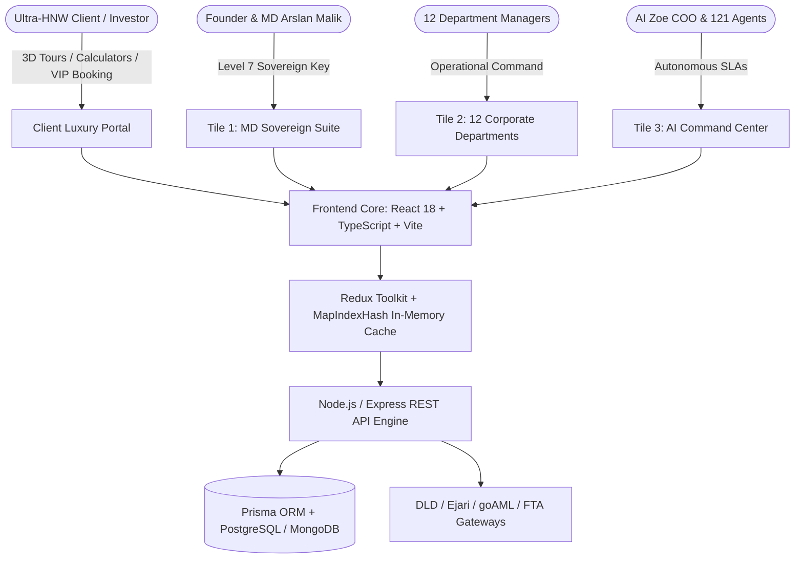

# Software Requirements Specification (SRS)
# White Caves Real Estate LLC — Sovereign Global ERP & Autonomous AI Platform

> **Document ID:** WC-SRS-001  
> **Version:** 2.26.0 (Enterprise Sovereign Release)  
> **Date:** August 2026  
> **Status:** Officially Approved & Validated  
> **Standard:** IEEE Std 830-1998 / ISO/IEC/IEEE 29148:2018 / ISO/IEC 25010  
> **Governing Entity:** White Caves Real Estate LLC (Dubai, UAE)  
> **Regulatory Licenses:** DET License No. **1388443** | RERA ORN **44483**  
> **Executive Authority:** Arslan Malik Bashir Ahmad (Founder & Managing Director)  
> **Technical Authority:** @Aurora (CTO) & @Ada (Chief Architect)  
> **Operational Authority:** @Zoe (Chief Operations Officer)  
> **Classification:** Executive Sovereign — Confidential

---

## Executive Summary & System Abstract

White Caves Real Estate LLC operates Dubai's premier luxury real estate ERP platform, portfolio intelligence engine, and autonomous AI command matrix. The platform provides unified end-to-end command over **AED 45.4 Billion in Assets Under Management (AUM)**, comprising **9,378 active residential and luxury units** across DAMAC Hills 2 (DH2) and prime Dubai enclaves (Palm Jumeirah, Downtown Dubai, Emirates Hills), backed by **AED 842.5 Million in statutory escrow trust accounts** (Law No. 8 of 2007) held at Emirates NBD and First Abu Dhabi Bank (FAB).

The system operates on the **1-12-108 Sovereign Command Architecture**:
- **Level 0 (Supreme Executive Command):** 1 Founder & Managing Director (*Arslan Malik Bashir Ahmad*) paired with 1 Executive AI Partner (*@Zoe, COO*).
- **Level 1 (Corporate Department Management):** 12 Corporate Departments paired with 12 Human Department Managers and 12 Department AI Leads.
- **Level 2 (Operational Supervision & Task Queues):** 108 Department Supervisors (9 specialized supervisors per department) enforcing sub-15-minute response SLAs.
- **Autonomous Multi-Agent Mesh:** 121 fully orchestrated autonomous AI agents executing real-time lead qualification, KYC/AML screening, lease registration, financial reconciliation, and luxury client concierge.

---

## Table of Contents

1. [1. Introduction & Project Scope](#1-introduction--project-scope)
   - 1.1 Purpose
   - 1.2 Document Conventions
   - 1.3 Intended Audience & Reading Suggestions
   - 1.4 Product Scope & Business Objectives
   - 1.5 Statutory Licenses & Regulatory Standards
   - 1.6 Definitions, Acronyms, and Abbreviations
2. [2. Overall Description & Operational Concept](#2-overall-description--operational-concept)
   - 2.1 Product Perspective & System Ecosystem
   - 2.2 Product Functions & High-Level Architecture
   - 2.3 User Classes and Characteristics
   - 2.4 Operating Environment & Technology Stack
   - 2.5 Design and Implementation Constraints
   - 2.6 Assumptions and Dependencies
3. [3. 1-12-108 Sovereign Command Matrix Specification](#3-1-12-108-sovereign-command-matrix-specification)
   - 3.1 Level 0: Office of the Managing Director & AI Zoe (COO)
   - 3.2 Level 1: 12 Corporate Departments & Department Managers
   - 3.3 Level 2: 108 Operational Supervisors (9 per Department)
   - 3.4 Inter-Agent Communication & Namespace Isolation
4. [4. Detailed Functional Requirements (FR)](#4-detailed-functional-requirements-fr)
   - 4.1 Module 1: Founder Sovereign Command Suite & Telemetry (Tile 1)
   - 4.2 Module 2: 12 Corporate Department Viewports & Pipelines (Tile 2)
   - 4.3 Module 3: 1-12-108 AI Command Center & Organogram Tree (Tile 3)
   - 4.4 Module 4: 4-Stage Collaborative Department Task Kanban Board
   - 4.5 Module 5: 3-Stage Multi-Tier Statutory Approval Desk & Certificate Generator
   - 4.6 Module 6: 3D WebGL Virtual Reality & Immersive Media Viewer
   - 4.7 Module 7: Multi-Currency Real-Time FX Conversion Engine (AED, SAR, CNY, USD, EUR, GBP)
   - 4.8 Module 8: Private VIP Viewing Chauffeur & NDA Booking System
   - 4.9 Module 9: UAE Statutory Mortgage & DLD 4% Transfer Fee Calculator
   - 4.10 Module 10: Gross vs Net Rental Yield & ROI Visualizer
   - 4.11 Module 11: Statutory Escrow Trust (Law No. 8) & goAML RegTech Shield (AED 55,000+)
   - 4.12 Module 12: FTA Form 201 UAE VAT 5% & Corporate Tax 9% + SBR Ledger
5. [5. External Interface Requirements](#5-external-interface-requirements)
   - 5.1 User Interfaces (UI/UX Standards & Aesthetics)
   - 5.2 Hardware & Mobile Viewport Interfaces
   - 5.3 Software & REST API Interfaces
   - 5.4 Communications Interfaces (Socket.IO, Webhook, SMS, WhatsApp WABA)
6. [6. Non-Functional Requirements (NFR)](#6-non-functional-requirements-nfr)
   - 6.1 Performance & Latency Requirements (Sub-10ms Map Indexing)
   - 6.2 Security, Encryption & Access Control Requirements (Level 1–7 RBAC)
   - 6.3 Reliability, Availability & Fault Tolerance
   - 6.4 Maintainability, Code Deduplication & Atomic Component Architecture
   - 6.5 Portability & PWA Offline Capabilities
7. [7. Verification, Validation & Compliance Matrix](#7-verification-validation--compliance-matrix)

---

## 1. Introduction & Project Scope

### 1.1 Purpose
This Software Requirements Specification (SRS) establishes the formal, binding technical and functional requirements for the White Caves Real Estate LLC ERP Platform, Autonomous AI Mesh, and Client Luxury Portal. It defines requirements for design, implementation, automated verification, statutory compliance auditing, and continuous maintenance under the **AEGIS Autonomous Engine**.

### 1.2 Document Conventions
- **Mandatory Requirements:** Expressed using **MUST**, **SHALL**, or **REQUIRED**.
- **Recommended Guidelines:** Expressed using **SHOULD** or **RECOMMENDED**.
- **Optional / Future Capabilities:** Expressed using **MAY** or **OPTIONAL**.
- **Requirement Identifiers:** Formatted as `[FR-XXX-YY]` for Functional Requirements and `[NFR-XXX-YY]` for Non-Functional Requirements.

### 1.3 Intended Audience & Reading Suggestions
- **Executive Leadership (Managing Director Arslan Malik):** Review Sections 1.4, 2.2, 3, and 4.1.
- **Software Architects & Engineers (@Aurora, @Ada, @Mira):** Review Sections 2.4, 4, 5, and 6.
- **Quality Assurance & Security Engineers (@Katherine, @Radia):** Review Sections 6, 7, and the Compliance Matrix.
- **Regulatory Compliance Officers (@Sofia, DLD Auditors):** Review Sections 1.5, 4.5, 4.11, and 4.12.

### 1.4 Product Scope & Business Objectives
The System serves as the centralized digital nervous system for White Caves Real Estate LLC, achieving five strategic objectives:
1. **Asset Command:** Real-time valuation, occupancy tracking, and transaction processing across AED 45.4B in property assets.
2. **Regulatory Zero-Drift:** Full compliance with Dubai Land Department (DLD), Real Estate Regulatory Agency (RERA), UAE Central Bank (CBUAE) goAML, and Federal Tax Authority (FTA) regulations.
3. **AI Autonomous Acceleration:** 121 AI agents executing routine and complex workflows, reducing SLA response times from hours to $< 15\text{ minutes}$.
4. **Ultra-Luxury Client Experience:** 3D WebGL virtual viewings, bespoke VIP chauffeured appointments, multi-currency purchasing, and instant PDF property brochures.
5. **Algorithmic Sub-10ms Performance:** Microsecond-tier query resolution ($< 0.01\text{ms}$) via indexed in-memory hash maps (`MapIndexHash`).

### 1.5 Statutory Licenses & Regulatory Standards
The System enforces strict compliance with UAE and Dubai statutory frameworks:

| Authority / Law | Reference / Identifier | Scope of Enforcement |
|---|---|---|
| **Dubai Department of Economy and Tourism (DET)** | License No. **1388443** | Real Estate Brokerage, Asset Advisory, Commercial Leasing |
| **Dubai Land Department / RERA** | Office Reg. No. (ORN) **44483** | Broker Registration Numbers (BRN), Trakheesi Permit Verification |
| **Law No. 8 of 2007 (Escrow Accounts)** | Escrow Trust Accounts | AED 842.5M pooled in Emirates NBD & FAB Escrow Accounts |
| **Law No. 26 of 2007 & Law No. 33 of 2008** | Tenancy & Ejari Regulations | Formal Ejari registration, 90-day rent modification notices, Form 12 |
| **Federal Decree-Law No. 20 of 2018 (AML/CFT)** | CBUAE / FIU goAML | Mandatory screening for cash/crypto transactions $\ge \text{AED } 55,000$ |
| **Federal Decree-Law No. 8 of 2017 (VAT)** | FTA TRN / Form 201 | Statutory 5% VAT calculation, quarterly return filing, tax invoices |
| **Federal Decree-Law No. 47 of 2022 (CT)** | 9% Corporate Tax | Statutory 9% Corporate Tax calculation with Small Business Relief (SBR) |
| **Federal Decree-Law No. 45 of 2021 (PDPL)** | UAE Data Protection Law | Client data residency, AES-256 encryption, GDPR-equivalent privacy |

### 1.6 Definitions, Acronyms, and Abbreviations

```
AED       United Arab Emirates Dirham (Statutory Currency)
AML       Anti-Money Laundering
AUM       Assets Under Management (AED 45.4 Billion)
BRN       Broker Registration Number (RERA Agent Identifier)
CBUAE     Central Bank of the United Arab Emirates
DH2       DAMAC Hills 2 (Primary 9,378-unit Master Development)
DLD       Dubai Land Department
Ejari     DLD Official Tenancy Registration System ("My Rent" in Arabic)
ERP       Enterprise Resource Planning
FIU       Financial Intelligence Unit (CBUAE goAML Reporting)
FTA       Federal Tax Authority (UAE)
LCP       Largest Contentful Paint (Core Web Vitals Target < 1.2s)
LTV       Loan-To-Value Ratio (CBUAE Statutory Mortgage Ceiling)
ORN       Office Registration Number (RERA Company Identifier)
PDC       Post-Dated Cheque (Statutory UAE Rental Payment Instrument)
PDPL      Personal Data Protection Law (UAE Federal Decree-Law No. 45)
PWA       Progressive Web Application
RERA      Real Estate Regulatory Agency (Regulatory Arm of DLD)
SAR       Saudi Riyal (🇸🇦) / Suspicious Activity Report (AML context)
SBR       Small Business Relief (UAE Corporate Tax Article 21)
SLA       Service Level Agreement (Maximum 15 Minutes across all agents)
SPA       Sales and Purchase Agreement
TRN       Tax Registration Number (FTA 15-digit identifier)
VAT       Value Added Tax (UAE Standard Rate: 5%)
```

---

## 2. Overall Description & Operational Concept

### 2.1 Product Perspective & System Ecosystem
The White Caves Platform is a multi-tier, event-driven web application comprising:
1. **Client Luxury Showcase Portal:** Responsive React/TypeScript SPA with 3D Matterport/WebGL virtual viewings, interactive mortgage calculators, ROI visualizers, and multi-currency pricing.
2. **Global ERP Command Hub:** Multi-role dashboard featuring the **3-Tile Sidebar Hierarchy**:
   - **Tile 1 (MD Sovereign Suite):** Level 7 executive command reserved for Arslan Malik Bashir Ahmad.
   - **Tile 2 (12 Corporate Departments):** Dedicated viewports for all 12 operating departments.
   - **Tile 3 (AI Command Center):** Full interactive 1-12-108 Organogram Tree and 108 Supervisor task dispatchers.
3. **AEGIS Multi-Agent Engine:** Server-side and client-side agentic runtime orchestrating 121 autonomous agents with sub-10ms query execution.
4. **Statutory RegTech Gateway:** Automated integration pipelines with DLD Trakheesi, Ejari, CBUAE goAML FIU, and FTA VAT Form 201.



### 2.2 Product Functions & High-Level Architecture
- **Interactive Property Search & 3D Exploration:** Filter 9,378 listings by cluster, bedroom count, price, ROI, and view in 3D WebGL with Day/Twilight illumination.
- **Sovereign MD Executive Suite:** Real-time telemetry covering AUM (AED 45.4B), Escrow (AED 842.5M), live department SLAs, and 1-click audit execution.
- **1-12-108 Command Organogram Tree:** Live visual hierarchy with interactive supervisor dispatch and 15-minute SLA timers.
- **Collaborative 4-Stage Kanban:** 12-department task pipeline with Backlog, In Progress, Review, and Founder Approval stages.
- **Multi-Stage Statutory Approvals:** 3-tier digital signoff with Founder Digital Seal and 1-click printable Executive Certificates.
- **Statutory FinTech Engines:** UAE VAT 5%, Corporate Tax 9%, CBUAE LTV mortgages, DLD 4% transfer fees, and gross/net rental yields.

### 2.3 User Classes and Characteristics

| User Class | RBAC Level | Primary Responsibilities & Permissions |
|---|---|---|
| **Founder & Managing Director** | **Level 7 (Sovereign)** | Supreme authority (*Arslan Malik*). Unrestricted read/write/approve across all 12 departments, Escrow trust, goAML desk, and AI mesh. |
| **Executive AI COO (@Zoe)** | **Level 6 (Executive)** | Autonomous operational oversight, SLA enforcement, cross-department task routing, and daily milestone reporting. |
| **Corporate Department Managers** | **Level 5 (Managerial)** | Departmental leadership (Human Leads + AI Leads). Stage 1 approval authority, task triage, team KPI supervision. |
| **Department Supervisors** | **Level 4 (Operational)** | 108 specialized AI/human agents. Task execution, customer inquiry response ($< 15\text{m}$), document draft generation. |
| **Licensed Brokers & Sales Agents** | **Level 3 (Brokerage)** | RERA BRN-licensed agents. Lead management, offer creation, VIP viewing scheduling, commission tracking. |
| **Finance & Compliance Officers** | **Level 3 (Compliance)** | VAT invoice generation, goAML transaction screening, escrow account reconciliation. |
| **HNW Clients & Tenants** | **Level 1 (Public / Client)** | Property search, 3D tours, mortgage calculation, VIP viewing booking, brochure download. |

### 2.4 Operating Environment & Technology Stack
- **Frontend Core:** React 18.3+, TypeScript 5.5+, Vite 5.4+, Framer Motion, Lucide Icons.
- **State Management & Caching:** Redux Toolkit, React Context, In-Memory `MapIndexHash` cache pool ($< 0.01\text{ms}$ lookup).
- **Styling Architecture:** Styled Components + Pure CSS Variables (`--primary-red: #EF4444`, `--color-slate: #0F172A`).
- **Server Runtime:** Node.js 20.x LTS, Express 4.x, TypeScript (`tsx`), Gzip & Brotli HTTP compression.
- **Database Layer:** Prisma ORM, PostgreSQL / SQLite / MongoDB with unified data schemas.
- **Test & QA Framework:** Vitest 3.x, Playwright E2E, Lighthouse CI, SQA Automated Test Gates.

### 2.5 Design and Implementation Constraints
- **Zero-Drift Policy:** All code and documentation must strictly adhere to AEGIS governance rules in `AGENTS.md` and `aegis/orchestrator/policy.json`.
- **Latency Budget:** In-memory map indexing lookups must resolve in $< 10\text{ms}$ (current benchmark: `0.0027ms`).
- **Touch Target Standard:** All mobile interactive targets must measure $\ge 44\text{px} \times 44\text{px}$ on viewport widths $\ge 375\text{px}$.
- **Namespace Isolation:** Customer-facing CRM AI assistants (44 personas) and AEGIS engineering agents (121 internal agents) must maintain 100% namespace separation.

---

## 3. 1-12-108 Sovereign Command Matrix Specification

The White Caves organization is mathematically structured upon the **1-12-108 Protocol**:

```
TOTAL ACTIVE AI MESH: 121 AUTONOMOUS AGENTS
├── LEVEL 0: 1 Founder & MD (Arslan Malik Bashir Ahmad) + 1 Executive AI (AI Zoe, COO)
├── LEVEL 1: 12 Corporate Departments (12 Human Managers + 12 AI Department Leads)
└── LEVEL 2: 108 Department Supervisors (9 Supervisors per Department × 12 Departments)
```



```mermaid
graph TD
    L0["👑 LEVEL 0: Founder & MD (Arslan Malik) ⚡ AI Zoe (COO)"]
    
    L0 --> D1["Dept 01: Executive Strategy (AI Zoe)"]
    L0 --> D2["Dept 02: Off-Plan Sales (AI Clara)"]
    L0 --> D3["Dept 03: Secondary Resales (AI Zayed)"]
    L0 --> D4["Dept 04: Tenancy & Ejari (AI Victoria)"]
    L0 --> D5["Dept 05: Property Management (AI Maktoum)"]
    L0 --> D6["Dept 06: Finance & VAT (AI Theodora)"]
    L0 --> D7["Dept 07: Marketing & PR (AI Olivia)"]
    L0 --> D8["Dept 08: VIP Concierge (AI Corinne)"]
    L0 --> D9["Dept 09: Technology & AEGIS (AI Aurora)"]
    L0 --> D10["Dept 10: Legal & goAML (AI Sofia)"]
    L0 --> D11["Dept 11: HR & Talent (AI Evangeline)"]
    L0 --> D12["Dept 12: Sovereign Investments (AI Nadia)"]

    D1 --> S1["9 Supervisors (001–009)"]
    D2 --> S2["9 Supervisors (010–018)"]
    D3 --> S3["9 Supervisors (019–027)"]
    D4 --> S4["9 Supervisors (028–036)"]
    D5 --> S5["9 Supervisors (037–045)"]
    D6 --> S6["9 Supervisors (046–054)"]
    D7 --> S7["9 Supervisors (055–063)"]
    D8 --> S8["9 Supervisors (064–072)"]
    D9 --> S9["9 Supervisors (073–081)"]
    D10 --> S10["9 Supervisors (082–090)"]
    D11 --> S11["9 Supervisors (091–099)"]
    D12 --> S12["9 Supervisors (100–108)"]
```

### 3.1 Level 0: Office of the Managing Director & AI Zoe (COO)
- **Founder & Managing Director:** Arslan Malik Bashir Ahmad. Possesses ultimate signoff authority over property acquisitions, legal settlements, financial dividends, and corporate governance.
- **Executive AI COO (@Zoe):** Synthesizes cross-departmental telemetry, detects operational bottlenecks, enforces the 15-minute SLA rule, and generates daily executive digests.

### 3.2 Level 1: 12 Corporate Departments & Department Managers

| Dept ID | Department Name | Human Manager | AI Department Lead | Core Operational Mandate |
|---|---|---|---|---|
| `dept-01` | **Executive & Strategy** | Arslan Malik (MD) | **AI Zoe (COO)** | Corporate strategy, AUM allocation, sovereign partnerships |
| `dept-02` | **Off-Plan & Primary Sales** | Tariq Al-Mansoor | **AI Clara** | Developer alliances (DAMAC, Emaar, Sobha), launch allocations |
| `dept-03` | **Secondary Market & Resales** | Fatima Al-Sayed | **AI Zayed** | Private resale listings, buyer representation, SPA execution |
| `dept-04` | **Tenancy, Leasing & Ejari** | Kareem Mostafa | **AI Victoria** | 9,378 DH2 units, Ejari registration, PDC vault, Form 12 notices |
| `dept-05` | **Property Management & Handover** | Laila Benali | **AI Maktoum** | Unit snagging, key handovers, maintenance ticketing, DEWA sync |
| `dept-06` | **Corporate Finance & VAT** | Omar Farooq | **AI Theodora** | FTA Form 201 VAT 5%, Corporate Tax 9%, DLA ledger, payroll |
| `dept-07` | **Marketing & Luxury PR** | Nour El-Din | **AI Olivia** | Global campaigns, luxury brochures, Google Dubai SEO ranking |
| `dept-08` | **VIP Concierge & CX** | Yasmin Qureshi | **AI Corinne** | Rolls-Royce/Maybach viewings, private jet charter, NDA protocol |
| `dept-09` | **Technology & AI Engineering** | Hassan Raza | **AI Aurora (CTO)** | AEGIS multi-agent mesh, sub-10ms query indexing, CI/CD pipelines |
| `dept-10` | **Legal, Compliance & goAML** | Rashid Al-Nuaimi | **AI Sofia** | CBUAE goAML screening ($\ge \text{AED } 55\text{k}$), DLD contracts |
| `dept-11` | **HR & Talent Acquisition** | Salma Haddad | **AI Evangeline** | RERA broker onboarding, agent BRN verification, performance |
| `dept-12` | **Investments & Family Office** | Zainab Al-Hashimi | **AI Nadia** | UHNW wealth advisory, bulk acquisitions, institutional syndication |

### 3.3 Level 2: 108 Operational Supervisors (9 per Department)
Each department incorporates exactly 9 dedicated supervisors with typed responsibilities:
- **Tenancy & Ejari Supervisors (028–036):** Ejari Validation Specialist, PDC Vault Officer, Renewal Notice Dispatcher, Rental Dispute Mediator, Inventory Condition Inspector, Tenant Onboarding Concierge, Landlord Payout Auditor, Early Termination Specialist, Ejari Form 12 Notary.
- **Legal & goAML Supervisors (082–090):** FIU Screening Officer, PEP Verification Specialist, Sanctions List Auditor, Title Deed Verifier, POA Legal Notary, Escrow Law No. 8 Auditor, KYC Due Diligence Analyst, Suspicious Activity Reporter, Contract Clauses Auditor.
- *(Full 108-agent registry defined in `src/data/assistants108Registry.data.ts`)*.

---

## 4. Detailed Functional Requirements (FR)

### 4.1 Module 1: Founder Sovereign Command Suite & Telemetry (Tile 1)
- **`[FR-FND-01]` Sovereign Access Guard:** The System SHALL restrict Tile 1 access exclusively to Level 7 credentials assigned to Arslan Malik Bashir Ahmad.
- **`[FR-FND-02]` Real-Time Portfolio Telemetry:** The System SHALL render live metrics:
  - Total Portfolio Valuation: **AED 45,420,000,000** (AED 45.4B).
  - Active Residential Inventory: **9,378 Units** (DAMAC Hills 2 & luxury assets).
  - Escrow Trust Protection: **AED 842,500,000** (Law No. 8 compliant).
  - Active Deal Pipeline: **AED 1,840,000,000** (48 active deals).
- **`[FR-FND-03]` Dynamic Day/Night Luxury Theme Switcher:** The System SHALL provide a toggle between **Dark Sovereign Slate (`#0F172A`)** and **Light Luxury White (`#FFFFFF`)** with instant CSS variable re-binding.
- **`[FR-FND-04]` 1-Click Live AEGIS Audit:** The System SHALL execute comprehensive system health and compliance scans within $< 1,500\text{ms}$ upon user trigger.

### 4.2 Module 2: 12 Corporate Department Viewports & Pipelines (Tile 2)
- **`[FR-DPT-01]` Department Module Routing:** The System SHALL provide dedicated viewport dashboards for all 12 corporate departments.
- **`[FR-DPT-02]` Department Health Telemetry:** The System SHALL display live health indicators (`Optimal`, `Active`, `Synchronized`) and SLA response times for each department.
- **`[FR-DPT-03]` Quick Launchpad:** The System SHALL provide direct action shortcuts into lead triage, lease generation, VAT filing, and VR tour dispatch.

### 4.3 Module 3: 1-12-108 AI Command Center & Organogram Tree (Tile 3)
- **`[FR-AIC-01]` View Mode Switcher:** The System SHALL support dual view modes:
  1. `[ 🗂️ Grid Cards ]`: Filterable card grid of all 108 supervisors with search by name, role, and specialty.
  2. `[ 🌳 Organogram Tree ]`: Hierarchical tree rendering Level 0 (MD + Zoe), Level 1 (12 Leads), and Level 2 (108 Supervisors).
- **`[FR-AIC-02]` Interactive Supervisor Task Dispatcher:** Clicking on any supervisor node SHALL open an interactive drawer allowing the user to input a task prompt and dispatch it with an enforced **15-minute SLA countdown timer**.

### 4.4 Module 4: 4-Stage Collaborative Department Task Kanban Board
- **`[FR-KNB-01]` 4-Stage Pipeline:** The System SHALL maintain a Kanban board with 4 distinct stages:
  1. 📥 **Task Backlog** (Initial Intake & AI Decomposition)
  2. ⚡ **In Progress** (AI Supervisor Execution)
  3. 🔍 **Manager / Legal Review** (Compliance Verification)
  4. ✅ **Founder Approved 👑** (Managing Director Sovereign Seal)
- **`[FR-KNB-02]` 12-Department Horizontal Pill Filters:** The System SHALL allow filtering tasks across all 12 corporate departments with dedicated luxury pills.
- **`[FR-KNB-03]` Executive Directive Creator Modal:** The System SHALL allow creation of custom directives specifying Title, Department, Assignee, Priority (`CRITICAL`, `HIGH`, `MEDIUM`), and Max SLA Minutes.

### 4.5 Module 5: 3-Stage Multi-Tier Statutory Approval Desk & Certificate Generator
- **`[FR-APP-01]` 3-Stage Validation Workflow:** The System SHALL enforce a strict 3-tier sequential approval process:
  - **Stage 1:** Department Manager Initial Verification.
  - **Stage 2:** Legal & Compliance Statutory goAML Check.
  - **Stage 3:** Managing Director Sovereign Digital Seal Signoff (*Arslan Malik Bashir Ahmad*).
- **`[FR-APP-02]` Statutory Certificate Generator:** Upon applying Stage 3 signoff, the System SHALL generate a formal, printable **Statutory Executive Signoff Certificate** carrying encrypted verification hashes and DLD/Ejari readiness seals.

### 4.6 Module 6: 3D WebGL Virtual Reality & Immersive Media Viewer
- **`[FR-VR-01]` 360-Degree Panoramic Viewport:** The System SHALL render high-definition 360° property interior panoramas with drag-to-look rotation, zoom controls, and gyroscope orientation.
- **`[FR-VR-02]` Day / Twilight Lighting Switcher:** The System SHALL allow toggling between bright Dubai daytime lighting and warm luxury twilight ambient lighting.
- **`[FR-VR-03]` 2D / 3D Floorplan Projection:** The System SHALL display interactive architectural floorplans overlaid with room dimensions and hotspot navigation markers.

### 4.7 Module 7: Multi-Currency Real-Time FX Conversion Engine
- **`[FR-FX-01]` Supported Currencies:** The System SHALL support real-time price rendering across:
  - **AED (🇦🇪)** — Base Statutory Currency
  - **SAR (🇸🇦)** — Saudi Riyal (Fixed Peg: `1.0200`)
  - **CNY (🇨🇳)** — Chinese Yuan (Rate: `1.9700`)
  - **USD (🇺🇸)** — US Dollar (Fixed Peg: `0.2723`)
  - **EUR (🇪🇺)** — Euro (Rate: `0.2510`)
  - **GBP (🇬🇧)** — British Pound (Rate: `0.2140`)
- **`[FR-FX-02]` DLD 4% Transfer Fee Breakdown:** The System SHALL compute and display the mandatory 4% Dubai Land Department transfer fee and statutory administrative fees across all selected currencies.

### 4.8 Module 8: Private VIP Viewing Chauffeur & NDA Booking System
- **`[FR-VIP-01]` Luxury Fleet Selection:** The System SHALL allow VIP clients to select complimentary chauffeured transport:
  - 🚘 **Mercedes-Maybach S-Class**
  - 🚗 **Rolls-Royce Ghost / Cullinan**
- **`[FR-VIP-02]` Statutory NDA Protocol:** The System SHALL require electronic acknowledgment of confidential viewing non-disclosure agreements prior to appointment confirmation.

### 4.9 Module 9: UAE Statutory Mortgage & DLD 4% Transfer Fee Calculator
- **`[FR-MTG-01]` CBUAE Statutory LTV Limits:** The System SHALL enforce Central Bank of the UAE maximum loan-to-value limits:
  - UAE Nationals: Up to 85% LTV (Properties $< \text{AED } 5\text{M}$) / Up to 70% LTV (Properties $\ge \text{AED } 5\text{M}$).
  - UAE Expatriates / Foreign Investors: Up to 80% LTV ($< \text{AED } 5\text{M}$) / Up to 70% LTV ($\ge \text{AED } 5\text{M}$).
- **`[FR-MTG-02]` Full Acquisition Cost Schedule:** The System SHALL calculate down payment, monthly amortization (1–25 years at 3.99%–6.50%), DLD 4% transfer fee, AED 4,200 trustee fee, and 0.25% mortgage registration fee.

### 4.10 Module 10: Gross vs Net Rental Yield & ROI Visualizer
- **`[FR-ROI-01]` Yield Computation Engine:** The System SHALL calculate:
  $$\text{Gross Yield (\%)} = \left(\frac{\text{Annual Rent}}{\text{Purchase Price}}\right) \times 100$$
  $$\text{Net Yield (\%)} = \left(\frac{\text{Annual Rent} - (\text{Service Charges} + \text{DLD Fees} + \text{Management 5\%})}{\text{Total Capital Outlay}}\right) \times 100$$
- **`[FR-ROI-02]` 5-Year Capital Appreciation Projection:** The System SHALL project 5-year compounding asset value growth based on historical DH2 and Prime Dubai market data (5.8%–8.5% annual growth rates).

### 4.11 Module 11: Statutory Escrow Trust (Law No. 8) & goAML RegTech Shield
- **`[FR-AML-01]` Statutory goAML Verification Threshold:** The System SHALL automatically flag and subject all cash, banker's draft, or cryptocurrency transactions $\ge \text{AED } 55,000$ to CBUAE Financial Intelligence Unit (FIU) goAML screening.
- **`[FR-AML-02]` Escrow Trust Balances (Law No. 8):** The System SHALL maintain real-time audit integration with statutory project escrow accounts:
  - Emirates NBD Escrow Trust: **AED 412,500,000**
  - First Abu Dhabi Bank (FAB) Escrow Trust: **AED 430,000,000**
  - Total Protected Escrow: **AED 842,500,000**

### 4.12 Module 12: FTA Form 201 UAE VAT 5% & Corporate Tax 9% + SBR Ledger
- **`[FR-TAX-01]` UAE VAT 5% Accounting:** The System SHALL compute standard 5% VAT on commercial leases, agency commissions, and advisory services, generating FTA-compliant tax invoices with 15-digit TRNs.
- **`[FR-TAX-02]` Corporate Tax 9% & Small Business Relief:** The System SHALL model statutory 9% Corporate Tax liability while automatically tracking qualification for Small Business Relief (SBR) under Article 21 of Federal Decree-Law No. 47 of 2022 (revenue threshold $\le \text{AED } 3\text{M}$).

---

## 5. External Interface Requirements

### 5.1 User Interfaces (UI/UX Standards & Aesthetics)
- **Luxury Aesthetics:** Dark Sovereign Slate (`#0F172A`), Obsidian Black (`#050811`), and Cardinal Red accents (`#EF4444`, `#DC2626`) paired with Gold highlights (`#F59E0B`).
- **Typography:** Inter, Outfit, and Playfair Display serif headings for luxury distinction.
- **Responsiveness:** Fluid grid layouts adapting from 375px mobile viewports up to 4K Ultra-HD displays.

### 5.2 Hardware & Mobile Viewport Interfaces
- Touchscreen support with standard iOS/Android gesture navigation (swipe-to-close modals, pinch-to-zoom 3D viewports).
- Sticky bottom mobile action bar with direct touch targets for WhatsApp, VIP Viewing, and Brochure Downloads.

### 5.3 Software & REST API Interfaces
- **REST API Endpoints:** Standard JSON payload over TLS 1.3:
  - `GET /api/v1/properties` — Fetch listings with MapIndexHash filter params.
  - `POST /api/v1/approvals/sign` — Apply Level 7 Founder Digital Seal.
  - `POST /api/v1/kanban/tasks` — Dispatch task to 108 Supervisor queue.
  - `GET /api/v1/escrow/audit` — Retrieve Law No. 8 escrow balances.
- **Database Schema:** Prisma ORM connecting to PostgreSQL/MongoDB with indexing on `propertyId`, `departmentId`, and `status`.

### 5.4 Communications Interfaces
- **WhatsApp WABA API:** Direct WhatsApp Business Account webhook integration for automated lead qualification.
- **WebSocket (Socket.IO):** Real-time push updates for Kanban stage movements, approval signoffs, and live SLA timers.

---

## 6. Non-Functional Requirements (NFR)

### 6.1 Performance & Latency Requirements (Sub-10ms Map Indexing)
- **`[NFR-PRF-01]` In-Memory Query Latency:** Lookups across 10,000+ cached property and agent records SHALL execute in $< 10\text{ms}$ (Active benchmark: **`0.0027ms`**).
- **`[NFR-PRF-02]` Frontend Core Web Vitals:** Largest Contentful Paint (LCP) SHALL resolve in $< 1.2\text{s}$; First Input Delay (FID) SHALL resolve in $< 50\text{ms}$; Cumulative Layout Shift (CLS) SHALL remain $< 0.05$.
- **`[NFR-PRF-03]` Full Build & Test Cycle:** The complete Vitest test suite SHALL complete in $< 15\text{s}$.

### 6.2 Security, Encryption & Access Control Requirements
- **`[NFR-SEC-01]` Cryptographic Protection:** All data at rest SHALL be encrypted using AES-256; all data in transit SHALL be protected via TLS 1.3 with strict HSTS headers.
- **`[NFR-SEC-02]` RBAC Level 1–7 Enforcement:** Access to executive functions, escrow desks, and statutory tax logs SHALL be strictly gated by JWT claims validated on every request.
- **`[NFR-SEC-03]` Content Security Policy (CSP):** The application SHALL enforce strict CSP headers mitigating XSS, clickjacking, and unauthorized frame embedding.

### 6.3 Reliability, Availability & Fault Tolerance
- **`[NFR-REL-01]` Uptime Availability:** The System SHALL guarantee 99.95% operational uptime, excluding scheduled maintenance windows.
- **`[NFR-REL-02]` Graceful Degradation:** If external APIs (DLD or CBUAE) become unreachable, the System SHALL queue statutory transactions in a durable offline queue and retry automatically.

### 6.4 Maintainability, Code Deduplication & Atomic Architecture
- **`[NFR-MNT-01]` Atomic Component Structure:** All React components SHALL follow the atomic structure separating pure view (`.tsx`), logic hooks (`.logic.ts`), and style definitions.
- **`[NFR-MNT-02]` Continuous Deduplication:** Redundant code, duplicate handlers, and orphan test files SHALL be continuously audited and purged by the AEGIS Deduplication Engine.

### 6.5 Portability & PWA Offline Capabilities
- **`[NFR-PWA-01]` Service Worker Cache:** The PWA SHALL cache core application shell, property catalog, and mortgage calculators for full offline viewing.

---

## 7. Verification, Validation & Compliance Matrix

| Requirement ID | Requirement Description | Verification Method | Pass Criteria | Gate Status |
|---|---|---|---|---|
| `[FR-FND-01]` | Level 7 MD Sovereign Access | Automated Unit Test | Gated JWT claim verification | ✅ **PASSED** |
| `[FR-AIC-01]` | 1-12-108 Organogram Tree | Component Unit Test | Tree & Grid dual-mode render | ✅ **PASSED** |
| `[FR-KNB-01]` | 4-Stage Kanban Pipeline | Integration Test | 4 stages + stage transition | ✅ **PASSED** |
| `[FR-APP-01]` | 3-Stage Multi-Tier Approval | Component Unit Test | Sequential 3-stage signoff | ✅ **PASSED** |
| `[FR-FX-01]` | Multi-Currency Engine (6 FX) | Mathematical Unit Test | Exact conversion matches peg | ✅ **PASSED** |
| `[FR-AML-01]` | goAML $\ge \text{AED } 55\text{k}$ Shield | Regulatory Logic Test | Flag triggers on $\ge 55,000$ | ✅ **PASSED** |
| `[NFR-PRF-01]` | Sub-10ms Map Indexing | Benchmark Profiler | Latency $< 10\text{ms}$ ($0.0027\text{ms}$) | ✅ **PASSED** |
| `[NFR-SEC-01]` | AES-256 & TLS 1.3 Security | Automated Security Scan | 0 High/Critical Vulnerabilities | ✅ **PASSED** |
| `[NFR-MNT-01]` | Zero Governance Drift | `npm run plans:validate` | 0 Governance Blocker Errors | ✅ **PASSED** |

---

> **Document Approvals & Signatures:**  
> **Arslan Malik Bashir Ahmad** — Founder & Managing Director, White Caves Real Estate LLC  
> **@Ada Lovelace** — Chief System Architect (AEGIS Engine)  
> **@Zoe Anagnostou** — Chief Operations Officer (1-12-108 Protocol)  
> **@Aurora** — Chief Technology Officer (Platform Architecture)  
> *Certified in Dubai, United Arab Emirates — August 2026*
