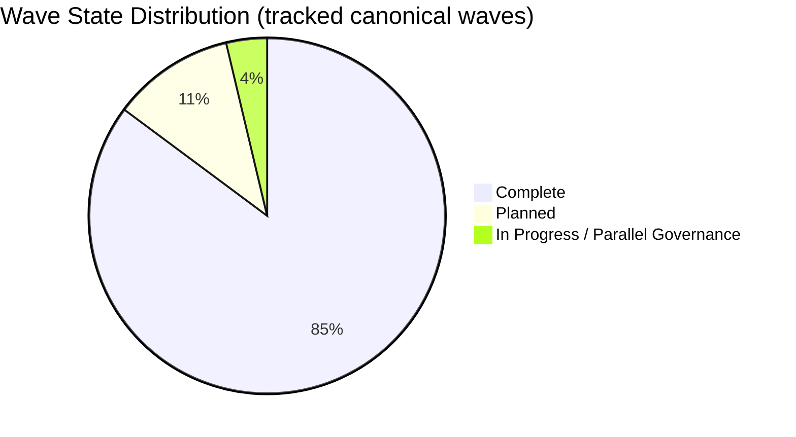
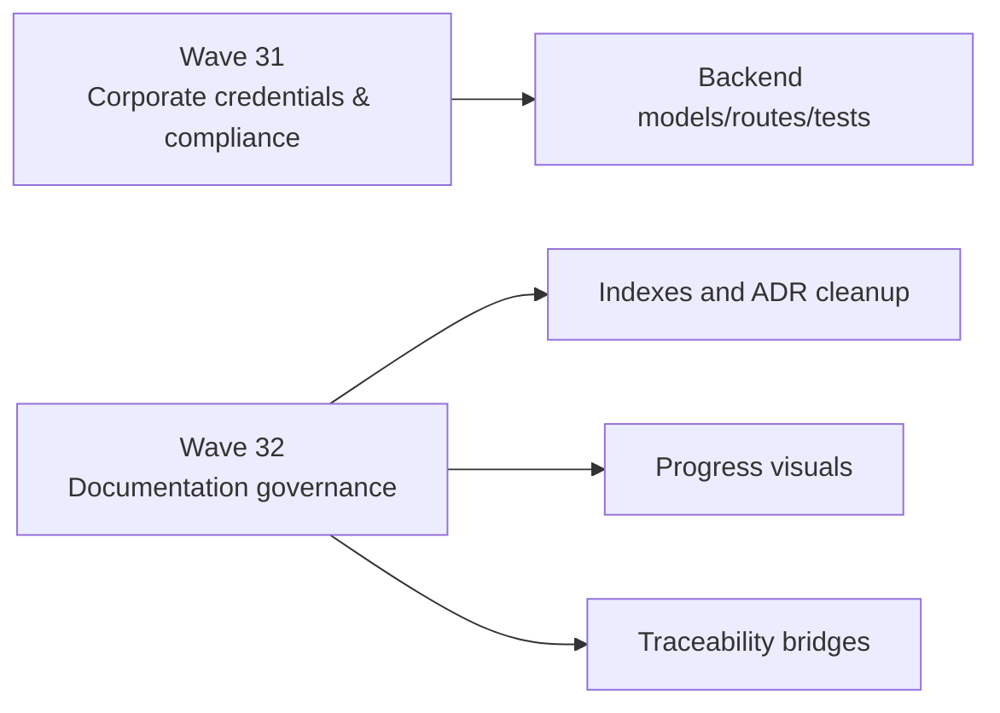

# Progress Dashboard

**Status:** Active  
**Owner:** @Margaret + @Ada  
**Last Updated:** 2026-08-02

This dashboard is the canonical visual summary for documentation and wave-level progress.
It complements `MASTER_PLAN.md`, `PENDING_TASKS_ONLY.md`, and `PROJECT_PROGRESS.md`.

## Current wave mix

## Active lanes

## Documentation uplift scoreboard

| Metric | Baseline State | Current Direction | Target |
| --- | --- | --- | --- |
| Canonical entrypoint integrity | Mixed / contradictory | Improving | 100% canonical |
| Business ↔ software traceability | Fragmented | Planned bridge creation | 85%+ mapped |
| Progress visibility | Table-heavy / contradictory | Visual dashboard introduced | Dashboard + summary + tracker alignment |
| Historical vs active separation | Inconsistent | Improving | explicit on all governance roots |

## Current contradictions being burned down

1. `PROJECT_PROGRESS.md` still claims full project completion while Wave 31 remains planned.
2. Historical ADR numbering coexists with canonical `ADR-###` numbering.
3. Business documentation contains active and transitional directories without a clear normalization note in every area.

## Near-term outcomes

- Wave 32 establishes the reporting baseline.
- Progress visuals move from narrative-only to visual + tracker-backed reporting.
- Traceability bridge artifacts will define how requirement, RBAC, SLA, and compliance truth travels across business and software docs.
