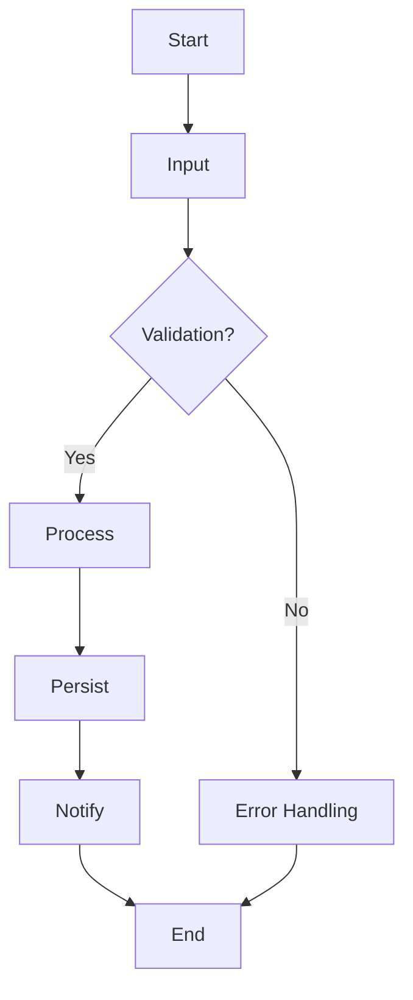
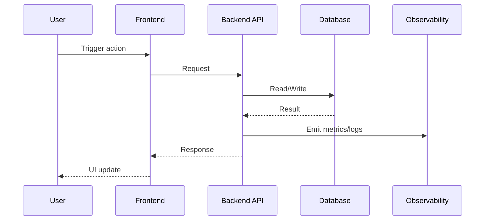

# Flowcharts Template (Mermaid Required)

## 1. Process Flowchart

## 2. Sequence Diagram

## 3. Failure/Retry Map

- Failure mode:
- Retry policy:
- Fallback path:
- Human handoff trigger:

## 4. Compliance Branches

- Compliance checkpoint IDs:
- Approval nodes:
- Audit trail fields:
