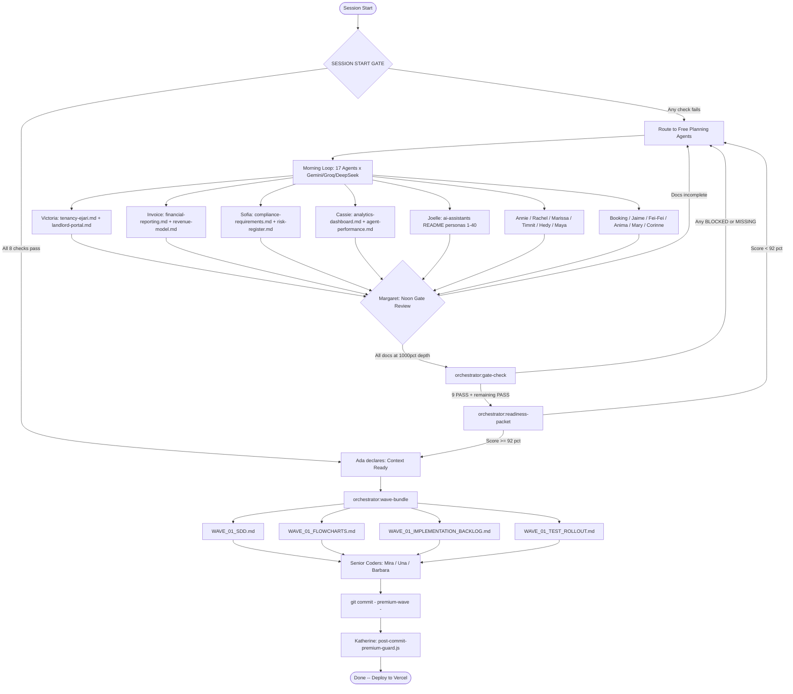
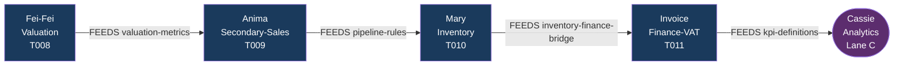
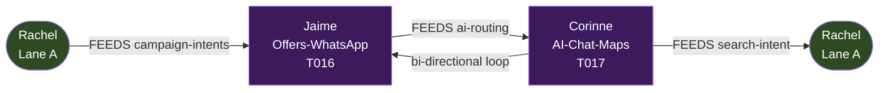
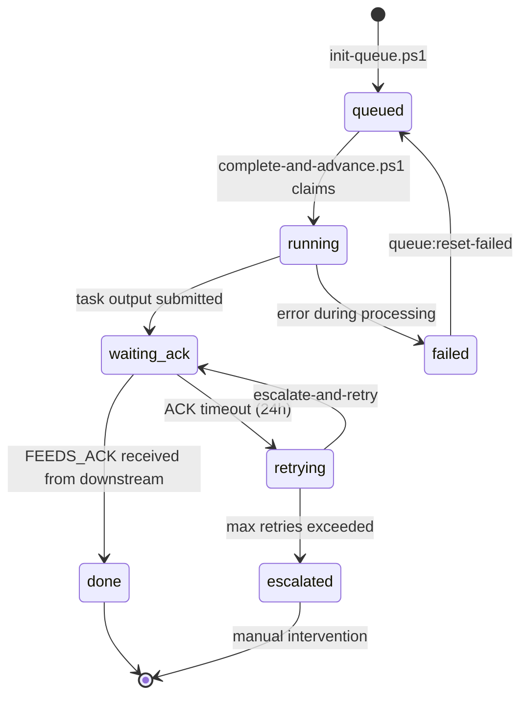
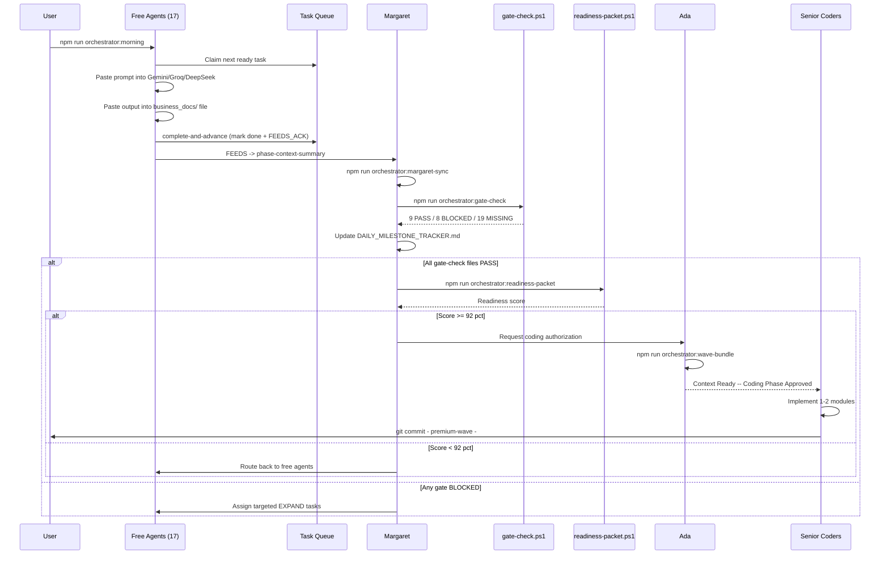

# WAVE_01 -- Flowcharts and Sequence Diagrams

> **Generated:** 2026-05-06 | Tool: Mermaid | Render: GitHub, GitLab, or mermaid.live
> Each diagram represents one aspect of the White Caves free-agent planning system.

---

## Diagram 1 -- Governance Flow: Planning to Coding Approval

> Shows how free agents feed planning docs to @Margaret and @Ada before any premium coding.

---

## Diagram 2 -- Lane A: Compliance / Legal / UX / AI Chain

> CONSUMES/FEEDS handoff chain for Lane A agents.

```mermaid
flowchart LR
    SOFIA[Sofia\nCompliance\nT001] -->|FEEDS compliance-rules| TIMNIT[Timnit\nDLD-Legal\nT002]
    TIMNIT -->|FEEDS contract-clauses| VICTORIA[Victoria\nTenancy-Ejari\nT003]
    VICTORIA -->|FEEDS tenant-obligations| ANNIE[Annie\nTenant-Portal\nT004]
    ANNIE -->|FEEDS ux-requirements| MARISSA[Marissa\nLuxury-UX\nT005]
    MARISSA -->|FEEDS seo-ux-copy| RACHEL[Rachel\nSEO-Marketing\nT006]
    RACHEL -->|FEEDS persona-intents| JOELLE[Joelle\nAI-Personas\nT007]
    JOELLE -->|FEEDS phase-context| MARGARET([Margaret\nSprint Sync])

    style SOFIA fill:#2d4a22,color:#fff
    style TIMNIT fill:#2d4a22,color:#fff
    style VICTORIA fill:#2d4a22,color:#fff
    style ANNIE fill:#2d4a22,color:#fff
    style MARISSA fill:#2d4a22,color:#fff
    style RACHEL fill:#2d4a22,color:#fff
    style JOELLE fill:#2d4a22,color:#fff
    style MARGARET fill:#7a5c00,color:#fff
```

---

## Diagram 3 -- Lane B: Valuation / Market / Finance Chain

> CONSUMES/FEEDS handoff chain for Lane B agents.

---

## Diagram 4 -- Lane C: Schedule / Off-plan / Analytics Chain

> CONSUMES/FEEDS handoff chain for Lane C agents.

---

## Diagram 5 -- Lane D: Offers / WhatsApp / AI-Chat Chain

> CONSUMES/FEEDS handoff chain for Lane D agents (bi-directional loop).

---

## Diagram 6 -- Task Queue State Machine

> All 51 tasks in logs/orchestrator/task-queue.json follow this state machine.

---

## Diagram 7 -- Full Session Sequence: Free Agent to Premium Coding

> End-to-end flow from morning free-agent run to premium coding authorization.

---

_Auto-generated by flowcharts-generator.ps1 on 2026-05-06_
