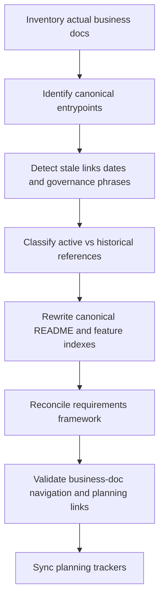
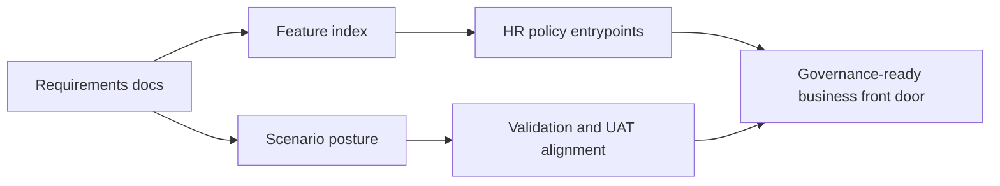

# Wave 33 — Flowcharts

**Wave:** 33  
**Status:** planned  
**Date:** 2026-08-07

---

## 1) Documentation Canonicalization Flow

## 2) Coverage Hardening Path

## 3) Review Sequence

1. Business docs root entrypoint
2. CRM features index
3. Requirements front door and framework
4. Testing/scenario posture
5. Release-management root
6. Tracker synchronization
