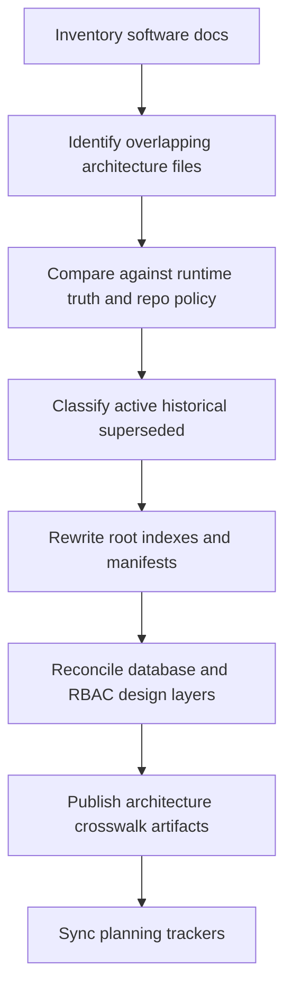
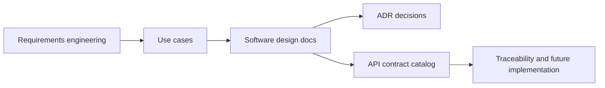

# Wave 34 — Flowcharts

**Wave:** 34  
**Status:** planned  
**Date:** 2026-08-07

---

## 1) Software Canon Reconciliation Flow

## 2) Architecture Truth Model

## 3) Review Sequence

1. Software-doc root index and manifests
2. Database architecture family
3. RBAC architecture family
4. Folder-structure and navigation canon
5. Architecture companion artifacts
6. Tracker synchronization
