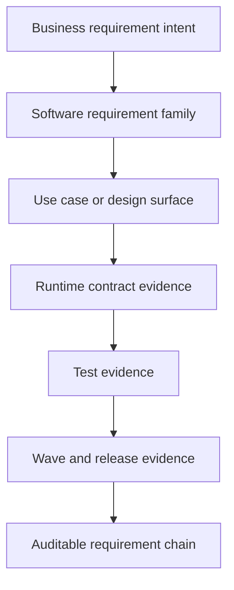
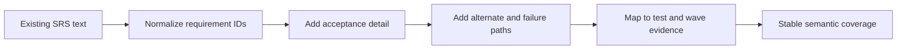

# Wave 35 — Flowcharts

**Wave:** 35  
**Status:** planned  
**Date:** 2026-08-07

---

## 1) Requirement Traceability Flow

## 2) SRS Semantic Hardening Path

## 3) Review Sequence

1. Functional specifications and top-level requirement taxonomy
2. Domain SRS files
3. Business SRS wrapper alignment
4. Crosswalk and traceability artifacts
5. SRS audit and tracker synchronization
