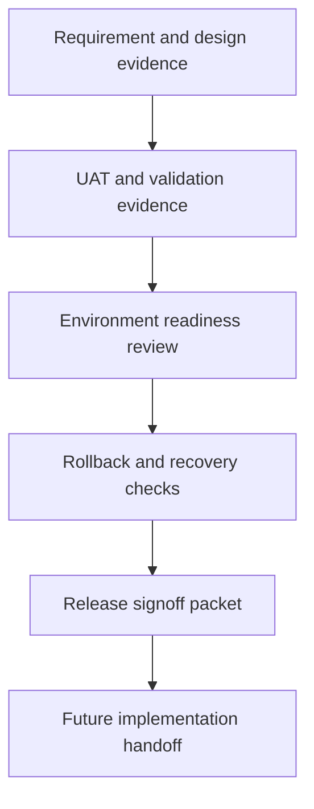
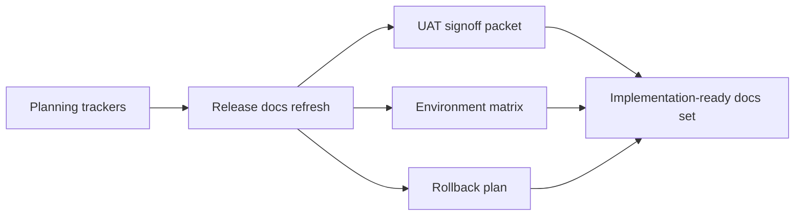

# Wave 36 — Flowcharts

**Wave:** 36  
**Status:** planned  
**Date:** 2026-08-07

---

## 1) Release-Readiness Evidence Flow

## 2) Operational Closeout Path

## 3) Review Sequence

1. Release-management root and process docs
2. Release evidence checklist
3. Environment readiness matrix
4. Rollback and recovery plan
5. UAT signoff packet
6. Tracker synchronization
