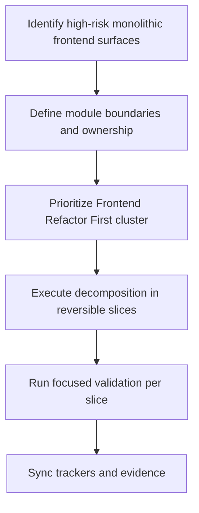
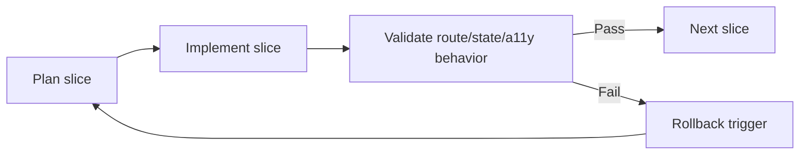

# Wave 37 — Flowcharts

**Wave:** 37  
**Status:** planned  
**Date:** 2026-08-07

---

## 1) Frontend decomposition execution path

## 2) Risk-controlled refactor loop

## 3) Review sequence

1. Route composition
2. Shared UI abstraction extraction
3. Feature boundary normalization
4. Validation and rollback evidence
