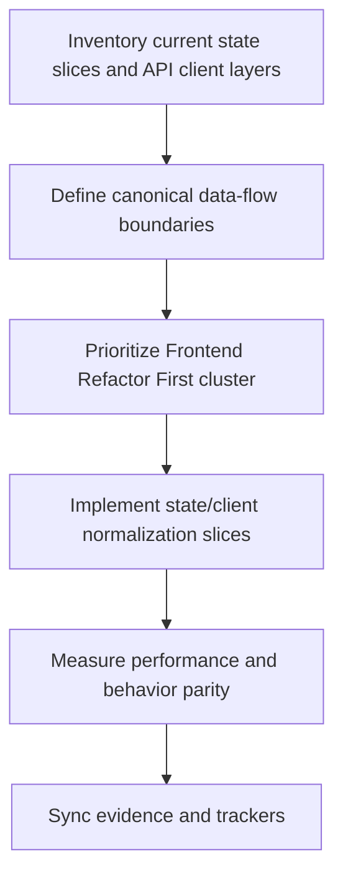
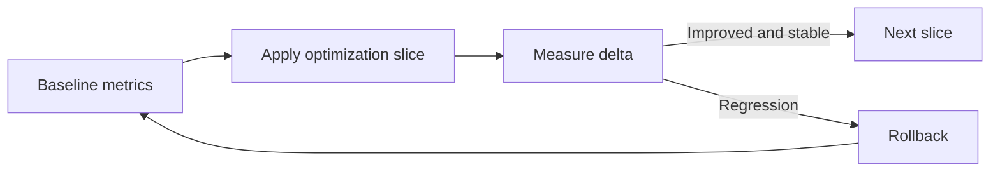

# Wave 38 — Flowcharts

**Wave:** 38  
**Status:** planned  
**Date:** 2026-08-07

---

## 1) State and client unification path

## 2) Optimization loop

## 3) Review sequence

1. State boundary map
2. API client consolidation decisions
3. Performance baseline and target deltas
4. Validation/rollback evidence
