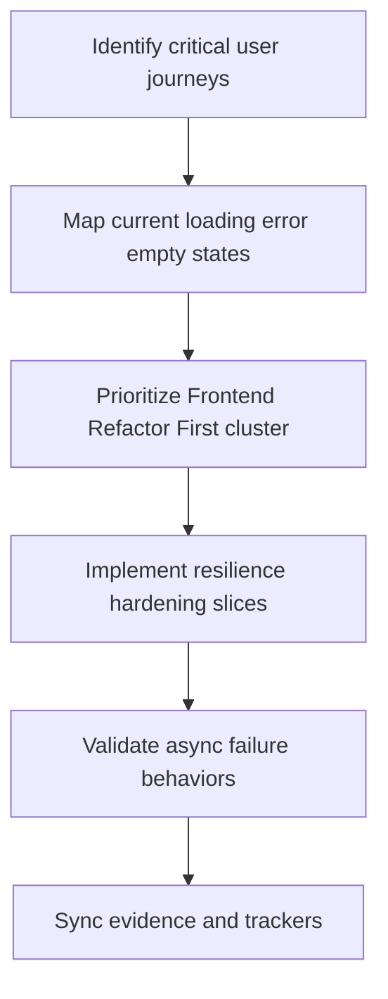
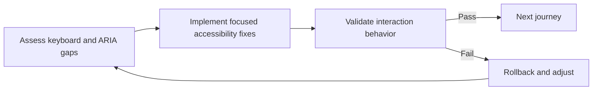

# Wave 39 — Flowcharts

**Wave:** 39  
**Status:** planned  
**Date:** 2026-08-07

---

## 1) Reliability hardening path

## 2) Accessibility hardening loop

## 3) Review sequence

1. Journey selection and resilience baseline
2. Accessibility gap map
3. Hardening slices and evidence
4. Governance/tracker sync
