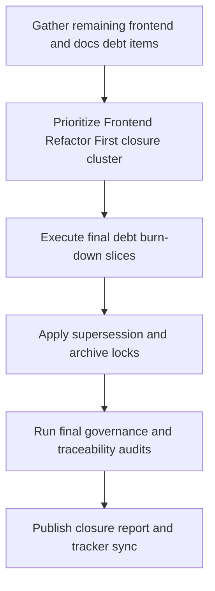
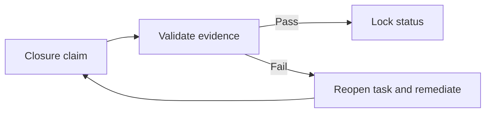

# Wave 40 — Flowcharts

**Wave:** 40  
**Status:** planned  
**Date:** 2026-08-07

---

## 1) Full-project closure path

## 2) Closure control loop

## 3) Review sequence

1. Frontend debt closure
2. Supersession/authority lock
3. SRS count/traceability closure checks
4. Final tracker reconciliation
