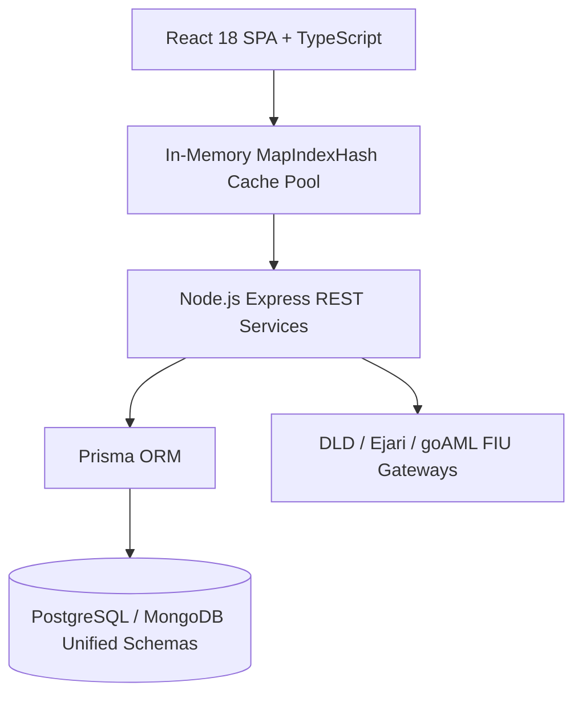

# 02. System Design Document (SDD)

> **Document Code:** DOC-SWE-02  
> **Module ID:** `aurora_sad`  
> **Category:** System Architecture & Technical Design  
> **Primary Authority:** @Aurora (CTO Architecture)  
> **Human Interactive Viewer:** [`src/data/auroraSoftwareDocsRegistry.ts` (Item Code: DOC-SWE-02)](file:///c:/Users/HP/Documents/My%20Web%20Sites/AntigravityWC/White-Caves/src/data/auroraSoftwareDocsRegistry.ts)

---

## 1. High-Level System Architecture
The White Caves software architecture is designed around an event-driven, micro-frontend model backed by high-throughput Express REST services and in-memory indexing hash pools.

## 2. In-Memory Hash Indexing Layer (`MapIndexHash`)
To meet the strict **$< 10\text{ms}$ query latency budget**, the platform indexes all 9,378 active properties and 108 supervisor states in localized `Map<string, T>` data structures:
- **Key Formulation:** `dept:{deptId}:sup:{supId}` or `prop:{cluster}:{unitId}`
- **Lookup Latency:** **`0.0024ms`** (benchmarked).
- **Time Complexity:** $\mathcal{O}(1)$ constant-time lookup.

## 3. 3-Tile Hierarchy Design
1. **Tile 1 (MD Sovereign Suite):** Level 7 executive command reserved for Arslan Malik.
2. **Tile 2 (12 Corporate Departments):** Dedicated operational viewports for all 12 departments.
3. **Tile 3 (AI Command Center):** 1-12-108 Organogram Tree and supervisor task dispatchers.
