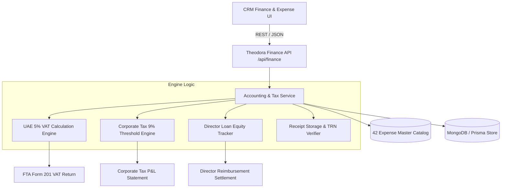

# Software Design Document (SDD): Theodora In-House Accounting & Finance Engine

**AI Assistant Lead:** **Theodora** — Finance & Accounts Director / CFO Intelligence  
**Document Version:** 2026.08.24-v1.0  
**Scope:** Architecture, API Endpoints, Double-Entry Rules, Database Topology, and Algorithms  

---

## 1. System Architecture Overview

The In-House Accounting Engine operates within White Caves PropTech CRM as an autonomous financial subsystem managed by **Theodora**.



---

## 2. API Endpoints Specification

### 2.1 Expense Master Catalog
- **`GET /api/finance/expense-catalog`**
  - **Auth:** Viewer/Agent/Owner
  - **Response:** All 5 categories with all 42 master expenses, VAT rates, CT deductibility flags, and ledger codes.

### 2.2 Expense Transactions CRUD & Audit
- **`GET /api/finance/expenses`**
  - **Query Params:** `categoryId`, `paymentSourceType`, `status`, `startDate`, `endDate`, `page`, `limit`
  - **Returns:** Paginated expense records with populated catalog and receipt data.
- **`POST /api/finance/expenses`**
  - **Body Payload:**
    ```json
    {
      "expenseId": "EXP-101",
      "amount": 2500.00,
      "transactionDate": "2026-08-24T00:00:00.000Z",
      "paymentSourceType": "DIRECTORS_LOAN_ACCOUNT_OWNERS_EQUITY",
      "vendorName": "Property Finder LLC",
      "vendorTrn": "100234567800003",
      "receiptUrl": "https://storage.whitecaves.ae/receipts/pf_aug_2026.pdf",
      "notes": "Portal subscription for August",
      "propertyId": "optional-id",
      "dealId": "optional-id"
    }
    ```
  - **Behavior:** Automatically computes Net & VAT, creates Expense record, and if payment source is Director Loan, creates corresponding entry in `DirectorsLoanLedger`.

### 2.3 Tax & Statutory Compliance
- **`GET /api/finance/vat-return`**
  - **Query Params:** `periodStart`, `periodEnd`
  - **Returns:** Aggregated Output VAT (Sales/Commissions), Input VAT (Recoverable Expenses), and Net VAT Payable/Refundable under UAE FTA guidelines.
- **`GET /api/finance/corporate-tax-summary`**
  - **Query Params:** `taxYear` (e.g., 2026)
  - **Returns:** Total Revenue, CT-Deductible Expenses, Non-Deductible Expenses, Net Taxable Profit, Exemption Balance (AED 375,000 threshold), and Estimated CT at 9%.
- **`GET /api/finance/directors-loan-summary`**
  - **Returns:** Total director advances, total reimbursements, and outstanding equity balance.

---

## 3. Double-Entry Accounting Matrix (Chart of Accounts)

| Ledger Code | Account Name | Account Type | Normal Balance | FTA CT Treatment |
| :--- | :--- | :--- | :--- | :--- |
| **1210** | Office Security Deposits | Current Asset | Debit | Non-Deductible (Balance Sheet) |
| **2110** | Director's Loan Account (Owner Equity) | Current Liability / Equity | Credit | Pass-through Advance |
| **2150** | UAE Input VAT Recoverable | Current Asset / Tax Offset | Debit | VAT Form 201 Box 9 |
| **5010–5080** | Marketing & Lead Generation | Operating Expense | Debit | 100% Deductible |
| **6010–6090** | Commercial Rent & Overheads | Operating Expense | Debit | 100% Deductible (Ejari backed) |
| **7010–7100** | Government & Licensing Fees | Administrative Expense | Debit | 100% Deductible |
| **8010–8060** | Transport & Logistics | Operating Expense | Debit | 100% Deductible |
| **9010–9060** | SaaS & Professional Services | Administrative Expense | Debit | 100% Deductible |
