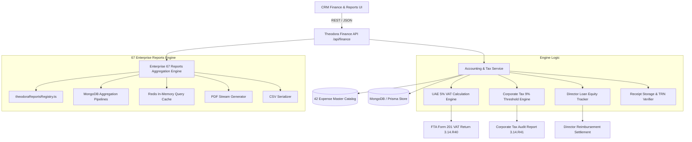
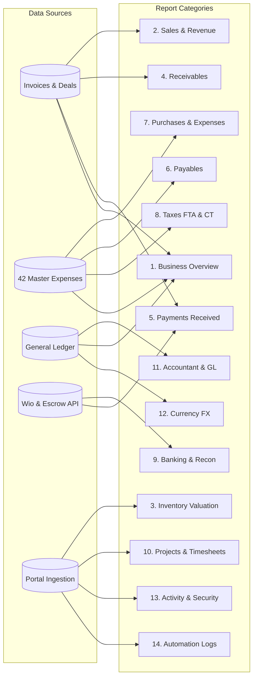

# Software Design Document (SDD): Theodora In-House Accounting & Finance Engine

**AI Assistant Lead:** **Theodora** — Finance & Accounts Director / CFO Intelligence  
**Document Version:** 2026.08.25-v2.0  
**Scope:** Architecture, 67 Enterprise Reports Pipeline, API Endpoints, Double-Entry Rules, Database Topology, and Algorithms  

---

## 1. System Architecture Overview

The In-House Accounting & Reporting Engine operates within White Caves PropTech CRM as an autonomous financial subsystem managed by **Theodora**.



---

## 2. API Endpoints Specification

### 2.1 Expense Master Catalog
- **`GET /api/finance/expense-catalog`**
  - **Auth:** Viewer/Agent/Owner
  - **Response:** All 5 categories with all 42 master expenses, VAT rates, CT deductibility flags, and ledger codes.

### 2.2 Expense Transactions CRUD & Audit
- **`GET /api/finance/expenses`**
  - **Query Params:** `categoryId`, `paymentSourceType`, `status`, `startDate`, `endDate`, `page`, `limit`
  - **Returns:** Paginated expense records with populated catalog and receipt data.
- **`POST /api/finance/expenses`**
  - **Body Payload:**
    ```json
    {
      "expenseId": "EXP-101",
      "amount": 2500.00,
      "transactionDate": "2026-08-24T00:00:00.000Z",
      "paymentSourceType": "DIRECTORS_LOAN_ACCOUNT_OWNERS_EQUITY",
      "vendorName": "Property Finder LLC",
      "vendorTrn": "100234567800003",
      "receiptUrl": "https://storage.whitecaves.ae/receipts/pf_aug_2026.pdf",
      "notes": "Portal subscription for August",
      "propertyId": "optional-id",
      "dealId": "optional-id"
    }
    ```
  - **Behavior:** Automatically computes Net & VAT, creates Expense record, and if payment source is Director Loan, creates corresponding entry in `DirectorsLoanLedger`.

### 2.3 Tax & Statutory Compliance
- **`GET /api/finance/vat-return`**
  - **Query Params:** `periodStart`, `periodEnd`
  - **Returns:** Aggregated Output VAT (Sales/Commissions), Input VAT (Recoverable Expenses), and Net VAT Payable/Refundable under UAE FTA guidelines.
- **`GET /api/finance/corporate-tax-summary`**
  - **Query Params:** `taxYear` (e.g., 2026)
  - **Returns:** Total Revenue, CT-Deductible Expenses, Non-Deductible Expenses, Net Taxable Profit, Exemption Balance (AED 375,000 threshold), and Estimated CT at 9%.
- **`GET /api/finance/directors-loan-summary`**
  - **Returns:** Real-time outstanding director advances balance, total historical injections, and pending Wio reimbursement payouts.

---

## 3. Enterprise 67 Reports Aggregation & Export Engine

### 3.1 Report Execution REST Endpoints
- **`GET /api/finance/reports`**
  - **Returns:** Catalog of all 67 reports with category groupings, schedules, and last visited timestamps.
- **`POST /api/finance/reports/:reportId/execute`**
  - **Path Param:** `reportId` (e.g., `3.14.R01`, `3.14.R17`, `3.14.R40`)
  - **Body Payload:**
    ```json
    {
      "dateRange": "ytd",
      "startDate": "2026-01-01",
      "endDate": "2026-08-25",
      "filters": {
        "developerId": "optional-dev-id",
        "agentId": "optional-agent-id"
      }
    }
    ```
  - **Returns:** Structured JSON containing column definitions, summary metric cards, and tabular data rows formatted in AED currency.
- **`GET /api/finance/reports/:reportId/export`**
  - **Query Params:** `format` (`csv` | `pdf` | `xlsx`), `dateRange`
  - **Returns:** Streamed binary file download with certified cryptographic SHA-256 integrity stamp.

### 3.2 14 Category Aggregation Topologies



---

## 4. Double-Entry Accounting Rules & Ledger Schema

### 4.1 Master Chart of Accounts (COA) Structure
| Account Code Range | Class | Normal Balance | Description |
| :--- | :--- | :--- | :--- |
| `1000 - 1999` | **Assets** | Debit | Cash, Bank (Wio), Receivables, Escrow Balances, Deposits |
| `2000 - 2999` | **Liabilities** | Credit | Accounts Payable, Output VAT 5% Payable, Accrued Split Payables |
| `3000 - 3999` | **Equity** | Credit | Share Capital, Director's Loan Account, Retained Earnings |
| `4000 - 4999` | **Revenue** | Credit | Primary Off-Plan Brokerage, Resale Commissions, Management Retainers |
| `5000 - 9999` | **Operating Expenses** | Debit | 42 Master Expenses (Portals, Rent, Overheads, Legal, Salik, Marketing) |

### 4.2 Posting Rules for Key Transactions
1. **Developer Invoicing (e.g. AED 100,000 + 5% VAT):**
   - $\text{Dr. 1100 Accounts Receivable}$ $\text{AED 105,000}$
   - $\text{Cr. 4010 Primary Sales Commission}$ $\text{AED 100,000}$
   - $\text{Cr. 2100 Output VAT 5% Payable}$ $\text{AED 5,000}$

2. **Director Paid Portal Expense (e.g. AED 10,500 Gross via Personal Card):**
   - $\text{Dr. 5010 Portal Subscriptions}$ $\text{AED 10,000}$
   - $\text{Dr. 1250 Input VAT Recoverable}$ $\text{AED 500}$
   - $\text{Cr. 3010 Director's Loan Account (Equity)}$ $\text{AED 10,500}$

3. **Reimbursement Payout via Wio Business Bank Account:**
   - $\text{Dr. 3010 Director's Loan Account}$ $\text{AED 10,500}$
   - $\text{Cr. 1010 Wio Bank Primary Account}$ $\text{AED 10,500}$

---

## 5. Security, Audit Trail & UAE PDPL Compliance

- **Role-Based Access Control (RBAC):** Access to financial statements, director loan ledgers, and VAT audit reports is strictly gated by Level 4 (Finance Director) and Level 5 (Managing Director Sovereign Override).
- **Cryptographic Hashing:** Every generated audit PDF includes an immutable SHA-256 checksum and timestamp.
- **Audit Logging:** Every journal entry creation, expense status mutation, and manual tax override emits an event to the `Activity Logs` (`3.14.R59`) and `Exception Report` (`3.14.R60`).
