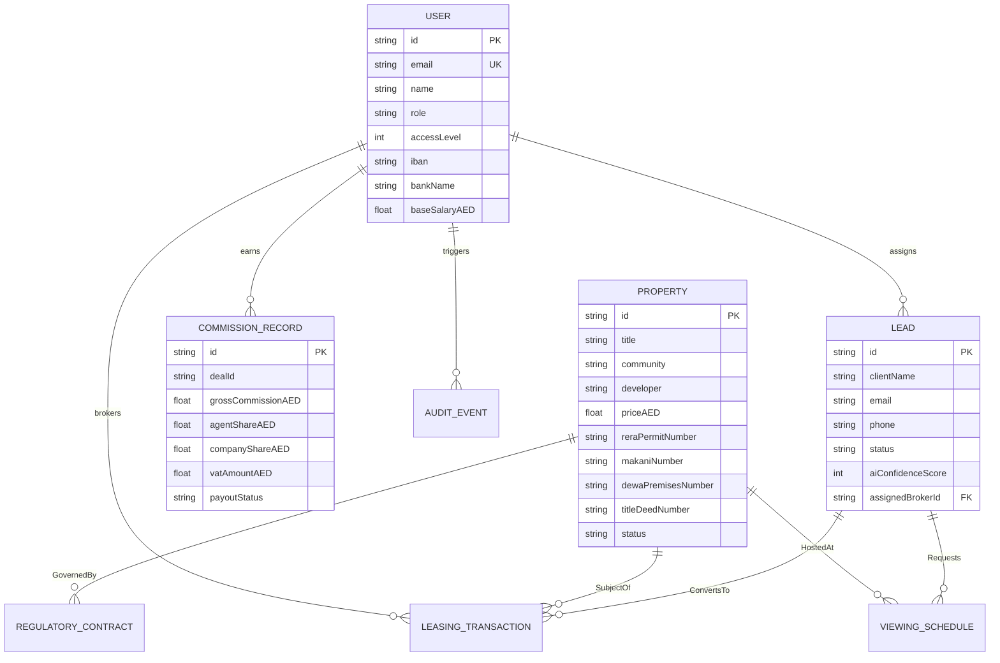
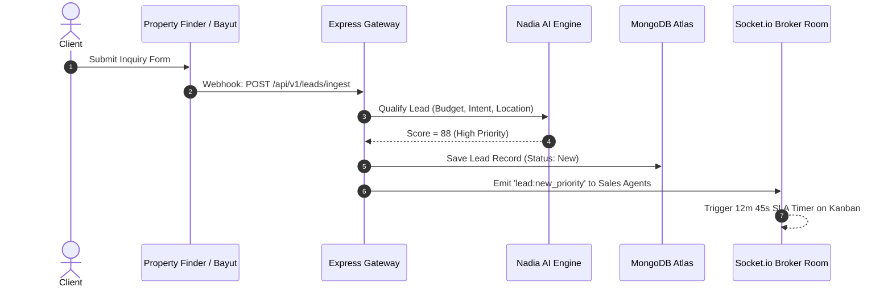
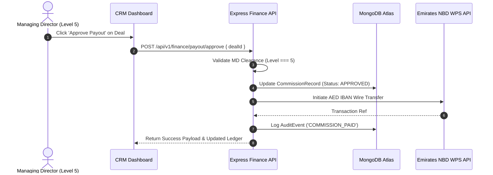

# System Design Document (SDD) — Managing Director 14 Operations Architecture

> **White Caves Real Estate LLC** — Core Technical Specification  
> **System Architecture**: React 18 + Redux Toolkit + TypeScript 5.7 + Express v4 + MongoDB / Prisma 6.2  
> **Security Rating**: Enterprise Level 5 Master RBAC Hardened

---

## 📐 1. ERD Database Schema Relationships

---

## ⚡ 2. Unified REST & WebSocket API Endpoint Matrix

| Method | Endpoint | Auth Clearance | Response Latency Target | Description |
|--------|----------|----------------|-------------------------|-------------|
| `GET` | `/api/v1/crm/leads` | Level 2+ | < 120ms | Fetch paginated leads for Sales Kanban |
| `PATCH` | `/api/v1/crm/leads/:id/stage` | Level 2+ | < 100ms | Update lead stage & trigger SLA countdown |
| `GET` | `/api/v1/properties` | Public / Level 1+ | < 80ms | Faceted search across 9,378+ units |
| `POST` | `/api/v1/documents/generate` | Level 3+ | < 400ms | Generate PDF RERA Form A/B/F/7/12 |
| `GET` | `/api/v1/finance/commissions` | Level 4+ | < 150ms | Fetch itemized commission ledger & VAT 5% |
| `POST` | `/api/v1/finance/payout/approve` | Level 5 Master | < 250ms | Approve AED IBAN bank transfer to broker |
| `GET` | `/api/v1/compliance/audit-scan` | Level 4+ | < 300ms | Run 12-check automated RERA/DLD scan |
| `GET` | `/api/v1/system/audit-trail` | Level 5 Master | < 100ms | Stream append-only audit events |
| `WS` | `ws://server/socket.io/?room=md` | Level 5 Master | Real-Time Push | Live WebSocket connection for AI traces & SLA alerts |

---

## 🔄 3. Operational Sequence Diagrams

### 3.1 Lead Ingestion & AI Qualifier Sequence

### 3.2 Commission Approval & Bank Payout Sequence

