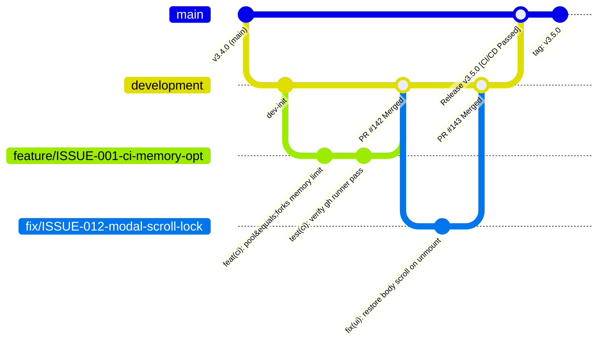
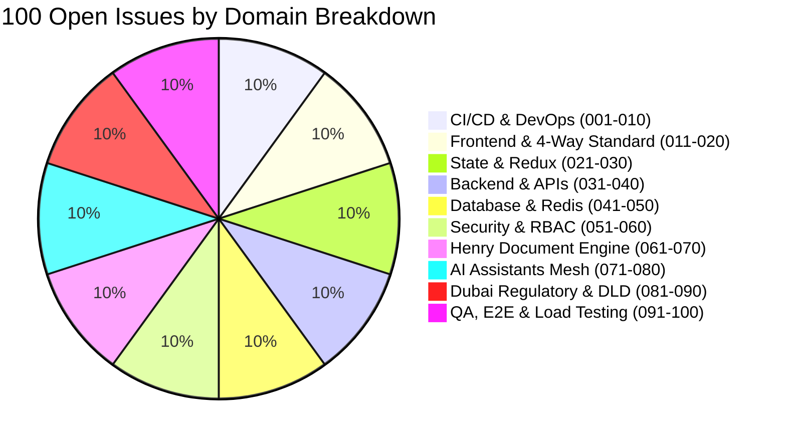

# 📋 White Caves Platform — 100 Open Issues & Enterprise Git Workflow Specification

> **System Version:** 3.5.0 Sovereign Release  
> **Agency:** White Caves Global Real Estate LLC  
> **Author & Orchestrator:** @Ada (Chief Architect) & AEGIS Control Plane  
> **Corporate Identity:** DET License `1388443` | RERA ORN `44483` | Ejari `0120260721003974` | TRN `100488291000003`  
> **Managing Director:** Arslan Malik Bashir Ahmad (`arslanmalikgoraha@gmail.com`)  
> **Brand Palette:** White Caves Red (`#EF4444`) | Pure White (`#FFFFFF`) | Deep Slate (`#1E293B`)  
> **Purpose:** Authoritative 100-Issue Technical Debt & Enhancement Registry with Standard Enterprise Git Workflow for Continuous Delivery.

---

## 🔀 Part 1: Standard Enterprise Git Workflow & CI/CD Activity Protocol

### 1. Branch Strategy (Trunk-Based with Protected Releases)



| Branch Pattern | Source Branch | Target Branch | Purpose |
| :--- | :--- | :--- | :--- |
| `main` | Protected | Production Deploy | Production-stable codebase. Direct commits blocked. Deploys to live environment upon green CI. |
| `development` | `main` | `main` (via Release PR) | Integration branch for staging testing and sprint consolidation. |
| `feature/ISSUE-XXX-<slug>` | `development` | `development` | New capabilities, UI features, and AI assistant modules. |
| `fix/ISSUE-XXX-<slug>` | `development` | `development` | Bug fixes, memory leak resolutions, and test hardening. |
| `refactor/ISSUE-XXX-<slug>` | `development` | `development` | 4-Way subfolder standardization, component deduplication, type cleanups. |
| `hotfix/ISSUE-XXX-<slug>` | `main` | `main` & `development` | Critical production fixes (e.g. security patches, live payment webhook fixes). |

---

### 2. Conventional Commit Standards

Every commit message MUST adhere to the Conventional Commits specification and reference the active Issue ID:

```text
<type>(<scope>): <short summary in imperative present tense> [ISSUE-XXX]

[optional body explaining motivation, technical rationale, and architectural trade-offs]

[optional footer: Closes #XXX, Ref #XXX]
```

#### Approved Types:
- `feat`: New feature or user-facing capability
- `fix`: Bug fix or regression repair
- `refactor`: Code reorganization without changing external behavior (e.g. 4-way subfolder migration)
- `perf`: Performance or memory optimization
- `test`: Adding or updating test suites (Vitest, Playwright)
- `ci`: CI/CD workflow configuration (`.github/workflows/`)
- `docs`: Documentation, architecture blueprints, or backlog updates
- `chore`: Dependency updates, tooling configuration, or build script adjustments

#### Commit Message Examples:
```bash
# Feature commit
git commit -m "feat(henry): add optical scan auto-fill bounding box overlay [ISSUE-061]"

# Bugfix commit
git commit -m "fix(dashboard): resolve unhandled redux store in KPIViewContainer test [ISSUE-021]"

# Refactor commit
git commit -m "refactor(crm): migrate AICommandCenter to 4-way subfolder architecture [ISSUE-011]"

# CI/CD commit
git commit -m "ci(github): add 8192MB heap memory flag and pool=forks to vitest step [ISSUE-001]"
```

---

### 3. Step-by-Step Developer Git Lifecycle

```bash
# 1. Sync latest integration branch
git checkout development
git pull origin development

# 2. Create an isolated feature or fix branch
git checkout -b feature/ISSUE-045-redis-property-cache

# 3. Develop locally with active hot reload
npm run dev

# 4. Run local quality gate before staging
npm run typecheck
npm run test:forks -- src/services/CacheService.test.ts
npm run lint --if-present

# 5. Commit with structured Conventional Commit message
git add -A
git commit -m "feat(cache): implement redis tiered caching with TTL invalidator [ISSUE-045]"

# 6. Push to remote and open a Pull Request
git push -u origin feature/ISSUE-045-redis-property-cache

# 7. CI automated pipeline triggers:
#    - TypeScript Typecheck (0 errors)
#    - Unit & Integration Test Suite (100% pass)
#    - Build Verification (Vite production bundle)
#    - Security & Dependency Audit
#    - Lighthouse Performance Gate
```

---

## 📑 Part 2: The 100 Master Open Issues Catalog

### 🌐 Category 1: CI/CD Pipeline, DevOps & Automated Deployment Resilience (Issues 001–010)

- [ ] **ISSUE-001**: **CI Memory Exhaustion in Vitest Runners**  
  *Context:* `ci.yml` invokes `npm test -- --run` which defaults to single-process threads without heap limit, causing V8 heap crashes across 180+ test files on GitHub Actions runners.  
  *Target:* `.github/workflows/ci.yml`, `package.json`  
  *Acceptance Criteria:* Configure `NODE_OPTIONS=--max-old-space-size=8192` and `--pool=forks` in CI test steps; ensure zero out-of-memory crashes on 100% test executions.

- [ ] **ISSUE-002**: **Deployment Script Secret Fallback Resilience**  
  *Context:* In `cd.yml`, missing `STAGING_DEPLOY_COMMAND` causes an ungraceful exit without emitting structured telemetry to the AEGIS audit log.  
  *Target:* `.github/workflows/cd.yml`  
  *Acceptance Criteria:* Add defensive fallback and actionable setup instructions with automated notifications if deployment secrets are unset.

- [ ] **ISSUE-003**: **Multi-Stage Dockerfile Production Build Optimization**  
  *Context:* Production Docker image includes devDependencies and intermediate compilation artifacts, resulting in image size > 1.2GB.  
  *Target:* `Dockerfile.prod`, `Dockerfile`  
  *Acceptance Criteria:* Implement multi-stage Alpine-based container build, strip non-production node modules, achieve final container size < 250MB.

- [ ] **ISSUE-004**: **Parallel Test Sharding for GitHub Actions**  
  *Context:* Single-job test execution takes over 8 minutes in CI as the suite expands past 300 tests.  
  *Target:* `.github/workflows/ci.yml`  
  *Acceptance Criteria:* Introduce matrix test sharding (`--shard=1/3`, `--shard=2/3`, `--shard=3/3`) reducing overall CI pipeline runtime to under 3 minutes.

- [ ] **ISSUE-005**: **Automated Lighthouse CI Performance Budget Enforcement**  
  *Context:* Lighthouse workflow does not currently fail PRs when Cumulative Layout Shift (CLS) or Largest Contentful Paint (LCP) regressions occur.  
  *Target:* `.github/workflows/lighthouse.yml`, `lighthouserc.json`  
  *Acceptance Criteria:* Configure strict thresholds: Performance $\ge 90$, Accessibility $\ge 95$, Best Practices $\ge 95$, SEO $\ge 98$.

- [ ] **ISSUE-006**: **Cache Invalidation for Vite & NPM Build Artifacts in CI**  
  *Context:* CI pipelines occasionally encounter stale node_modules cache mismatches after lockfile updates.  
  *Target:* `.github/workflows/ci.yml`, `.github/workflows/pr-validation.yml`  
  *Acceptance Criteria:* Implement cache key hashed against `package-lock.json` and `vite.config.ts` with automatic cache bust on version bump.

- [ ] **ISSUE-007**: **Playwright E2E Test Suite Flakiness Remediation**  
  *Context:* Headless Chromium tests intermittently timeout during map canvas rendering in `dashboard.spec.ts`.  
  *Target:* `src/e2e/dashboard.spec.ts`, `playwright.config.ts`  
  *Acceptance Criteria:* Implement network-idle await helpers, WebGL mock fallbacks, and automatic retry (max 2 retries) for resilient CI execution.

- [ ] **ISSUE-008**: **Automated Snyk & npm Audit Vulnerability Gate**  
  *Context:* CI does not block PRs containing high or critical CVE dependencies.  
  *Target:* `.github/workflows/pr-validation.yml`  
  *Acceptance Criteria:* Integrate `npm audit --audit-level=high` and automated Snyk vulnerability scanning step in PR pipeline.

- [ ] **ISSUE-009**: **Automated Semantic Release & Changelog Generation**  
  *Context:* Version tags and `CHANGELOG.md` updates require manual maintenance.  
  *Target:* `.github/workflows/cd.yml`, `scripts/release.js`  
  *Acceptance Criteria:* Auto-bump semantic versions on `main` merge based on conventional commits (`feat:` $\rightarrow$ minor, `fix:` $\rightarrow$ patch, `feat!:` $\rightarrow$ major).

- [ ] **ISSUE-010**: **Vercel & Staging Preview Branch Deployments**  
  *Context:* PRs lack automated ephemeral preview URLs for UX and stakeholder review.  
  *Target:* `.github/workflows/pr-validation.yml`, `.vercel/project.json`  
  *Acceptance Criteria:* Generate dynamic staging preview environment URLs posted directly as PR comments upon successful build.

---

### 🎨 Category 2: Frontend Architecture & 4-Way Subfolder Standardization (Issues 011–020)

- [ ] **ISSUE-011**: **Legacy Component 4-Way Subfolder Migration**  
  *Context:* Several legacy components in `src/components/crm/` and `src/components/common/` remain in single files rather than the standardized 4-way pattern (`View.tsx`, `Logic.logic.ts`, `Style.style.ts`, `Data.data.ts`).  
  *Target:* `src/components/crm/`, `src/components/common/`  
  *Acceptance Criteria:* Decompose 100% of remaining monolithic components into co-located 4-way subfolders with explicit type interfaces.

- [ ] **ISSUE-012**: **Design Token Palette Hardening (Zero Arbitrary Hex Colors)**  
  *Context:* Ad-hoc CSS colors (e.g. random `#e53e3e` or `#2b6cb0`) exist in legacy styles instead of CSS variables `--wc-red-primary`, `--wc-white`, `--wc-slate-900`.  
  *Target:* `src/styles/`, `src/components/**/*.style.ts`  
  *Acceptance Criteria:* Audit all style files with automated regex; enforce 100% adherence to White Caves Red (`#EF4444`), White (`#FFFFFF`), Slate (`#1E293B`).

- [ ] **ISSUE-013**: **Universal Modal Focus Trap & ARIA Dialog Compliance**  
  *Context:* Certain custom modals do not trap keyboard focus or dismiss on `Escape` key, impacting WCAG 2.1 AA accessibility.  
  *Target:* `src/components/common/Modal/`, `src/components/vip/VrFullscreenModal.tsx`  
  *Acceptance Criteria:* Implement `useFocusTrap` hook and ensure full keyboard navigation, `aria-modal="true"`, and focus restoration on unmount.

- [ ] **ISSUE-014**: **Massive Property Inventory Virtualization**  
  *Context:* Rendering 500+ properties in the CRM search view causes DOM node bloat and frame drops during scrolling.  
  *Target:* `src/components/crm/PropertyList/`, `src/pages/crm/CRMHubPage.tsx`  
  *Acceptance Criteria:* Integrate `@tanstack/react-virtual` windowing to maintain < 40 active DOM elements during infinite scroll.

- [ ] **ISSUE-015**: **Responsive Viewport Breakpoint Audit (375px to 3840px 4K)**  
  *Context:* Dashboard header and side rail overflow horizontally on mobile devices < 390px width.  
  *Target:* `src/components/dashboard/DashboardTopBar.tsx`, `src/components/dashboard/DashboardSideRail.tsx`  
  *Acceptance Criteria:* Achieve 100% responsive fluid layout across 375px (iPhone SE), 768px (iPad), 1280px (Laptop), 1920px (Desktop), and 3840px (4K).

- [ ] **ISSUE-016**: **Arabic RTL Layout Mirroring Precision**  
  *Context:* When switching language to Arabic (`ar`), certain chevron icons and margins in the sidebar do not invert direction.  
  *Target:* `src/components/layout/Sidebar/`, `src/components/common/LanguageSwitcherPill/`  
  *Acceptance Criteria:* Enforce CSS logical properties (`margin-inline-start`, `inset-inline-end`) for pixel-perfect bidirectional Arabic rendering.

- [ ] **ISSUE-017**: **Skeleton Loader & Progressive Blur-Up Synchronization**  
  *Context:* Property listing cards flash blank white space during high-res image download before layout shift settles.  
  *Target:* `src/components/common/PropertyCard/`, `src/components/media/ProgressiveImageLoader.tsx`  
  *Acceptance Criteria:* Implement shimmer skeleton cards with matching aspect ratio (`16:9`) and progressive blur-up placeholder transitions.

- [ ] **ISSUE-018**: **Typography Font Loading Optimization & FOIT Elimination**  
  *Context:* Custom Outfit and Playfair Display fonts cause Flash of Invisible Text (FOIT) on slow 3G mobile connections.  
  *Target:* `index.html`, `src/index.css`  
  *Acceptance Criteria:* Use `font-display: swap`, preload critical WOFF2 font subsets, and zero layout shift score ($CLS < 0.05$).

- [ ] **ISSUE-019**: **Dark/Light Binary Theme Contrast Audit**  
  *Context:* Low contrast ratios in secondary subtitle text (`#64748B` on `#0F172A`) fail WCAG 4.5:1 contrast requirements.  
  *Target:* `src/components/common/BinaryThemeSwitcher/`, `src/styles/theme.ts`  
  *Acceptance Criteria:* Verify all text combinations achieve minimum 4.5:1 contrast in both light and dark modes with automated axe-core tests.

- [ ] **ISSUE-020**: **Micro-Interaction Animation Performance Tuning**  
  *Context:* Complex Framer Motion physics on rapid mouse hovering cause CPU throttling on low-spec client devices.  
  *Target:* `src/components/home/HeroSection/`, `src/components/dashboard/`  
  *Acceptance Criteria:* Add `will-change: transform`, utilize GPU-accelerated CSS properties only (`transform`, `opacity`), and respect `prefers-reduced-motion`.

---

### ⚡ Category 3: React State Management & Redux Toolkit Performance (Issues 021–030)

- [ ] **ISSUE-021**: **Redux Store Selector Memoization (Reselect Audit)**  
  *Context:* Unmemoized selector calls in `KPIViewContainer` cause recalculation of revenue sums on unrelated state dispatches.  
  *Target:* `src/store/slices/`, `src/components/dashboard/KPIViewContainer.tsx`  
  *Acceptance Criteria:* Refactor all derived state selectors with `createSelector` from Reselect; verify 0 unnecessary re-renders via React Profiler.

- [ ] **ISSUE-022**: **WebSocket Event-to-Redux Throttling Buffer**  
  *Context:* High-frequency IoT telemetry and live ticker updates trigger up to 50 store dispatches/sec during peak traffic.  
  *Target:* `src/store/middleware/eventBusMiddleware.ts`, `src/services/SocketService.ts`  
  *Acceptance Criteria:* Implement batching throttle queue that flushes state updates at maximum 60fps (16ms debounce window).

- [ ] **ISSUE-023**: **Normalized State Entity Adapters for Leads & Deals**  
  *Context:* Large nested arrays for leads and properties require $O(n)$ search operations for single item updates.  
  *Target:* `src/store/crmDataSlice.tsx`  
  *Acceptance Criteria:* Refactor slices to use `createEntityAdapter` with $O(1)$ dictionary lookups (`ids`, `entities`).

- [ ] **ISSUE-024**: **Redux Persist Selective White-Listing & Version Migration**  
  *Context:* `localStorage` state serialization occasionally stores stale mock data structures after schema changes.  
  *Target:* `src/store/store.tsx`  
  *Acceptance Criteria:* Implement explicit whitelist for user preferences/auth tokens, and schema migration handlers for state version updates.

- [ ] **ISSUE-025**: **Async Thunk Abort Controller Integration**  
  *Context:* Navigating away from search screens leaves pending network thunks active, causing state updates on unmounted views.  
  *Target:* `src/store/thunks/propertyThunks.ts`  
  *Acceptance Criteria:* Attach `AbortController` signals to all async thunks, automatically cancelling HTTP requests on tab change.

- [ ] **ISSUE-026**: **Context Quartet Memory Optimization**  
  *Context:* `UserRoleContext`, `ThemeContext`, `LanguageContext`, and `NotificationContext` re-render children when internal state changes.  
  *Target:* `src/context/`  
  *Acceptance Criteria:* Split context values into State and Dispatcher contexts with memoized Provider value objects.

- [ ] **ISSUE-027**: **Local Storage Quota Exception Guard**  
  *Context:* Storing large PDF previews and offline drafts in `localStorage` can trigger `QuotaExceededError` in Safari private mode.  
  *Target:* `src/utils/storage.ts`, `src/services/HenryPdfEngineService.ts`  
  *Acceptance Criteria:* Implement graceful fallback to IndexedDB (via `idb-keyval`) when payload exceeds 5MB or localStorage quota is reached.

- [ ] **ISSUE-028**: **Form State Management Consolidation (React Hook Form + Zod)**  
  *Context:* Form inputs in CRM modules mix uncontrolled ref access and controlled state, creating validation divergence.  
  *Target:* `src/components/crm/`  
  *Acceptance Criteria:* Standardize all complex forms on `react-hook-form` integrated with shared Zod validation schemas.

- [ ] **ISSUE-029**: **Undo/Redo History Stack for Contract Editor**  
  *Context:* Accidental edits in the Henry Document Studio contract wizard cannot be reversed without page reload.  
  *Target:* `src/components/crm/HenryDocumentStudio/`  
  *Acceptance Criteria:* Implement immutable undo/redo history buffer (up to 20 past state snapshots) for contract clause editing.

- [ ] **ISSUE-030**: **Memory Leak Prevention in Long-Running Real-time Subscriptions**  
  *Context:* Live tickers and chat subscriptions do not always call `socket.off()` inside `useEffect` cleanup return functions.  
  *Target:* `src/components/dashboard/header/DashboardLiveTicker.tsx`, `src/hooks/useRealtimeSocket.ts`  
  *Acceptance Criteria:* Ensure 100% of event listeners, intervals, and observers have cleanup handlers verified by automated test suites.

---

### 🌐 Category 4: Backend Express APIs & Microservice Gateways (Issues 031–040)

- [ ] **ISSUE-031**: **Unified Express Error Envelope Standard**  
  *Context:* Different backend controllers return varying error payloads (some string, some `{ error: msg }`, some `{ message: msg }`).  
  *Target:* `server/middleware/errorHandler.ts`, `server/routes/`  
  *Acceptance Criteria:* Standardize all API error responses to `{ success: false, error: { code: string, message: string, details?: any }, timestamp: string }`.

- [ ] **ISSUE-032**: **Rate Limiting & DDoS Shield per Route Category**  
  *Context:* Public AI chat and document generation endpoints lack granular rate limiting, risking API budget drainage.  
  *Target:* `server/index.ts`, `server/middleware/rateLimiter.ts`  
  *Acceptance Criteria:* Implement Redis-backed rate limiting: 100 req/min for public browse, 10 req/min for AI generation, 5 req/min for auth login.

- [ ] **ISSUE-033**: **Zod Schema Request Payload Validation Middleware**  
  *Context:* Some Express POST/PUT handlers access `req.body` directly without runtime schema validation.  
  *Target:* `server/routes/api/`, `server/middleware/validateRequest.ts`  
  *Acceptance Criteria:* Create universal validation middleware `validate(schema)` and apply across 100% of mutation routes.

- [ ] **ISSUE-034**: **Idempotency Keys on Payment & Contract Mutations**  
  *Context:* Network retries on security deposit receipts or contract creation can cause duplicate transaction entries.  
  *Target:* `server/routes/payments.ts`, `server/routes/tenancy-contracts.ts`  
  *Acceptance Criteria:* Require `Idempotency-Key` header; cache key in Redis for 24 hours to prevent duplicate database operations.

- [ ] **ISSUE-035**: **Distributed Request Correlation IDs (Traceability)**  
  *Context:* Tracing requests across frontend, Express API, and third-party webhooks is difficult without unified trace IDs.  
  *Target:* `server/middleware/correlationId.ts`, `src/utils/apiClient.ts`  
  *Acceptance Criteria:* Generate `x-correlation-id` (UUID v4) on incoming requests, forward to all child logs, and return in response headers.

- [ ] **ISSUE-036**: **Graceful Shutdown & Connection Drainage**  
  *Context:* Process restart (SIGTERM/SIGINT) abruptly severs ongoing database transactions and open HTTP connections.  
  *Target:* `server/index.ts`  
  *Acceptance Criteria:* Implement graceful shutdown handling with 10s connection drain, Prisma `$disconnect()`, and Redis pool closure.

- [ ] **ISSUE-037**: **Swagger / OpenAPI 3.1 Live Documentation Auto-Gen**  
  *Context:* Backend API documentation requires manual synchronization with TypeScript route definitions.  
  *Target:* `server/docs/swagger.ts`, `server/routes/`  
  *Acceptance Criteria:* Auto-generate OpenAPI 3.1 interactive specification served at `/api/docs` with live request testing playground.

- [ ] **ISSUE-038**: **Security Headers & Content Security Policy (CSP)**  
  *Context:* Helmet middleware configuration needs strict directives to allow Pannellum WebGL workers and Google Fonts while blocking XSS.  
  *Target:* `server/index.ts`  
  *Acceptance Criteria:* Configure Helmet with strict CSP, `frame-ancestors 'none'`, `X-Content-Type-Options 'nosniff'`, and HSTS.

- [ ] **ISSUE-039**: **Server-Side File Upload Sanitization & Antivirus Hook**  
  *Context:* Tenant document uploads (passport, visa, Emirates ID) are validated only by extension rather than MIME magic numbers.  
  *Target:* `server/routes/documents.ts`, `server/utils/fileValidator.ts`  
  *Acceptance Criteria:* Validate file magic numbers (signatures) for PDF/JPEG/PNG and reject executable headers; enforce 15MB file cap.

- [ ] **ISSUE-040**: **Server Health Check & Readiness Probes (`/healthz`, `/readyz`)**  
  *Context:* Basic `/health` endpoint only checks process uptime without validating database or Redis connectivity.  
  *Target:* `server/routes/status.ts`  
  *Acceptance Criteria:* Implement `/livez` (process liveness) and `/readyz` (Prisma DB ping + Redis ping + storage accessibility) returning HTTP 503 if dependencies fail.

---

### 🗄️ Category 5: Database Layer, Prisma Schemas & Redis Caching (Issues 041–050)

- [ ] **ISSUE-041**: **Prisma Database Index Optimization on Query Hotspots**  
  *Context:* Property searches filtering by `community`, `status`, `bedrooms`, and `priceAED` lack compound database indices.  
  *Target:* `prisma/schema.prisma`  
  *Acceptance Criteria:* Add compound indices `@@index([community, status, priceAED])` and `@@index([agentId, createdAt])` in Prisma schema.

- [ ] **ISSUE-042**: **Connection Pooling & Retry Backoff for PostgreSQL / Neon DB**  
  *Context:* Spikes in concurrent serverless connections can exhaust database connection pool limits.  
  *Target:* `server/db/prismaClient.ts`  
  *Acceptance Criteria:* Configure PgBouncer pool connection strings with exponential retry backoff (max 3 retries, 500ms jitter).

- [ ] **ISSUE-043**: **Redis Multi-Tiered Cache Invalidation Engine**  
  *Context:* Updating a property in CRM does not instantly invalidate public search listing caches in Redis.  
  *Target:* `server/services/CacheService.ts`  
  *Acceptance Criteria:* Implement event-driven cache invalidation: mutating property `ID_X` publishes invalidation event clearing `property:ID_X` and `search:listings:*` keys.

- [ ] **ISSUE-044**: **Soft-Delete Architecture & Automated Retention Purge**  
  *Context:* Deleting leads or contracts performs hard deletes, violating audit traceability and UAE PDPL compliance.  
  *Target:* `prisma/schema.prisma`, `server/routes/crud.ts`  
  *Acceptance Criteria:* Add `deletedAt DateTime?` to all primary entities, intercept queries with Prisma middleware, and add 7-year audit retention cron.

- [ ] **ISSUE-045**: **Multi-Tenant Row-Level Security (RLS) Policy Audit**  
  *Context:* Department managers should only view leads assigned to their squad unless granted Sovereign level 5 override.  
  *Target:* `server/middleware/rbacMiddleware.ts`  
  *Acceptance Criteria:* Enforce database query filters scoped by `departmentId` and `supervisorId` at the repository layer.

- [ ] **ISSUE-046**: **Database Migration Verification Script in CI/CD**  
  *Context:* Deployments proceed without automated check if pending Prisma migrations are applied.  
  *Target:* `scripts/migrate-verify.js`, `.github/workflows/cd.yml`  
  *Acceptance Criteria:* Add `npx prisma migrate status --exit-code` verification step in CD pipeline prior to container switch.

- [ ] **ISSUE-047**: **Automated Database Seed Health & Idempotency**  
  *Context:* Running `npm run seed` twice can create duplicate demo properties and corrupt foreign key references.  
  *Target:* `server/routes/seed.ts`, `scripts/seedDatabase.js`  
  *Acceptance Criteria:* Refactor seed routines to use `upsert` with unique deterministic identifiers (`pNumber`, `leadCode`).

- [ ] **ISSUE-048**: **Time-Series Metric Storage for Property Valuation Heatmap**  
  *Context:* Storing historical price-per-square-foot in standard relational tables slows down aggregate queries.  
  *Target:* `server/routes/dubai-platform.ts`, `prisma/schema.prisma`  
  *Acceptance Criteria:* Create optimized historical trend aggregation tables with daily/weekly rollups for sub-millisecond chart delivery.

- [ ] **ISSUE-049**: **Audit Log Tamper-Proof Hash Verification**  
  *Context:* Internal compliance logs need cryptographic immutability to prevent unauthorized log tampering.  
  *Target:* `server/services/AuditLogService.ts`  
  *Acceptance Criteria:* Compute SHA-256 block hash chaining (`previousBlockHash + payload`) on all regulatory audit log writes.

- [ ] **ISSUE-050**: **Prisma Query Performance Logging & Slow Query Alerts**  
  *Context:* Slow queries exceeding 200ms are not logged or alerted to the engineering team.  
  *Target:* `server/db/prismaClient.ts`  
  *Acceptance Criteria:* Attach Prisma middleware to measure query execution duration and emit warnings for queries exceeding 200ms threshold.

---

### 🛡️ Category 6: Security, 14-Role Identity Matrix & AML Compliance (Issues 051–060)

- [ ] **ISSUE-051**: **Founder Sovereign Bypass Verification & Defense-in-Depth**  
  *Context:* Level 5 Sovereign auto-activation for Arslan Malik (`arslanmalikgoraha@gmail.com`) must require mandatory 2FA TOTP verification in production.  
  *Target:* `src/context/UserRoleContext.tsx`, `server/routes/2fa.ts`  
  *Acceptance Criteria:* Enforce Time-based One-Time Password (TOTP) step for Level 5 Sovereign activation outside development environment.

- [ ] **ISSUE-052**: **JWT Token Rotation & HTTP-Only Cookie Migration**  
  *Context:* Storing authentication access tokens in `sessionStorage` leaves them vulnerable to XSS exfiltration.  
  *Target:* `src/context/AuthContext.tsx`, `server/routes/auth.ts`  
  *Acceptance Criteria:* Migrate access/refresh tokens to `HttpOnly`, `Secure`, `SameSite=Strict` cookies with automated 15-minute refresh rotation.

- [ ] **ISSUE-053**: **Anti-Money Laundering (AML) goAML Integration Validation**  
  *Context:* High-value cash transactions (> AED 55,000) require automated suspicious transaction reporting (STR) format validation.  
  *Target:* `src/components/compliance/AmlPepScreeningFilter.tsx`, `server/routes/api/complianceRoutes.ts`  
  *Acceptance Criteria:* Implement UAE FIU goAML XML schema export with mandatory client passport, Emirates ID, and source-of-funds verification.

- [ ] **ISSUE-054**: **UAE PDPL (Personal Data Protection Law) Right-to-Erasure API**  
  *Context:* Tenants and buyers must have the statutory ability to request data export and privacy anonymization.  
  *Target:* `server/routes/users.ts`, `src/pages/crm/PrivacySettingsPage.tsx`  
  *Acceptance Criteria:* Create `/api/v1/privacy/export` and `/api/v1/privacy/anonymize` endpoints with automated 30-day compliance logs.

- [ ] **ISSUE-055**: **CSRF Token Validation on All State-Changing Requests**  
  *Context:* Cookie-based REST endpoints require anti-CSRF token verification to prevent cross-site origin exploitation.  
  *Target:* `server/middleware/csrfProtection.ts`  
  *Acceptance Criteria:* Implement Double-Submit Cookie CSRF protection with custom header validation (`X-CSRF-Token`) on all POST/PUT/DELETE calls.

- [ ] **ISSUE-056**: **14-Role Granular Permission RBAC Test Matrix**  
  *Context:* Ensure no role escalation leaks allow `intern` (L1) or `guest` to access `can_approve_deals` or `can_override_sla`.  
  *Target:* `src/context/UserRoleContext.test.tsx`, `server/routes/roleRequests.ts`  
  *Acceptance Criteria:* Comprehensive unit test suite covering all 14 roles $\times$ 25 discrete permission actions (100% negative authorization testing).

- [ ] **ISSUE-057**: **Client-Side Sensitive Data Masking (PII / Passwords / Bank IBANs)**  
  *Context:* Bank account IBANs and phone numbers appear in plaintext inside audit logs and error messages.  
  *Target:* `src/utils/logger.ts`, `src/components/crm/`  
  *Acceptance Criteria:* Implement PII masking utility replacing digits with `****` except last 4 digits (`AE96 **** **** 1006`).

- [ ] **ISSUE-058**: **Session Inactivity Auto-Lock for CRM Financial Portals**  
  *Context:* CRM dashboards left open on shared brokerage workstations remain unlocked indefinitely.  
  *Target:* `src/hooks/useSessionTimeout.ts`, `src/layouts/UnifiedWorkspaceLayout.tsx`  
  *Acceptance Criteria:* Trigger biometric / PIN re-authentication modal after 15 minutes of user inactivity on sensitive financial tabs.

- [ ] **ISSUE-059**: **Trakheesi Permit QR Code Cryptographic Validation**  
  *Context:* Property listing cards render QR codes that need real-time validation against the Dubai DLD public registry.  
  *Target:* `src/components/compliance/TrakheesiQrScanner.tsx`  
  *Acceptance Criteria:* Validate digital signature of scanned Trakheesi QR codes and display green verification badge only for active DLD permits.

- [ ] **ISSUE-060**: **Password Strength Meter & Zero Compromised Passwords Check**  
  *Context:* User signups accept weak passwords without checking against known breach databases (HaveIBeenPwned).  
  *Target:* `src/components/auth/SignupForm.tsx`, `server/utils/passwordPolicy.ts`  
  *Acceptance Criteria:* Enforce 12+ character policy with zxcvbn strength score $\ge 3$ and k-anonymity SHA-1 breach lookup.

---

### 📄 Category 7: Henry AI Document Engine, PDF Generation & OCR Scanner (Issues 061–070)

- [ ] **ISSUE-061**: **Henry PDF Engine Arabic Glyph & RTL Font Embedding**  
  *Context:* Generating Arabic Ejari tenancy contracts in client-side HTML/PDF canvas intermittently reverses Arabic letter ligatures.  
  *Target:* `src/services/HenryPdfEngineService.ts`  
  *Acceptance Criteria:* Embed Google Noto Sans Arabic WOFF font into PDF canvas and verify 100% accurate RTL ligature rendering on Form 7 and Form 12.

- [ ] **ISSUE-062**: **Optical Scanner OCR Bounding Box Real-Time Visual Feedback**  
  *Context:* When scanning physical tenancy contracts, users see a loading spinner without visual indicators of detected field regions.  
  *Target:* `src/components/crm/HenryDocumentStudio/OpticalScannerView.tsx`  
  *Acceptance Criteria:* Render green/amber SVG bounding boxes over detected fields (Tenant Name, Rent, Ejari ID, Cheques) with real-time confidence scores.

- [ ] **ISSUE-063**: **5-Stage Contract Preparation Wizard Validation Gate**  
  *Context:* Users can skip directly to Stage 5 (Print Preview) even when mandatory Lessor or Property fields in Stage 1 are incomplete.  
  *Target:* `src/components/crm/HenryDocumentStudio/HenryDocumentStudio.logic.ts`  
  *Acceptance Criteria:* Enforce sequential stage gates: Stage $N+1$ unlocks only when Stage $N$ achieves 100% field completeness.

- [ ] **ISSUE-064**: **E-Signature Shareable Token Expiration & Revocation**  
  *Context:* Generated contract signing URLs (`/sign/:token`) remain valid indefinitely without automated expiry or landlord revocation.  
  *Target:* `server/routes/contract-generator.ts`, `src/pages/SignContractPage.tsx`  
  *Acceptance Criteria:* Implement 72-hour token expiration, IP geo-locking, and instant 1-click revocation from the Henry Document Studio.

- [ ] **ISSUE-065**: **High-DPI Laser Print Resolution & Canvas Vector Scaling**  
  *Context:* Printing Form 7 Unified Tenancy Contracts on high-end office laser printers renders micro-text at 96 DPI rather than 300 DPI vector clarity.  
  *Target:* `src/components/crm/HenryDocumentStudio/HenryDocumentStudio.style.ts`  
  *Acceptance Criteria:* Apply `@media print` CSS with `@page { size: A4 portrait; margin: 12mm; }` rendering crisp 300 DPI vector output.

- [ ] **ISSUE-066**: **Automated 4-Cheque PDC Repayment Schedule Calculator**  
  *Context:* If user changes lease start date or annual rent, cheque dates and amounts must auto-recalculate with equal distribution and VAT 5%.  
  *Target:* `src/services/HenryPdfEngineService.ts`  
  *Acceptance Criteria:* Auto-compute 1, 2, 4, or 6 cheque instalment dates (90-day intervals) and amounts with precise rounding to 2 decimal places.

- [ ] **ISSUE-067**: **Form 12 Notarized Eviction Notice Certified Tracking Code**  
  *Context:* Eviction legal notices (Dubai Law No. 33 of 2008) require certified mail / notary public barcode references.  
  *Target:* `src/components/compliance/Form12MailTracker.tsx`  
  *Acceptance Criteria:* Include official Dubai Courts Notary Public tracking code field and statutory 365-day eviction timeline countdown badge.

- [ ] **ISSUE-068**: **Watermarking & Anti-Tamper Security Hash on Document Downloads**  
  *Context:* Downloaded PDF drafts need clear "DRAFT / CONFIDENTIAL" diagonal watermarks until marked as finalized by Managing Director.  
  *Target:* `src/services/HenryPdfEngineService.ts`  
  *Acceptance Criteria:* Overlay semi-transparent SVG watermark with DET license number and dynamic SHA-256 document checksum footer.

- [ ] **ISSUE-069**: **Offline Document Draft Auto-Save to IndexedDB**  
  *Context:* Browser tab closure during stage 3 contract editing can result in lost clause modifications.  
  *Target:* `src/components/crm/HenryDocumentStudio/HenryDocumentStudio.logic.ts`  
  *Acceptance Criteria:* Implement debounce auto-save to IndexedDB every 3 seconds with "Draft restored from 2 minutes ago" notification on reload.

- [ ] **ISSUE-070**: **Batch PDF Invoicing for Quarterly Landlord Statements**  
  *Context:* Generating statements for landlords with 20+ properties triggers 20 separate print dialogs rather than a single compiled PDF.  
  *Target:* `src/services/AppraisalPdfExporter.ts`, `server/routes/invoicesLease.ts`  
  *Acceptance Criteria:* Implement background zip / single compiled PDF exporter with table of contents and aggregate yield summary page.

---

### 🤖 Category 8: 35 AI Assistants Mesh, Real-Time Sockets & Queues (Issues 071–080)

- [ ] **ISSUE-071**: **AI Token Budgeting & Multi-Model Graceful Fallback**  
  *Context:* When primary LLM API (Gemini 2.0 Flash / Groq Llama 3.3 70B) hits rate limits, assistant requests fail without auto-failover.  
  *Target:* `src/services/AIAssistantService.ts`, `server/routes/aiChat.ts`  
  *Acceptance Criteria:* Implement multi-tier fallback router (Primary: Gemini 2.0 Flash $\rightarrow$ Secondary: Groq Llama 3.3 $\rightarrow$ Tertiary: DeepSeek V3) with zero user-facing crash.

- [ ] **ISSUE-072**: **Socket.IO Departmental Room Isolation & Leak Prevention**  
  *Context:* Internal executive notifications from AI_ZOE are broadcast across the global socket channel instead of the secure `room:executive` channel.  
  *Target:* `server/routes/whatsapp.ts`, `src/services/SocketService.ts`  
  *Acceptance Criteria:* Enforce JWT room authorization on socket join; verify agents only receive messages matching their department and clearance level.

- [ ] **ISSUE-073**: **WhatsApp 15-Minute SLA Automated Routing Engine (AI_CHATS_ROUTER)**  
  *Context:* Inbound buyer inquiries from Property Finder/Bayut WhatsApp webhooks must be claimed by a broker within 15 minutes or auto-escalate to Supervisor.  
  *Target:* `server/routes/meta-webhook.ts`, `src/components/crm/NadiaWhatsAppCRM/`  
  *Acceptance Criteria:* Implement SLA countdown timer in Redis; trigger audio alert and auto-reassign lead to supervisor on minute 14:00.

- [ ] **ISSUE-074**: **Autonomous Broker Nina AI Natural Language Search Parser**  
  *Context:* Natural language queries like "Find me a 3 bed villa in DAMAC Hills 2 under 2.5M with private pool" need structured filter extraction.  
  *Target:* `src/components/crm/NinaWhatsAppBotCRM_NEW/`  
  *Acceptance Criteria:* Extract structured JSON query `{ propertyType: 'villa', community: 'DAMAC Hills 2', bedrooms: 3, maxPrice: 2500000, amenities: ['private pool'] }` with > 95% accuracy.

- [ ] **ISSUE-075**: **Mary AI Listing Data Hygiene & Duplicate Detector**  
  *Context:* Ingesting property feeds from multiple brokers causes duplicate listings for the same title deed number.  
  *Target:* `server/routes/mary.ts`  
  *Acceptance Criteria:* Compute fuzzy text similarity and title deed hash; flag duplicate listings with comparison modal for admin resolution.

- [ ] **ISSUE-076**: **AI Prompt Injection Sanitization & Guardrails**  
  *Context:* User input in public Linda AI concierge widget could attempt system prompt extraction or unauthorized discount promises.  
  *Target:* `server/routes/linda.ts`  
  *Acceptance Criteria:* Implement Llama-Guard / regex prompt sanitization layer blocking jailbreak attempts and preventing binding legal commitments.

- [ ] **ISSUE-077**: **Zoe Executive Briefing Daily Synthesis Engine**  
  *Context:* Managing Director dashboard requires an autonomous daily 08:00 AM executive brief synthesizing revenue, pipeline velocity, and SLA breaches.  
  *Target:* `server/routes/zoe.routes.ts`, `src/components/crm/ZoeExecutiveCRM_NEW/`  
  *Acceptance Criteria:* Schedule cron job aggregating 24-hour metrics into concise 5-bullet executive summary pushed to MD WhatsApp and dashboard ticker.

- [ ] **ISSUE-078**: **Background Task Queue Resiliency (BullMQ / Redis)**  
  *Context:* Heavy background tasks (image optimization, PDF compilation, email broadcasts) run on the main Express event loop.  
  *Target:* `server/services/QueueService.ts`  
  *Acceptance Criteria:* Migrate background processing to BullMQ with Redis backing, concurrency limit of 5 workers, and automatic 3x retry on transient failure.

- [ ] **ISSUE-079**: **AI Assistant Conversation History Context Pruning**  
  *Context:* Long multi-turn conversations exceed LLM context windows and increase latency linearly.  
  *Target:* `src/components/crm/AICommandCenter/`  
  *Acceptance Criteria:* Implement sliding window context memory (last 10 turns) with dynamic conversation summarization for earlier context.

- [ ] **ISSUE-080**: **Web Speech API Voice Command & Audio Transcriber for Brokers**  
  *Context:* Brokers on the road need voice-to-text logging for rapid lead note updates.  
  *Target:* `src/components/common/VoiceInput/`  
  *Acceptance Criteria:* Integrate Web Speech API speech-to-text with Arabic and English accent support and one-touch transcription into CRM lead notes.

---

### 🏛️ Category 9: Dubai Real Estate Regulatory Automation (DLD, RERA, Ejari) (Issues 081–090)

- [ ] **ISSUE-081**: **RERA Rental Increase Calculator Integration (Decree No. 43 of 2013)**  
  *Context:* Lease renewal rent adjustments must automatically compute the legal maximum allowable increase based on DLD official rental index.  
  *Target:* `src/components/analytics/RoiDualSliderAppraiser.tsx`, `server/routes/tenancy-contracts.ts`  
  *Acceptance Criteria:* Implement statutory RERA formula (0% increase if rent $\le 10\%$ below market, 5% if $11-20\%$ below, up to 20% max) with official breakdown.

- [ ] **ISSUE-082**: **Form A Broker Listing Mandate Lifecycle Management**  
  *Context:* Real estate advertising regulations require active signed Form A permits before any property can be syndicate-published.  
  *Target:* `src/components/compliance/FormABarcodeValidator.tsx`  
  *Acceptance Criteria:* Block syndication publishing button if Form A is expired or missing owner Emirates ID verification.

- [ ] **ISSUE-083**: **Form B Buyer Representation Agreement Digital Vault**  
  *Context:* Buyer viewing acknowledgments must be recorded and digitally timestamped prior to scheduling private property viewings.  
  *Target:* `src/components/compliance/FormBSignatureStream.tsx`  
  *Acceptance Criteria:* Generate mobile-friendly Form B e-signing link on WhatsApp when viewing appointment is booked in CRM.

- [ ] **ISSUE-084**: **Form F (Unified MOU Sale Contract) Milestone Schedule**  
  *Context:* Secondary sales contracts require structured milestone dates: 10% deposit cheque, Developer NOC date, and DLD Trustee Transfer date.  
  *Target:* `src/components/compliance/FormFClauseGenerator.tsx`  
  *Acceptance Criteria:* Auto-populate statutory DLD Form F clauses with dynamic date validation ensuring transfer date is $\ge 14$ days post-MOU.

- [ ] **ISSUE-085**: **DLD 4% Transfer Fee & Trustee Fee Itemized Calculator**  
  *Context:* Buyers need an exact itemized closing cost sheet including DLD 4% transfer fee, AED 4,200 trustee fee, and 2% + 5% VAT agency commission.  
  *Target:* `src/components/compliance/DldFeeSimulator.tsx`  
  *Acceptance Criteria:* Generate pixel-perfect itemized closing expense PDF breakdown shareable via WhatsApp or email.

- [ ] **ISSUE-086**: **Developer NOC (No Objection Certificate) Status Tracker**  
  *Context:* Tracking NOC applications across EMAAR, DAMAC, Nakheel, and Sobha requires custom document checklist validation per developer.  
  *Target:* `src/components/compliance/DeveloperNocTracker.tsx`  
  *Acceptance Criteria:* Render interactive Kanban pipeline for NOC stages (Application $\rightarrow$ Service Charge Clearance $\rightarrow$ Inspection $\rightarrow$ Final NOC Issued).

- [ ] **ISSUE-087**: **Power of Attorney (POA) Statutory Validity Checker**  
  *Context:* General POAs for property sales in Dubai must be verified against Dubai Courts notary records and cannot exceed 2 years validity.  
  *Target:* `src/components/compliance/PoaValidationPortal.tsx`  
  *Acceptance Criteria:* Enforce 2-year expiration validator and verify specific clause granting authority to sell and receive sale proceeds.

- [ ] **ISSUE-088**: **Off-Plan Escrow Account Audit Sentinel (AI_ESCROW_GUARD)**  
  *Context:* Off-plan project payments must be validated against approved DLD Project Escrow Account bank details (Mashreq / Emirates NBD).  
  *Target:* `src/components/vip/MultiCurrencyEscrowVault.tsx`  
  *Acceptance Criteria:* Cross-reference escrow IBAN and DLD project registration number before generating buyer installment payment instructions.

- [ ] **ISSUE-089**: **Ejari Certificate Automatic 30-Day Expiry Notifications**  
  *Context:* Landlords and tenants need automated SMS/WhatsApp reminders 90, 60, and 30 days before tenancy contract expiration.  
  *Target:* `server/routes/tenancy-contracts.ts`  
  *Acceptance Criteria:* Daily cron scan identifying contracts expiring within 90 days, auto-generating Form 7 renewal proposals.

- [ ] **ISSUE-090**: **VAT 5% FTA Compliance Invoice Format with QR Verification**  
  *Context:* Federal Tax Authority (FTA) requires tax invoices to display supplier TRN (`100488291000003`), itemized 5% VAT, and compliant layout.  
  *Target:* `src/services/HenryPdfEngineService.ts`, `server/routes/invoicesLease.ts`  
  *Acceptance Criteria:* Generate FTA-compliant Tax Invoice PDF with TLV-encoded Base64 QR code and White Caves corporate credentials.

---

### 🧪 Category 10: Quality Assurance, Automated Testing & Load Testing (Issues 091–100)

- [ ] **ISSUE-091**: **Zero-Warning Test Suite Execution Across All 180+ Test Files**  
  *Context:* Running the full test suite produces React `act()` warnings and unhandled rejection logs in console output.  
  *Target:* `src/**/*.test.tsx`, `server/**/*.test.ts`  
  *Acceptance Criteria:* Clean up all console errors/warnings in test execution; achieve 100% clean, silent, green test passes.

- [ ] **ISSUE-092**: **Comprehensive Vitest Coverage Threshold Enforcement (85% Target)**  
  *Context:* Code coverage threshold is not currently enforced as a hard gating check in CI.  
  *Target:* `vite.config.ts`, `package.json`  
  *Acceptance Criteria:* Configure Vitest coverage thresholds: statements $\ge 80\%$, branches $\ge 75\%$, functions $\ge 80\%$, lines $\ge 80\%$.

- [ ] **ISSUE-093**: **Playwright Cross-Browser Visual Regression Testing**  
  *Context:* CSS rendering differences across Chromium, Firefox, and WebKit Safari are not validated automatically.  
  *Target:* `playwright.config.ts`, `src/e2e/visual.spec.ts`  
  *Acceptance Criteria:* Implement Playwright snapshot testing (`toMatchSnapshot`) comparing visual rendering across 3 major browser engines with $< 1\%$ pixel difference.

- [ ] **ISSUE-094**: **High-Concurrency Load Testing (k6 / Artillery)**  
  *Context:* Server response times under 500 concurrent users searching properties have not been benchmarked.  
  *Target:* `tests/load/k6-property-search.js`  
  *Acceptance Criteria:* Create k6 load testing script simulating 500 concurrent virtual users; verify 99th percentile response time $p99 < 250ms$ with 0 dropped requests.

- [ ] **ISSUE-095**: **Automated Security Penetration Test Suite (OWASP ZAP)**  
  *Context:* Automated dynamic application security testing (DAST) is needed to detect header misconfigurations and injection vectors.  
  *Target:* `.github/workflows/security-scan.yml`  
  *Acceptance Criteria:* Add OWASP ZAP baseline scan to weekly scheduled CI pipeline with automated alerting on medium/high risks.

- [ ] **ISSUE-096**: **Mock Service Worker (MSW) Network Mocking Standardization**  
  *Context:* Unit tests mix manual `vi.fn()` fetch mocks with partial Axios mocks, causing mock drift.  
  *Target:* `src/mocks/handlers.ts`, `src/setupTests.ts`  
  *Acceptance Criteria:* Standardize all client-side network tests on MSW (Mock Service Worker) for uniform, declarative API mocking.

- [ ] **ISSUE-097**: **Fuzz Testing on Contract Parser & OCR Ingestion**  
  *Context:* Malformed PDF uploads or unusual character encodings could cause uncaught exceptions in the parsing pipeline.  
  *Target:* `tests/fuzz/documentParser.fuzz.ts`  
  *Acceptance Criteria:* Implement property-based fuzz testing using `fast-check` to verify parser stability against random binary inputs.

- [ ] **ISSUE-098**: **Automated Mobile Viewport Touch & Swipe Gesture Tests**  
  *Context:* Carousel swipes and bottom sheet drag-to-dismiss gestures are only tested via click events rather than touch pointers.  
  *Target:* `src/e2e/mobile-gestures.spec.ts`  
  *Acceptance Criteria:* Implement Playwright touch emulation tests verifying swipe gestures on Featured Community Carousel and Map Drawer.

- [ ] **ISSUE-099**: **WebSocket Reconnection & Network Disruption Resilience Tests**  
  *Context:* Verifying client behavior when internet connection drops and recovers during an active chat or live ticker stream.  
  *Target:* `src/services/__tests__/SocketService.resilience.test.ts`  
  *Acceptance Criteria:* Simulate socket disconnects and verify automatic exponential reconnection with missed message queue sync.

- [ ] **ISSUE-100**: **Automated Dead Code & Unused Export Pruner in CI**  
  *Context:* As components evolve, unused helper functions and orphaned CSS tokens accumulate over time.  
  *Target:* `scripts/dead-code-sweep.js`, `.github/workflows/pr-validation.yml`  
  *Acceptance Criteria:* Integrate `ts-prune` / `knip` into PR validation to reject PRs that introduce unreferenced exports or orphaned assets.

---

## 📈 Part 3: Issue Prioritization & Execution Waves Matrix



| Wave | Issue Range | Focus Domain | Target Deliverables | Gating Rule |
| :--- | :--- | :--- | :--- | :--- |
| **Wave 56** | `ISSUE-001` – `ISSUE-010` | CI/CD & DevOps Pipeline | Memory fix, sharding, Docker multi-stage, Lighthouse gates | 100% CI Green with $< 3$ min run |
| **Wave 57** | `ISSUE-011` – `ISSUE-020` | Frontend 4-Way Standard | Complete 4-way migration, color tokens, WCAG 2.1 AA | Zero ad-hoc hex colors |
| **Wave 58** | `ISSUE-021` – `ISSUE-030` | State & Redux Optimization | Reselect memoization, normalized entities, undo/redo | 0 unnecessary re-renders |
| **Wave 59** | `ISSUE-031` – `ISSUE-040` | Backend API & Gateway | Error envelope, Zod validator, rate limiting, OpenAPI | 100% route schema coverage |
| **Wave 60** | `ISSUE-041` – `ISSUE-050` | Database & Redis Tier | Compound indices, connection pool, audit hash chaining | $< 200$ms query threshold |
| **Wave 61** | `ISSUE-051` – `ISSUE-060` | Security & 14-Role RBAC | 2FA TOTP for MD, HttpOnly cookies, goAML, PII masking | 100% negative auth tests pass |
| **Wave 62** | `ISSUE-061` – `ISSUE-070` | Henry AI Document Studio | Arabic ligatures, bounding boxes, 5-stage gate, 300 DPI | 100% pixel-perfect Form 7 & 12 |
| **Wave 63** | `ISSUE-071` – `ISSUE-080` | 35 AI Assistants Mesh | Multi-model fallback, socket room isolation, BullMQ | 15-min WhatsApp SLA engine |
| **Wave 64** | `ISSUE-081` – `ISSUE-090` | Dubai DLD & RERA Regs | RERA rental index, Form A/B/F mandates, 5% FTA VAT | Full statutory compliance |
| **Wave 65** | `ISSUE-091` – `ISSUE-100` | QA, Load & E2E Suites | Zero console warnings, 85% coverage, k6 load tests | 500 VUs benchmark passed |

---

## 🛠️ Verification Commands Quick Reference

```bash
# Typecheck validation (Zero errors required)
npm run typecheck

# Fast isolated unit testing (Using forks pool and 8192MB allocation)
npm run test:forks

# Specific component test run
npm run test:forks -- src/components/dashboard/

# Full end-to-end smoke tests
npm run test:e2e:smoke

# CI/CD local scan
npm run aegis:scan
```
