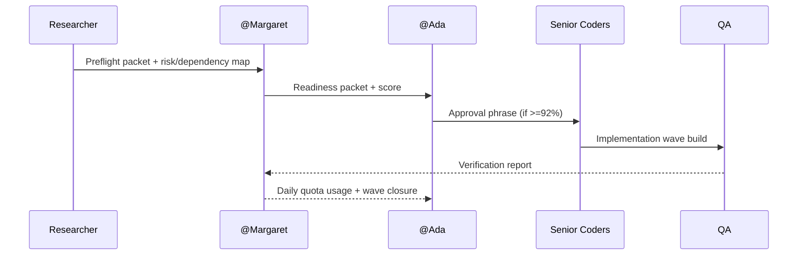

# WAVE_01_FLOWCHARTS

## Process Flow

```mermaid
flowchart TD
  A[Researcher Preflight] --> B[Docs 1000% Validation]
  B --> C[SDD + Flowcharts + Readiness Packet]
  C --> D{Readiness >= 92%?}
  D -->|No| E[Back to Free Agents]
  D -->|Yes| F[@Ada Approval]
  F --> G[Premium Coding Wave 3-5 Modules]
  G --> H[Test Rollout + Verification]
  H --> I[Daily Tracker + Quota Log]
```

## Sequence


