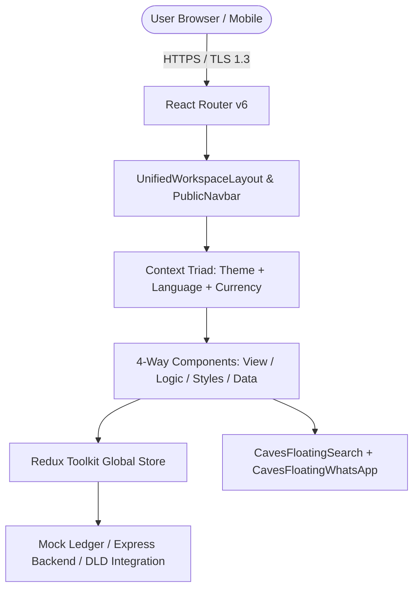

# White Caves Real Estate LLC — Software Architecture Overview

## 📐 System Architecture

White Caves is architected as an enterprise-grade, high-performance web application utilizing modern TypeScript, React, Redux Toolkit, styled-components, and Vite:

---

## 🏛️ Front-End Architecture: The 4-Way Folder Segregation Standard

Every component in `src/components/` conforms to the 4-way subfolder isolation rule:

1. **View Shell (`ComponentName.tsx`):**
   - Pure presentational JSX/TSX.
   - Sits at the root of the component subfolder.
   - Receives data and callbacks from the logic hook.

2. **Logic Layer (`logic/ComponentName.logic.ts`):**
   - React hooks, event listeners, state machines, and Redux actions.
   - Decoupled from JSX markup.

3. **Style Layer (`styles/ComponentName.style.ts`):**
   - Styled-components and Framer Motion animations.
   - Adheres strictly to the Color Lockdown protocol (`#EF4444`, `#FFFFFF`, `#1E293B`).

4. **Data Layer (`data/ComponentName.data.ts`):**
   - Content strings, metadata, option matrices, and default variables.
   - Facilitates instantaneous multi-language translation (`en`, `ar`, `es`, `ru`).

---

## 🌐 Global Context Quartet Layer

The application context layer provides global, zero-latency state synchronization across 4 critical pillars:

1. **`ThemeContext`:** Manages `light`, `dark`, and `system` theme modes with smooth CSS transitions (`data-theme` attribute).
2. **`LanguageContext`:** Manages 4 supported languages (`en`, `ar`, `es`, `ru`) and dynamically toggles the HTML document direction (`dir="ltr"` / `dir="rtl"`).
3. **`CurrencyContext`:** Manages 4 major currencies (`AED`, `USD`, `EUR`, `GBP`) with automated FX rate conversion across all property and tool calculators.
4. **`UserRoleContext`:** Manages global user profile, RBAC roles (`guest`, `buyer`, `seller`, `agent`, `supervisor`, `manager`, `managing_director`, `admin`), access levels 1 to 5, permissions matrix, and the Founder Managing Director sovereign bypass (`arslanmalikgoraha@gmail.com`).

---

## 🧪 Quality Gates & CI/CD Verification Protocol

Every merge or commit to `main` must strictly satisfy:
- **TypeScript Typecheck:** `npm run typecheck` (`tsc --noEmit`) must exit with **code 0 (0 errors)**.
- **Unit Testing:** `npx vitest run` must execute all unit test suites with **100% pass rate**.
- **Linting & Code Deduplication:** Enforce single source of truth across all components and eliminate duplicate styling definitions.
